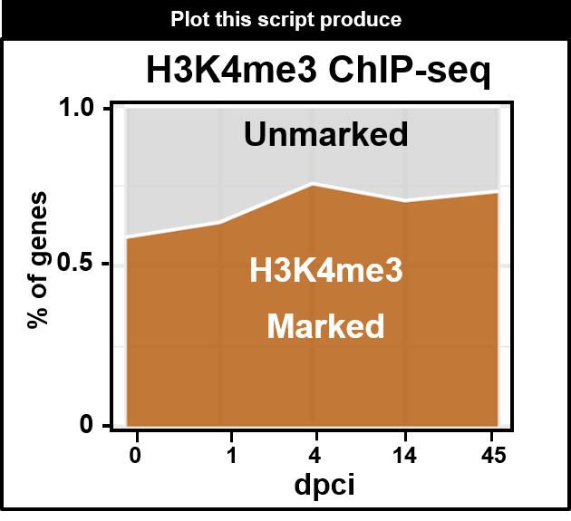

```{r style, echo = FALSE, results = 'asis'}
BiocStyle::markdown()
```


Mailto: julio.cordero@medma.uni-heidelberg.de<br />

# **Objective**
- To determine the number of genes marked by H3K4me3 during the Zebrafish heart regeneration.

# General Comments on the Script
- We would like to see if there is more peaks that are annotated to new genes or there are more peaks regulating the same gene sets. With the density plot of the Number of genes marked by time point we are able to detect the gene dynamic marked by H4K4me3.<br />


# Figure produced by this Script.
```{r,fig.dim = c(13, 8), results="asis", align='center',out.width="150%", echo=F}
library(knitr)

```   

```{r,message=FALSE,echo=FALSE,warning=FALSE}
library(openxlsx)
library(data.table)
library(dplyr)
library(ggplot2)
library(RColorBrewer)
library(Rcpp)
library(plyr)
library(viridis)
library(hrbrthemes)
library(gplots)
library(ggpubr)
library(tidyr)
```

## Set the working environment and Folder to output the results
- Important to keep the output files well organized follwoing the FAIR principles
- Findable, Accessible, Interoperable, and Reusable **(FAIR)**
```{r,class.source="bg-info",echo=TRUE,warning=FALSE}
workdir = "./"
setwd(workdir)
PTHA11="../03OUTPUT/"
dir.create(PTHA11)
PROJECT="03aH3K4me3_DENSITY_genes"
PTHA=paste(PTHA11,PROJECT,"/",sep="")
dir.create(PTHA)
```

# Load annotation files
```{r,class.source="bg-info",echo=TRUE,warning=FALSE}
#This EMSEM_danRer11 file could also be obtained using the BioMart tool
#library(biomaRt)
#colnames(GN)<- c("ensembl_transcript_id","zfin_id_symbol")
#query:
###### #############################ensembl_transcript_id_version  YOu could add any version and genome available ####################
#zf = useMart("ensembl", dataset = "drerio_gene_ensembl",host="www.ensembl.org")
#res <- getBM(attributes = c("ensembl_transcript_id_version","ensembl_gene_id", "ensembl_transcript_id",           "zfin_id_symbol"), mart = zf)
#head(res)
#write.table (res,file="../ENSEM/EEmsem_danRer11_fromgetBM.txt",sep="\t",row.names = F,col.names=T,dec=".",quote = F)

# to check what to extract from zf
#listAttributes(zf)

######################## Load output from the tool ################
BT="../01DATA/Emsem_danRer11_fromgetBM.txt"

mat_BT = read.delim(BT,header=T,check.names=FALSE, stringsAsFactors=FALSE)
NAME11<- data.frame(colnames(mat_BT))

NAME99<- c("EMS", "SYMBOL","chromosome_name","ensembl_gene_id", "ensembl_transcript_id")
colnames(mat_BT)<- NAME99
mat_BT$ID<- "ALL"
mat_BT_1<- subset(mat_BT,select=c("ID", "SYMBOL","EMS"))
length(unique(mat_BT_1$SYMBOL))
```


## Import all the annotated peaks.
- we used annotatePeak.pl from homer
```{r,class.source="bg-info",echo=TRUE,warning=FALSE}
NAME55<- c("ID","SYMBOL","EMS")
NAME3<- data.frame(c( "00dpci","01dpci","04dpci","14dpci","45dpci"))
WORK="../01DATA/01PEAKS_H3K4me3_ZF_dpci/"
file.list0 <- list.files(path=WORK,pattern='*bro_200_001_PEAKS', all.files = T,    full.names = T, recursive = T)
df.list0 <- lapply(file.list0, read.delim)
df.list1<- list()
df.list2<- list()
CHECK1<- df.list0[[1]]
for(i in 1:length(df.list0)) {
#  print(i)
  df.list0[[i]]$PEAK_ID <- df.list0[[i]][,1]
  df.list0[[i]]$EMS <- df.list0[[i]]$Nearest.PromoterID
  df.list0[[i]]$ID <-NAME3[i,1]
  df.list0[[i]] <- subset(df.list0[[i]], select=c("ID","EMS") )
  df.list1[[i]]<- merge(mat_BT_1,df.list0[[i]],by="EMS")
  df.list1[[i]] <- df.list1[[i]][!duplicated(df.list1[[i]]$SYMBOL),]
  df.list1[[i]] <- subset(df.list1[[i]], select=c("ID.y","SYMBOL","EMS") )
 colnames(df.list1[[i]])<- NAME55
}
GN5d<- do.call(rbind, df.list1)
### Check for the total number of ENSEMBL genes in danRer11 zebrafish genome

GN5e1<- rbind(GN5d,mat_BT_1)
## Remove duplicated genes 
GN5e2 <- GN5e1[!duplicated(GN5e1$EMS),]
CHECK<- df.list0[[3]]
GN5e<- data.frame(table(GN5e1$SYMBOL,GN5e1$ID))
GN5e1<- subset(GN5e,Freq<1000 )

GN6<- spread(GN5e1,Var2,Freq,fill=0)

NAME33<- c("Var1" ,"ALL", "00dpci","01dpci","04dpci","14dpci","45dpci")
NAME33b<- c("SYMBOL" ,"ALL", "x00dpci","x01dpci","x04dpci","x14dpci","x45dpci")

GN7<- subset(GN6,select=NAME33)
colnames(GN7)<- NAME33b

GN7_0<- subset(GN7,ALL==0 )
GN7$ALL[GN7$ALL>= 1] <-1
GN_SUM<- data.frame(colSums(GN7[,2:ncol(GN7)]))

GN_SUM$SAMPLES<- rownames(GN_SUM)
colnames(GN_SUM)[1]<- "value"
GN_SUM$group<- "02marked"
GN_SUMb<- subset(GN_SUM,value<20000 )
GN_SUM2<- data.frame(GN_SUM[1,1]- GN_SUMb[,1])
GN_SUM2$SAMPLES<- rownames(GN_SUMb)
colnames(GN_SUM2)[1]<- "value"
GN_SUM2$group<- "01unmarked"
GN_SUM3<- rbind(GN_SUMb,GN_SUM2)
GN_SUM3<- subset(GN_SUM3,value<20000 )
GN_SUM3$value2<- as.numeric(GN_SUM3$value)
```


# Code used for the Density plot
- this plot shows the percentage of genes marked by H3K4me3 during zebrafih heart regeneration

```{r,class.source="bg-info",echo=TRUE,warning=FALSE}
CO22P2<- c("lightgrey","#B35806")
NAME33b2<- c( "00","01","04","14","45")
IP="H3k4m3"
LE=14
SI=14
BASIC_COL="black"
PEAK="N° of genes"
XL="dpci"
YL="N° of genes"
YL2="total number of peaks"
gg1<- ggplot(GN_SUM3, aes(SAMPLES, value)) + geom_area(aes(fill = group, group = group),position = "fill",alpha=0.8 , size=.5, colour="white")

gg1a <- gg1+   scale_fill_manual(values =CO22P2) +   theme_bw()+  theme( panel.border = element_rect(colour = BASIC_COL,  size=2),strip.placement = "outside",strip.text.y.left = element_text(angle=0),axis.text.x=element_text(angle = 0,size=SI , face="bold"),axis.text.y=element_text(angle = 0,size=SI , face="bold"),axis.title.y = element_text(angle = 90,size=SI , face="bold"),axis.title.x = element_text(angle = 0,size=SI , face="bold")) + labs(title=paste(PROJECT,sep="" ) , x=XL, y = YL)+ scale_y_continuous(breaks=seq(0,25,0.5))+ scale_x_discrete(labels=NAME33b2)

{pdf(file=paste(PTHA,"001_Fig1Abo", PROJECT,".pdf",sep="")  , width=4, height=3)
arrange1 <- ggarrange(gg1a, ncol = 1,nrow =1,common.legend = T, align = c("hv"),legend="right")
print(arrange1)
}
dev.off()
```


## Print  Density plot of H3K4me3
```{r,fig.dim = c(8, 6.5),class.source="bg-info",fig.align='center'}
print(arrange1)
```

# SessionInfo 
```{r,warning=FALSE}
sessionInfo()
```

