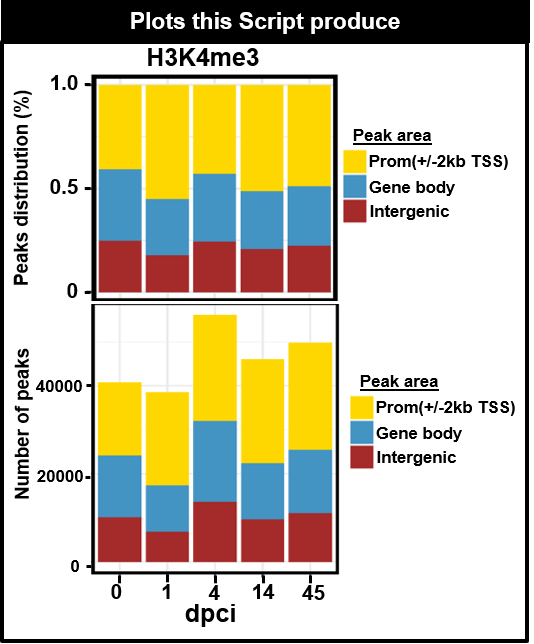

```{r style, echo = FALSE, results = 'asis'}
BiocStyle::markdown()
```

# **Objective**
# **Objective**
- To provide barplots from the ChIP-seq peak files.

# General Comments on the Script
-In this script, we summarize the annotation of the histone mark peaks in genomic areas in 3 main areas **Promoter= TSS+/- 2kb, Genomic (>2kb), and Intergenic. We used the output results from Homer** **annotatepeaks.pl**. The reference gtf used was a merge file from ENSEMBL, RefSeq, and NONCODE of the DanRer11 from Zebrafish. The script could be highly customized and modified to the research question.

# Summary of figures produced by this script.
```{r,fig.dim = c(13, 8), results="asis", align='center',out.width="150%", echo=F}
library(knitr)

```   

## Set processors 
```{r,message=FALSE,class.source="bg-info",warning=FALSE,echo=F}
library(future)

plan("sequential", workers = 16)
```


```{r,message=FALSE,class.source="bg-info",warning=FALSE,echo=F}
##THANK JESUS ####
library(openxlsx)
library(data.table)
library(edgeR)
library(dplyr)
library(doParallel)
library(BiocParallel)
library(gam)
library(foreach)
library(ggplot2)
library("RcppArmadillo")
library(DESeq2)
library(RColorBrewer)
library(Rcpp)
library(plyr)
library(gplots)
library(Hmisc)
library(tidyr)
workdir = "./"
setwd(workdir)

```

## Define the Output directory
- Important to keep the output files well organized follwoing the FAIR principles
- Findable, Accessible, Interoperable, and Reusable **(FAIR)**
```{r,class.source="bg-info",echo=TRUE,warning=FALSE}
PTHA1="../03OUTPUT/"
dir.create(PTHA1)
PROJECT="01Fig1A_H3K4me3_ANNOT_PEAKS"
PTHA=paste(PTHA1,PROJECT,"/",sep="")
dir.create(PTHA)
### Distance to denife the  Promoter area of the peaks
DIS=2000
DIS2=-2000
NAME33b<-c("00", "01", "04", "14", "45") 
#options(future.globals.maxSize = 100000 * 1024^2)
```

# Input Peak data
- ** all Peaks file in this folder(../01DATA/01PEAKS_H3K4me3_ZF_dpci/)** 
```{r,class.source="bg-info",echo=TRUE,warning=FALSE}
### Path to locate all the peak annotated files. The peak file were annotated with annotatePeaks.pl from homer using the merge gtf files from danRer11 genome from REFSEQ, NONCODE, and EMSENBEL
WORK="../01DATA/01PEAKS_H3K4me3_ZF_dpci/"
file.list <- list.files(path=WORK,pattern='*bro_200_001_PEAKS', all.files = T,
           full.names = T, recursive = T)
df.list <- lapply(file.list, read.delim)
NAME3<- data.frame(c( "00dpci","01dpci","04dpci","14dpci","45dpci"))

for(i in 1:length(df.list)) {
df.list[[i]]$PEAK_ID <- df.list[[i]][,1]
df.list[[i]]$transcriptId <- df.list[[i]]$Nearest.PromoterID
  df.list[[i]]$ID <-NAME3[i,1]
NAME1<- colnames(df.list[[i]][,2:19])
df.list[[i]] <- subset(df.list[[i]], select=c("ID","PEAK_ID",NAME1) )
df.list[[i]]<- separate(df.list[[i]], col = Annotation, into = c("Annotation","Annot2"), sep = " ")
df.list[[i]]<- replace_na(df.list[[i]],list(Annotation="NF"))
df.list[[i]] <- subset(df.list[[i]], select=c("ID", "PEAK_ID","Annotation","Distance.to.TSS","Nearest.PromoterID") )
df.list[[i]]$Var2[df.list[[i]]$Distance.to.TSS <= DIS & df.list[[i]]$Distance.to.TSS >=DIS2] <- "01PROM(<2kb)"
df.list[[i]]$Var3[df.list[[i]]$Distance.to.TSS > DIS] <- "OUT_PROM"
df.list[[i]]$Var3[df.list[[i]]$Distance.to.TSS < DIS2] <- "OUT_PROM"
df.list[[i]]$Var2[df.list[[i]]$Annotation=="intron" &  df.list[[i]]$Var3=="OUT_PROM"] <- "02Genebody(>2kb)"
df.list[[i]]$Var2[df.list[[i]]$Annotation=="exon" &  df.list[[i]]$Var3=="OUT_PROM"] <- "02Genebody(>2kb)"
df.list[[i]]$Var2[df.list[[i]]$Annotation=="TTS"&  df.list[[i]]$Var3=="OUT_PROM"] <- "02Genebody(>2kb)"
df.list[[i]]$Var2[df.list[[i]]$Annotation=="Intergenic"&  df.list[[i]]$Var3=="OUT_PROM"] <- "03Interg"
df.list[[i]]$Var2[df.list[[i]]$Annotation=="NF"] <- "04NF"
}
GN5a<- do.call(rbind, df.list)
CHECK1<- subset(GN5a, Var2=="01PROM(<2kb)" | Var2=="02Genebody(>2kb)" | Var2=="03Interg" )
GN5d <- subset(GN5a, select=c("ID","Var2") )
GN5_NF<- data.frame(table(GN5a$ID,GN5a$Var2))
GN5e<- data.frame(table(CHECK1$ID,CHECK1$Var2))
MA6 <- GN5e
colnames(MA6)<- c("SAMPLE", "Var1","Freq")
cat("This is the way the data should looks like:","/n")

head(GN5a,4)
```

## Quantify the number of regions per time point (dpci)
```{r,class.source="bg-info",echo=TRUE,warning=FALSE}
MA7<- subset(GN5d, Var2=="04NF" )
colnames(GN5_NF)<- c("SAMPLE", "Var1","Freq")
MA7<- GN5_NF
CO22 <-  c("gold","#4393C3","brown", "gray","darkblue", "black")
FIL1<- data.matrix(summary(MA6$Freq))
FIL1a<-as.numeric(round(FIL1[2,1],digits = 2))
```

# Performing the Barplot of Fig2A

## Core Script for the bar plot 
```{r,class.source="bg-info",echo=TRUE,warning=FALSE}
###option fill is giving the result in percentage and stack in total values
XL="dpci"
YL="Peak distribut (%)"
YL2="number of Peaks"
BASIC_COL="black"
SI=14
GR="Genomic area"
pdf(file=paste(PTHA,"001_FIG2A_", PROJECT,".pdf",sep=""),width=4, height=2.5) 
{p1 <- ggplot(MA6, aes(factor(SAMPLE), Freq, fill = factor(Var1))) +  geom_bar(position = "fill",stat = "identity") +    guides(fill = guide_legend(reverse = F)) +   labs(fill = GR) + theme_bw()+   scale_fill_manual(values =CO22) +   scale_fill_manual(values =CO22) +  theme(strip.placement = "outside",strip.text.y.left = element_text(angle=0),axis.text.x=element_text(angle = 0,size=SI , face="bold"),axis.text.y=element_text(angle = 0,size=SI , face="bold"), axis.title.y = element_text(angle = 90,size=SI , face="bold"), axis.title.x = element_text(angle = 0,size=SI , face="bold"),panel.border = element_rect(colour = BASIC_COL,  size=2)) + labs(title=paste(PROJECT,sep="" ) , x=XL, y = YL)+ scale_y_continuous(breaks=seq(0,25,0.5))
print(p1)
}
dev.off()
```

## Bar plot of peaks H3K4me3 across time points  
```{r,fig.dim = c(6, 4),class.source="bg-info"}
print(p1)
```
# Optional
## To Export the matrix used for the Barplot.
```{r,class.source="bg-info",echo=TRUE,warning=FALSE}
#write.table(GN5a,file=paste(PTHA,"001_FIG2A_", PROJECT,"ANNOT_fromR.txt",sep=""),sep="\t",row.names = F,col.names=T,dec=".",quote = F)
#write.xlsx(GN5a,file=paste(PTHA,"001_FIG2A_", PROJECT,"ANNOT_fromR",".xlsx",sep=""),overwrite = T)

```


# SessionInfo 
```{r,warning=FALSE}
sessionInfo()
```