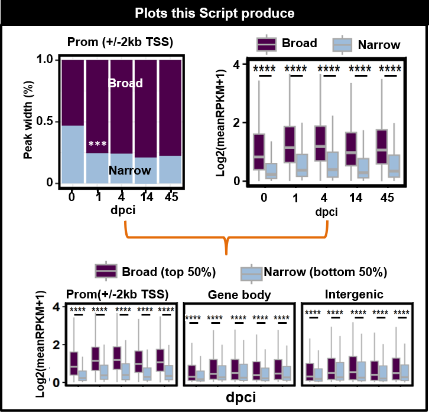

```{r style, echo = FALSE, results = 'asis'}
BiocStyle::markdown()
```


Mailto: julio.cordero@medma.uni-heidelberg.de<br />


# **Objective**
-To generate a bar plot from the broadness of the H3K4me3 ChIP-seq.<br /><br />
- To perform boxplots from the associated genes to H3K4me3 ChIP-seq peaks.<br />

# General comments on the script
-H3K4me3 broadness is associated with genes with high expression genes and genes specific for lineage cell specification. Each Peak calling program will give a different size of the peak. For this reason, we define the broad H3K4me3 peaks as those peaks’ media size or more (>Q2) and narrow as peaks <Q2. In this way, any peak caller program is applicable to use. Q2 means the media value from all the peaks.


# Summary of figures produced by this script.
```{r,fig.dim = c(13, 8), results="asis", align='center',out.width="150%", echo=F}
library(knitr)

```   

```{r,message=FALSE,class.source="bg-info",warning=FALSE,echo=F}
library(future)
plan("sequential", workers = 16)
```

```{r,message=FALSE,echo=FALSE,warning=FALSE}
library(openxlsx)
library(data.table)
library(dplyr)
library(doParallel)
library(BiocParallel)
library(gam)
library(foreach)
library(ggplot2)
library("RcppArmadillo")
library(RColorBrewer)
library(Rcpp)
library(plyr)
library(rstatix)
library(gplots)
 library(ggpubr)  
library(tidyverse)
library(readxl)
library(tidyr)

```

# Set the working environment and folder to output the results
- Important to keep the output files well organized follwoing the FAIR principles
- Findable, Accessible, Interoperable, and Reusable **(FAIR)**
```{r,class.source="bg-info",echo=TRUE,warning=FALSE}
workdir = "./"
setwd(workdir)

PTHA11="../03OUTPUT/"
dir.create(PTHA11)
PROJECT="02aH3K4me3_PEAK_BROADNESS"

PTHA=paste(PTHA11,PROJECT,"/",sep="")
PTHA2=paste(PTHA11,PROJECT,"/",sep="")
dir.create(PTHA)
dir.create(PTHA2)
WORK="../01DATA/01PEAKS_H3K4me3_ZF_dpci/"

DIS=2000
DIS2=-2000
TRY="EMS_RNA"
 LE=12
 #######COLORS
PROM="gold"
GENBODY="#4393C3"
INTER="brown"
NF="#31a354"
CO22 <-  c(PROM,GENBODY,INTER)
CO22NF <-  c(PROM,GENBODY,INTER,NF)
NAME33b<-c("00", "01", "04", "14", "45") 

```

# Load annotation files
```{r,class.source="bg-info",echo=TRUE,warning=FALSE}
BT="../01DATA/Emsem_danRer11_fromgetBM.txt"

mat_BT = read.delim(BT,header=T,check.names=FALSE, stringsAsFactors=FALSE)
NAME11<- data.frame(colnames(mat_BT))

NAME99<- c("EMS", "SYMBOL","chromosome_name","ensembl_gene_id", "ensembl_transcript_id")
colnames(mat_BT)<- NAME99
mat_BT$ID<- "ALL"
mat_BT_1<- subset(mat_BT,select=c("ID", "SYMBOL","EMS"))

TSS_EMS="../../000Input_Files/001Emsem_danRer11_TSS2kb_Annot.bed"
mat_TSS_EMS = read.delim(TSS_EMS,header=F,check.names=FALSE, stringsAsFactors=FALSE)
NAME11<- data.frame(colnames(mat_TSS_EMS))
mat_TSS_EMS$ID<- "ALL"
NAM00<- c("v1","v2","v3","SYMBOL","EMS","ID")
colnames(mat_TSS_EMS)<- NAM00
mat_TSS_EMS_1<- subset(mat_TSS_EMS,select=c("ID","SYMBOL","EMS"))
mat_TSS_EMS_1 <- mat_TSS_EMS_1[!duplicated(mat_TSS_EMS_1$EMS),]

########### load biomart
RES=unzip("../01DATA/002PEAKS_ALL_ANNOT_EM_REF_NON.zip")
mat_RES = read.delim(RES,header=T,check.names=FALSE, stringsAsFactors=FALSE)
NAME11<- data.frame(colnames(mat_RES))
mat_RES$ID<- "ALL"
mat_RES$SYMBOL<- mat_RES$`Gene Name`
mat_RES$EMS<- mat_RES$`Nearest PromoterID`
NAME55<- c("ID","SYMBOL","EMS")
NAME55b<- c("SYMBOL","EMS")
mat_RES_1<- subset(mat_RES,select=NAME55)
mat_BT_2b<- rbind(mat_RES_1,mat_TSS_EMS_1)
mat_BT_2 <- mat_BT_2b[!duplicated(mat_BT_2b$EMS),]
mat_BT_2bu<- mat_BT_2b[!duplicated(mat_BT_2b[,c("SYMBOL", "EMS")]),]

mat_BT_3<- subset(mat_BT_2,select=c("SYMBOL","EMS"))
mat_BT_3b<- subset(mat_BT_2,select=c("ID", "SYMBOL","EMS"))
colnames(mat_BT_3)<- NAME55b
colnames(mat_BT_3b)<- NAME55
```

## Peak files combined from H3K4me3 with annotation 
```{r,class.source="bg-info",echo=TRUE,warning=FALSE}
############ Peaks from H3k4me3 total  #######################
NAME12<- c(1,2,3,4,5,6,7,8,9,10,11,12,15,17)
NAME00<- paste("V",NAME12,sep="")
NAME01<- c("chr",	"start",	"end","chrP",	"startP",	"endP",	"PEAK_ID",	"ID" ,"SYMBOL", "EMS",	"length",	"CLU_1",	"Distance.to.TSS",	"CLU_GE")
PEAKS=unzip("../../004Fig2_H3K4me3_clusters/01DATA/01ANNO_PEAKS_H3K4me3_ZF_ALL_x_BEDTO.zip")
mat_PEAKS2 = read.delim(PEAKS,header=F,check.names=FALSE, stringsAsFactors=FALSE,sep="\t")
NAME11b<- data.frame(colnames(mat_PEAKS2))
NAME11b<- t(NAME11b)
mat_PEAKS2_1<- subset(mat_PEAKS2,select=NAME00)
colnames(mat_PEAKS2_1)<- NAME01
mat_PEAKS2_1$PEAK_ID2<- paste(mat_PEAKS2_1$chr,mat_PEAKS2_1$start,mat_PEAKS2_1$end,sep="_")
#length(unique(mat_PEAKS2_1$PEAK_ID2))
head(mat_PEAKS2_1,4)
```

## Crossed with RNA-seq from PRJNA509429
- Reanalysis of PRJNA509429 data with k-means
```{r,class.source="bg-info",echo=TRUE,warning=FALSE}
meta = "../../000Input_Files/02RE_analysis_PRJNA509429_CLUS.csv"
mat_m = read.delim(meta,header=T,check.names=FALSE, stringsAsFactors=FALSE)
                   
mat_m$SYMBOL<- mat_m$zfin_id_symbol
NAME11b<- data.frame(colnames(mat_m))
mat_m<- mat_m[2:nrow(mat_m),]

######## select Log2FC  ###############
mat_m1a<- data.frame(NAME11b[grep("log2fc_*", NAME11b[,1]), ])
mat_m1a<- t(mat_m1a)
mat_m1b<- data.frame(NAME11b[grep("^mean*", NAME11b[,1]), ])
mat_m1b<- t(mat_m1b)
mat_m1c <- cbind(mat_m1a,mat_m1b)
name55<- c("mean00","mean01","mean04","mean14","mean45")
name5=c("EMSEMBL", "rgd_symbol","ensembl_gene_id","length",name55)
mat_m1b2<- c(name55)
NAME_EXP<- c("SYMBOL",name55)
mat_m3<- subset(mat_m,select=NAME_EXP)
```

## Code to define the broadness of H3K4me3 ChIP-seq
```{r,class.source="bg-info",echo=TRUE,warning=FALSE}
file.list0 <- list.files(path=WORK,pattern='*_PEAKS', all.files = T,   full.names = T, recursive = T)
df.list1 <- lapply(file.list0, read.delim)
CHECK0<- df.list1[[1]]
CHECK0$length <- CHECK0$End-CHECK0$Start
NAME3<- data.frame(c( "00dpci","01dpci","04dpci","14dpci","45dpci"))
NAME555<- c("PEAK_ID", "chr","start","end", "ID","EMSPEAK","length")
df.list0 <- lapply(file.list0, read.delim)

for(i in 1:length(df.list0)) {
  df.list0[[i]]$PEAK_ID <- df.list0[[i]][,1]
  df.list0[[i]]$SYMBOL <- df.list0[[i]]$Gene.Name
  df.list0[[i]]$EMS <- df.list0[[i]]$Nearest.PromoterID
  df.list0[[i]]$ID <-NAME3[i,1]
  df.list0[[i]]$length <- df.list0[[i]]$End-df.list0[[i]]$Start
  df.list0[[i]] <- subset(df.list0[[i]], select=c("PEAK_ID","Chr","Start","End", "ID","EMS","length") )
  df.list0[[i]] <- df.list0[[i]][!duplicated(df.list0[[i]]$PEAK_ID),]
colnames(df.list0[[i]])<- NAME555
}
CHECK<- df.list0[[3]]
#length(unique(CHECK$PEAK_ID))
GN5d<- do.call(rbind, df.list0)
colnames(GN5d)<- NAME555
#length(unique(GN5d$PEAK_ID))
```


```{r,class.source="bg-info",echo=TRUE,warning=FALSE}
### to improve the annotation to genename
GN5e1<- GN5d
GN5e1$PEAK_ID_P<- paste(GN5e1$chr,GN5e1$start,GN5e1$end,sep="_")

#length(unique(GN5e1$PEAK_ID))
GN5e2 <- GN5e1
#length(unique(GN5e2$PEAK_ID))
FIL<- data.matrix(summary(GN5e2$length))
FIL2<-as.numeric(round(FIL[2,1],digits = 1))
#length(GN5d$PEAK_ID)
GN5e2_CHECK<- subset(GN5e2,length >FIL2)
GN5e2_CHECKm<- subset(GN5e2,length <FIL2)
############ select the peak Wide from each data 
FIL<- data.matrix(summary(GN5e2$length))
FIL5<-as.numeric(round(FIL[5,1],digits = 1))
FIL3<-as.numeric(round(FIL[3,1],digits = 1))
FIL2<-as.numeric(round(FIL[2,1],digits = 1))

FIL5b<-as.numeric(round(FIL5/1000,digits = 1))
FIL3b<-as.numeric(round(FIL3/1000,digits = 1))
FIL2b<-as.numeric(round(FIL2/1000,digits = 1))

GN5e2$CLU3[GN5e2$length >=FIL3] <- paste("01BR",">",FIL3b,sep=" ")
GN5e2$CLU3[GN5e2$length < FIL3] <- paste("03NAR_",FIL3b,sep="")
GN5e2$CLU2[GN5e2$length >=FIL3] <- "01BROAD"
GN5e2$CLU2[GN5e2$length < FIL3] <- "03NARROW"

GN5e2_2<- subset(GN5e2,select=c("PEAK_ID","CLU2","PEAK_ID_P"))
```

## Merge peaks and find from Narrow to Broad 
```{r,class.source="bg-info",echo=TRUE,warning=FALSE}
##################################### MERGE to get PEEAK_ID2 ##############
mat_BT_1<- merge(GN5e2_2,mat_PEAKS2_1,by="PEAK_ID")
##################################### to see PEAKS from narrow to BROAD ##############
NAME77<- c("PEAK_ID","PEAK_ID2", "ID","CLU2","SYMBOL")
NAME77b<- c("PEAK_ID","PEAK_ID2", "ID","CLU2","SYMBOL")
mat_BT_CHE<- subset(mat_BT_1,select=NAME77)
colnames(mat_BT_CHE)<- NAME77b
CHANG_PEAKS <- spread(mat_BT_CHE,"ID","CLU2",fill="")
CHANG_PEAKS2=aggregate(CHANG_PEAKS[,4:8], list(CHANG_PEAKS$PEAK_ID2), paste, collapse="")
CHANG_PEAKS1<- subset(CHANG_PEAKS,select=c("PEAK_ID2","SYMBOL"))

colnames(CHANG_PEAKS2)<- c("PEAK_ID2","X00dpci","X01dpci","X04dpci","X14dpci","X45dpci")

CHANG_PEAKS2$ID3<- paste(CHANG_PEAKS2$X00dpci,CHANG_PEAKS2$X01dpci,CHANG_PEAKS2$X04dpci,CHANG_PEAKS2$X14dpci,CHANG_PEAKS2$X45dpci,sep="_")

CHANG_PEAKS3<- merge(CHANG_PEAKS1,CHANG_PEAKS2,by="PEAK_ID2")
CHANG_PEAKS3 <- CHANG_PEAKS3[!duplicated(CHANG_PEAKS3$PEAK_ID2),]

CHANG_PEAKS4<- subset(CHANG_PEAKS3, X00dpci=="03NARROW"& X01dpci=="01BROAD" & X04dpci=="01BROAD",select=c("PEAK_ID2","SYMBOL","ID3"))

CHANG_PEAKS4NN<- subset(CHANG_PEAKS3, X00dpci=="03NARROW"& X01dpci=="03NARROW" & X04dpci=="03NARROW",select=c("PEAK_ID2","SYMBOL","ID3"))
CHANG_PEAKS4$ENH5<- "01NAR_BROAD"
CHANG_PEAKS4NN$ENH5<- "02NAR_NAR"
CHANG_PEAKS5<- rbind(CHANG_PEAKS4,CHANG_PEAKS4NN)
####################################################### to find the IGV candidates ############
NAME_ENH<- data.frame(table(CHANG_PEAKS5$ENH5))
#write.xlsx(CHANG_PEAKS5,file=paste(PTHA,"000_forFig2", PROJECT,"_MAT_Candidate_genes",".xlsx",sep=""),overwrite = T)
```

# Barplot for the broadness

```{r,class.source="bg-info",echo=TRUE,warning=FALSE}
NAME88<- data.frame(colnames(mat_BT_1))
NAME88<- t(NAME88)
NAME88b<- c("chr","start","end","PEAK_ID", NAME88[,5:ncol(NAME88)])
NAME11<- c("ID","CLU_GE","CLU2","CLU_1")
NAME11b<- c("ID","CLU_geno","CLU2_broa","CLU2_broa_1")

#length(unique(mat_BT_1$SYMBOL))
mat_BT_2<- subset(mat_BT_1,select=NAME11)
colnames(mat_BT_2)<- NAME11b
GN5e<- data.frame(table(mat_BT_2$CLU2_broa,mat_BT_2$CLU_geno,mat_BT_2$ID))
GN5e_1<- data.frame(table(mat_BT_2$CLU2_broa_1,mat_BT_2$CLU_geno,mat_BT_2$ID))

GN6<- spread(GN5e,Var2,Freq)
#write.table(GN5e2,file=paste(PTHA,PROJECT,"PEAK_fromR2.txt",sep=""),sep="\t",row.names = F,col.names=T,dec=".",quote = F)
#brewer.pal(n = 11, name = "Dark2")
MI=6
COL<- "black" 
YL_EXP2="Zscore"
XL<- "dpci"
YL="Peak wide (kb)"
YL_EXP="Log2(meanRPKM+1)"
IP="H3k4m3"
LE=14
SI=14
BASIC_COL="black"
PEAK="Peak group"
MA6<- GN5e
MA6_1<- GN5e_1
MA6$Var2[MA6$Var2=="04NF"] <- "03Interg"
MA6_1$Var2[MA6_1$Var2=="04NF"] <- "03Interg"
```

```{r,message=FALSE,class.source="bg-info",warning=FALSE,echo=FALSE}
CO22P <-  c("#4d004b","#9ebcda", "gray","darkblue", "black")
CO22P1 <-  c("#4d004b","#8c6bb1","#9ebcda", "gray","darkblue", "black")
p11<-  ggplot(MA6, aes(factor(Var3), Freq, fill = factor(Var1))) +geom_bar(position = "fill",stat = "identity") +   guides(fill = guide_legend(reverse = F)) +labs(fill = PEAK)+theme_bw()+ scale_fill_manual(values =CO22P) +  theme( panel.border = element_rect(colour = BASIC_COL,  size=2),strip.placement = "outside",strip.text.y.left = element_text(angle=0),axis.text.x=element_text(angle = 0,size=SI , face="bold"),axis.text.y=element_text(angle = 0,size=SI , face="bold"),axis.title.y = element_text(angle = 90,size=SI , face="bold"),axis.title.x = element_text(angle = 0,size=SI , face="bold")) + labs(title=paste("001_FIG_2B_S2B_",PROJECT,sep="" ) , x=XL, y = YL)+ scale_y_continuous(breaks=seq(0,25,0.5))+ scale_x_discrete(labels=NAME33b)

p6a <- p11 +    facet_wrap(~Var2, ncol = 4,strip.position="top",scales="fixed")

pdf(file=paste(PTHA,"001_FIG_2B_S2B_",PROJECT,".pdf", sep=""),width=7, height=2.5)  
arrange0b <- ggarrange(p6a,     ncol = 1,nrow =1,common.legend = T, align = c("hv"),legend="top")
print(arrange0b)            
dev.off()
```


## Plot of Peak size of H3K4me3 by genomic Region
```{r,fig.dim = c(6, 4),class.source="bg-info"}
print(arrange0b) 

```

## Export the text file from the bar plot.

```{r,class.source="bg-info",echo=TRUE,warning=FALSE}
write.table(mat_BT_1,file=paste(PTHA2,PROJECT,"PEAK_fromR_WGN.txt",sep=""),sep="\t",row.names = F,col.names=T,dec=".",quote = F)
```

# Histone data crossed with the Expression RNA-seq data


## Merge clusters from Histone to Expression
```{r,class.source="bg-info",echo=TRUE,warning=FALSE}
#length(unique(mat_BT_1$EMS))
#length(unique(mat_m3$EMS))
#length(unique(mat_PEAKS2_1$EMS))
##########   MERGE  with RNA_SEQ with the BROAD 
NAME03<- c("EMS","SYMBOL",	"PEAK_ID",	"ID" ,	"CLU_1","length",		"CLU2","CLU_GE","PEAK_ID2","PEAK_ID_P")
mat_BT_BRO<- subset(mat_BT_1,CLU2=="01BROAD",select=NAME03)
mat_BT_NAR<- subset(mat_BT_1,CLU2=="03NARROW",select=NAME03 )
MA11<- merge(mat_m3,mat_BT_BRO,by="SYMBOL")
MA11_NAR<- merge(mat_m3,mat_BT_NAR,by="SYMBOL")

MA1NARR<- data.frame(setdiff(MA11_NAR$SYMBOL,MA11$SYMBOL))
colnames(MA1NARR)<- "SYMBOL"
MA1NARR2<- merge(MA1NARR,MA11_NAR,by="SYMBOL")
MA1<- rbind(MA11,MA1NARR2)
MA2<- MA1[!duplicated(MA1[,c("SYMBOL","PEAK_ID")]),]
MA22 <- MA1[!duplicated(MA1$EMS),]
NAME_MA2<- colnames(MA2)
MA2_2<- subset(MA2,select=c("SYMBOL",mat_m1b2, "CLU_1","CLU2","CLU_GE","PEAK_ID2"))

MA2_3<- data.frame(setdiff(MA2$PEAK_ID2,MA2_2$PEAK_ID2))
colnames(MA2_3)<- "PEAK_ID2.y"
NAME55<- paste("mean",c("00","01","04","14","45"),sep="")
NAME55b<- c("00","01","04","14","45")

mat_adD1b<- MA2_2
colnames(mat_adD1b)<- c("SYMBOL",NAME55b, "CLU_1","CLU2","CLU_GE","PEAK_ID2")
```

## Calculate with P-value for the Boxplots of the genes associated to H3K4me3 peaks
```{r,class.source="bg-info",echo=TRUE,warning=FALSE}
#### To Ensure the identity of the PEAK during differentiation ###
mat_RPKM1_5_c1 <- gather(mat_adD1b, NAME55b, key="Sample",value= "log2fc")
mat_RPKM1_5_c1$log2fc<- log2(mat_RPKM1_5_c1$log2fc+1)
mat_RPKM1_5_c<- mat_RPKM1_5_c1[!duplicated(mat_RPKM1_5_c1[,c("SYMBOL","Sample","CLU2")]),]
#CHEDCK_3<- count(mat_RPKM1_5_c,c("CLU2"))
CO<-brewer.pal(n = 8, name = "Dark2")
mat_RPKM1_5_c2<- replace_na(mat_RPKM1_5_c,list(CLU="TO_FIND"))
mat_RPKM1_5_c$Group<- mat_RPKM1_5_c$CLU2

stat.test3 <- mat_RPKM1_5_c %>%
  dplyr::group_by(Sample) %>%
  wilcox_test(log2fc ~ CLU2) %>%
  adjust_pvalue(method = "fdr") %>%
  add_significance("p.adj")

stat.test3 <- stat.test3 %>%
  add_xy_position(x = "Sample", dodge = 0.8)

stat.test3$Y<- as.numeric(stat.test3$y.position/3)-0.8

test_willc3b <- mat_RPKM1_5_c %>%
  group_by(Sample,CLU_GE) %>%
  wilcox_test(log2fc ~ CLU2) %>%
  adjust_pvalue(method = "fdr") %>%
  add_significance("p.adj")
#as.numeric(length(unique(mat_RPKM1_5_c$CLU2)))
test_willc4b <- test_willc3b %>%
  add_xy_position(x = "Sample", dodge = 0.8)
test_willc4b$Y<- as.numeric(test_willc4b$y.position/3)-0.8
```


```{r,class.source="bg-info",echo=TRUE,warning=FALSE}

str(mat_RPKM1_5_c)
stat.test3 <- mat_RPKM1_5_c %>%
  dplyr::group_by(Sample) %>%
  wilcox_test(log2fc ~ CLU2) %>%
  adjust_pvalue(method = "fdr") %>%
  add_significance("p.adj")
head(stat.test3,4)
stat.test3c <- mat_RPKM1_5_c %>%
  group_by(Sample) %>%
  pairwise_wilcox_test(log2fc ~ CLU2) %>%
  adjust_pvalue(method = "fdr") %>%
  add_significance("p.adj")
stat.test4c <- stat.test3c %>%
  add_xy_position(x = "Sample", dodge = 0.8)

stat.test4 <- stat.test3 %>%
  add_xy_position(x = "Sample", dodge = 0.8)
stat.test3b <- mat_RPKM1_5_c  %>%
  wilcox_test(log2fc ~ CLU2) %>%
  adjust_pvalue(method = "fdr") %>%
  add_significance("p.adj")
YPOS4<- as.numeric((stat.test4$y.position )/3)-0.5
YPOS4c<- as.numeric((stat.test4c$y.position )/3)-0.5
```

## Wilcon test for the FigS2C
```{r,class.source="bg-info",echo=TRUE,warning=FALSE}

test_willc3b <- mat_RPKM1_5_c %>%
  group_by(Sample,CLU_GE) %>%
  wilcox_test(log2fc ~CLU2 ) %>%
  adjust_pvalue(method = "bonferroni") %>%
  add_significance("p.adj")
test_willc4b <- test_willc3b %>%
  add_xy_position(x = "Sample", dodge = 0.8)
test_willc4b <- test_willc4b[order(test_willc4b$CLU_GE,decreasing=F),]
test_willc4b$Y<- as.numeric((test_willc4b$y.position )/3)-1
```

```{r,message=FALSE,class.source="bg-info",warning=FALSE,echo=FALSE}
MAX=4.4
bxp <- ggboxplot( mat_RPKM1_5_c, x = "Sample", y = "log2fc",  fill = "Group", palette =  (CO22P),outlier.shape =NA,legend = "right",color="darkgrey")+ylim(0,MAX)

B11<-  ggpar(bxp,ylim=c(0,MAX),color="grey")+theme(plot.title = element_text(color=BASIC_COL, size=LE, face="bold.italic"), axis.text.x=element_text(angle = 0,size=SI , face="bold"),axis.text.y=element_text(angle = 0,size=SI , face="bold"), axis.title.x = element_text(color=BASIC_COL, size=LE, face="bold"),  panel.border = element_rect(colour = BASIC_COL, fill=NA, size=2))+ labs(title=paste("002_FIG2D_",PROJECT,sep="_" ) , x=XL, y = YL_EXP)+ scale_x_discrete(labels=(NAME33b))+guides(fill = guide_legend(title = "Group"))+ scale_y_continuous(breaks=c(0,2,4))
                      
B112<-   ggpar(bxp,ylim=c(0,MAX)) +theme(plot.title = element_text(color=BASIC_COL, size=LE, face="bold.italic"), axis.text.x=element_text(angle = 0,size=SI , face="bold"),axis.text.y=element_text(angle = 0,size=SI , face="bold"), axis.title.x = element_text(color=BASIC_COL, size=LE, face="bold"),  panel.border = element_rect(colour = BASIC_COL, fill=NA, size=2))+ labs(title=paste("002_FIG2D_",PROJECT,sep="_" ) , x=XL, y = YL_EXP)+ scale_x_discrete(labels=(NAME33b))+ scale_y_continuous(breaks=c(0,2,4))+ stat_pvalue_manual(stat.test4,  label = "{p.adj.signif}", tip.length = 0.01 , y.position =YPOS4, step.increase = 0.00001)

pdf(file=paste(PTHA,"002_FIG2D_", PROJECT,"_W_PVALUEs.pdf",sep=""),width=3.5, height=5 )
 
arrangeB11 <- ggarrange(B11, B112,    ncol = 1,nrow =2,common.legend = T, align = c("hv"),legend="top")
print(arrangeB11)   
dev.off()

```


## Bloxplot from gene expression by broadnessof the histone mark
```{r,fig.dim = c(5, 5),class.source="bg-info"}
print(arrangeB11)   

```


```{r,message=FALSE,class.source="bg-info",warning=FALSE,echo=FALSE}
bxpB <- ggboxplot( mat_RPKM1_5_c, x = "Sample", y = "log2fc",  fill = "Group", palette =  (CO22P),outlier.shape =NA,legend = "right",color="darkgrey")+ylim(0,MAX)

B1<-  ggpar(bxpB,ylim=c(0,MAX),color="grey")+facet_wrap(~CLU_GE, ncol = MI,strip.position="top")+theme(plot.title = element_text(color=BASIC_COL, size=LE, face="bold.italic"), axis.text.x=element_text(angle = 0,size=SI , face="bold"),axis.text.y=element_text(angle = 0,size=SI , face="bold"), axis.title.x = element_text(color=BASIC_COL, size=LE, face="bold"),  panel.border = element_rect(colour = BASIC_COL, fill=NA, size=2))+ labs(title=paste("003_FIGS2C_",PROJECT,sep="_" ) , x=XL, y = YL_EXP)+ scale_x_discrete(labels=(NAME33b))+guides(fill = guide_legend(title = "Group"))+ scale_y_continuous(breaks=c(0,2,4))
 
B1p<-   ggpar(bxpB,ylim=c(0,MAX),color="grey")+facet_wrap(~CLU_GE, ncol = MI,strip.position="top")+theme(plot.title = element_text(color=BASIC_COL, size=LE, face="bold.italic"), axis.text.x=element_text(angle = 0,size=SI , face="bold"),axis.text.y=element_text(angle = 0,size=SI , face="bold"), axis.title.x = element_text(color=BASIC_COL, size=LE, face="bold"),  panel.border = element_rect(colour = BASIC_COL, fill=NA, size=2))+ labs(title=paste("003_FIGS2C_",PROJECT,sep="_" ) , x=XL, y = YL_EXP)+ scale_x_discrete(labels=(NAME33b))+guides(fill = guide_legend(title = "Group"))+ scale_y_continuous(breaks=c(0,2,4))+ stat_pvalue_manual(test_willc4b,  label = "{p.adj.signif}", tip.length = 0.01 , y.position =test_willc4b$Y, step.increase = 0.00001)
pdf(file=paste(PTHA,"003_FIGS2C_", PROJECT,"_WPxGE.pdf",sep=""),width=5, height=5 )

arrange0bB1 <- ggarrange(B1,B1p,     ncol = 1,nrow =2,common.legend = T, align = c("hv"),legend="top")
print(arrange0bB1)            
dev.off()
```


## Box plot from associated genes  to H3K4me3 peaks distributed by genomic region and proadness
```{r,fig.dim = c(5, 5),class.source="bg-info"}
print(arrange0bB1) 

```


```{r,echo=FALSE,warning=FALSE}
stat.test3b <- mat_RPKM1_5_c %>%
  group_by(Sample,CLU2) %>%
  wilcox_test(log2fc ~ CLU_GE) %>%
  adjust_pvalue(method = "bonferroni") %>%
  add_significance("p.adj")
as.numeric(length(unique(mat_RPKM1_5_c$CLU2)))
stat.test4b <- stat.test3b %>%
  add_xy_position(x = "Sample", dodge = 0.8)
```


# Suplementary information of expression groupy by Broadness and p-value by genomic regions 
```{r,message=FALSE,class.source="bg-info",warning=FALSE,echo=FALSE}

YSTA<- as.numeric(stat.test4b$y.position/3)-0.4
#summary(YSTA)
stat.test4b$Y<- as.numeric(stat.test4b$y.position/3)-0.4
NAME_G3<- data.frame(table(stat.test4b$CLU2))
DE_LIS<- list(NULL)
stat.test4b$ID4<- paste(stat.test4b$CLU2,stat.test4b$Sample,stat.test4b$group1,stat.test4b$group2,sep="_")
NAME_NU<- data.frame(c(0,0.6,2))
#NAME_NU[2,1]
  rownames(stat.test4b)<- stat.test4b$ID4
for(i in 1:length(NAME_G3$Var1)) {
DE_LIS [[i]]<- subset(stat.test4b, CLU2==NAME_G3[i,1])
DE_LIS [[i]]$Y2<- DE_LIS [[i]]$Y - NAME_NU[i,1]
}
YPOS6d<- do.call(rbind, DE_LIS)
XL<- "dpci"
YL_EXP="Log2(meanRPKM+1)"
IP="H3k4m3"
YL_EXP2="Zscore"
YL_EXP="Log2(meanRPKM+1)"
 
bxp1 <- ggboxplot( mat_RPKM1_5_c, x = "Sample", y = "log2fc", fill = "CLU_GE", palette =  (CO22),outlier.shape =NA,legend = "right")+ylim(0,6)+facet_wrap(~CLU2, ncol = MI,strip.position="top")+theme(plot.title = element_text(color=BASIC_COL, size=LE, face="bold.italic"), axis.text.y   = element_text(size=LE), axis.title.x = element_text(color=BASIC_COL, size=LE, face="bold"),  panel.border = element_rect(colour = BASIC_COL, fill=NA, size=2))+ labs(title=paste(PROJECT,TRY,sep="_" ) , x=XL, y = YL_EXP)+ scale_x_discrete(labels=(NAME33b))

p6<- bxp1+facet_wrap(~CLU2, ncol = MI,strip.position="top")+theme(plot.title = element_text(color=BASIC_COL, size=LE, face="bold.italic"), axis.text.y   = element_text(size=LE), axis.title.x = element_text(color=BASIC_COL, size=LE, face="bold"),  panel.border = element_rect(colour = BASIC_COL, fill=NA, size=2))+ labs(title=paste(PROJECT,TRY,sep="_" ) , x=XL, y = YL_EXP)+ scale_x_discrete(labels=(NAME33b))
  
p6b<- bxp1  + stat_pvalue_manual(stat.test4b,  label = "{p.adj.signif}", tip.length = 0 , y.position = YPOS6d$Y2,   step.increase = 0.001)

pdf(file=paste(PTHA,"004_SU_",PROJECT,"_BOX_W_P",".pdf", sep=""),width=7, height=5)  
arrange0 <- ggarrange(p6,p6b,     ncol = 1,nrow =2,common.legend = T, align = c("none"),legend="top")
print(arrange0)
dev.off()
```

##   Boxplot from the gene expression by peak broadness grouped by genomic region
```{r,fig.dim = c(5, 5),class.source="bg-info"}
print(arrange0)

```

# SessionInfo 
```{r,warning=FALSE}
sessionInfo()
```

