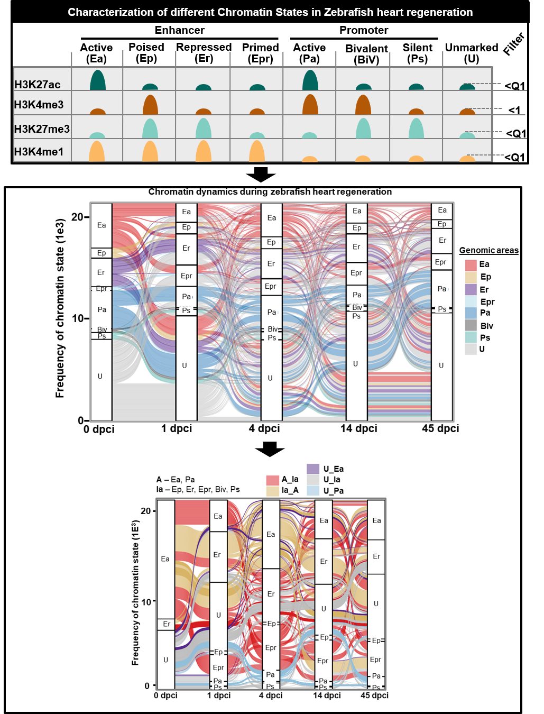

```{r style, echo = FALSE, results = 'asis'}
library(BiocStyle)
BiocStyle::markdown()
```

# **Objective**
-  To define all the chromatin states based on the marks from the 4 Histone marks used in this study. :<br />
- To generate all the peak files for Transcriptional factors in Neighborhood ZONE(TFinZONE) in all of the stages as reference (01dcpi, 04dcpi, and 14dcpi). <br />

# General Comments on the script
-In this Script, you will find how we defined the different Chromatin States by the combination of **H3K4me, H3K27ac, H3K27me3, and H3K4me1**. We represent the stages with an alluvial plot. Since the States are highly dynamic. The chromatin states are highly diverse. Therefore, we propose 5 groups we called:<br /><br />
                                                            **Divergent regions**<br /><br />
1.**00A_Ia** =active areas that change to inactive areas. <br />
2.**01Ia_A**= transitions from inactive to active chromatin state. <br />
3.**02U_Ea**= unmarked areas changing to active enhancers. <br />
4.**03U_Ia**= unmarked areas to inactive chromatin states. <br />
5.**U_Pa**= unmarked areas to active promoters<br />

The inactive area is the combination of enhancer poised (Ep), enhancer repressed (Er), enhancer primed (Epr), promoter bivalent (BiV), and promoter poised (Ps). For active areas is combined by enhancer active (Ea) and promoter active (Pa). Unmarked was considered when a region was enriched less than the **Quartile 1 (Q1)** of the markers (H3K27ac, H3K27me3, and H3K4me1). For H3K4me3 was below 1 of the z-score of normalized enrichment. the value of 1 for taken for H3K4me3 after manual checking of the marker in the genome browser. **All 5 divergent regions** were calculated by taking 3 points of reference. 01dcpi, 04dcpi, and 14dcpi. 

# Summary of figures produced by this script.


```{r,fig.dim = c(13, 8), results="asis", align='center',out.width="150%", echo=F}
library(knitr)

```

```{r,message=FALSE,class.source="bg-info",echo=FALSE,warning=FALSE}
library(openxlsx)
library(ComplexHeatmap)
library(data.table)
library(edgeR)
library(dplyr)
library(alluvial)
library(ggalluvial)
library(gridExtra)
library(doParallel)
library(BiocParallel)
library(foreach)
library(ggplot2)
library("RcppArmadillo")
library(DESeq2)
library(RColorBrewer)
library(Rcpp)
library(clusterProfiler)
library(org.Dr.eg.db)
library(plyr)
library(gplots)
library(EnrichedHeatmap)
library(ComplexHeatmap)
library(tidyr)
library(circlize)
library(riverplot)
library(data.table)
```

# Set the working environment and Folder to output the results
- Important to keep the output files well organized follwoing the FAIR principles
- Findable, Accessible, Interoperable, and Reusable **(FAIR)**

```{r,class.source="bg-info",echo=TRUE,warning=FALSE}
workdir = "./"
setwd(workdir)

PTHA1="../03OUT/"
dir.create(PTHA1)
PROJECT="01Fig3_5_ChrSt_01to14dpci"

PTHA=paste(PTHA1,PROJECT,"/",sep="")
PTHAa<- paste(PTHA,"00ALLU_PL","/",sep="")
PTHA_1=paste(PTHA,"01MAT_fALLU/",sep="")
PTHA_2=paste(PTHA,"03GOs/",sep="")
PTHA_3=paste(PTHA,"01fMOTIFs/",sep="")

dir.create(PTHAa)
dir.create(PTHA)
dir.create(PTHA_1)
dir.create(PTHA_2)
dir.create(PTHA_3)
### GROUP to make
PROM="gold"
GENBODY="#4393C3"
INTER="brown"
NF="#31a354"
CO22 <-  c(PROM,GENBODY,INTER)
```

# Define the number of histones to classify the Chromatin stages 
```{r,class.source="bg-info",echo=TRUE,warning=FALSE}
NAME_G<- data.frame(c("00Ea","01Ep","02Er","03Pa","04Pp","05Ps","07u"))
NAME_HM<- data.frame(c("k4m3","k27ac","k27m3","k4m1"))
colnames(NAME_G)<- "GROUP"
colnames(NAME_HM)<- "GROUP2"
WHERE_isDATA="../01DATA/"
```

## Set processor
```{r,message=FALSE,class.source="bg-info",warning=FALSE,echo=FALSE}
library(future)
plan("sequential", workers = 16)
```

# Inport matrixes
## Load count data from the 4 histone marks
```{r,message=FALSE,class.source="bg-info",warning=FALSE,echo=FALSE}
meta = paste(WHERE_isDATA,"COMBI_META_ALL_COMBINA.csv",sep="")
mat_m = read.table(meta,header=F,check.names=FALSE, stringsAsFactors=FALSE)
mat_m3<- as.data.frame(mat_m)
mat_m2 <-t(mat_m[1:nrow(mat_m),])
mat_m3 <-t(mat_m2)
meta2 = "../01DATA/META_ZF_heart_re_HISTONTES.txt"
mat_m1 = read.table(meta2,header=F, check.names=FALSE, stringsAsFactors=FALSE)
mat_m4<- t(mat_m1)
name5=c("chr","start","end","EMSEMBL")
name3<- c(name5,mat_m4)
name3s<- c("PEAK_ID2","EMSEMBL","length",mat_m4)
name4r<- paste("RPKM",mat_m4,sep="")
name4r2<- data.frame(name4r)
```

## Load Matrix containing the annotation of the peaks per histone mark
```{r,class.source="bg-info",echo=TRUE,warning=FALSE}
NAME01<- c("PEAK_ID2", 	"PEAK_ID","ENH", "Sample","SYMBOL","CLU", "Clu_k27ac","BROAD_k4m3", "isSuper")
adD0 = unzip("../01DATA/001ZF_Geno_Areas_bedto_HEATMAP_MAT_ALL.zip")
#cat("Current file name is:",adD0,"/n")
mat_adD0 = read.table(adD0,header=T,sep="\t")
NAME99<- data.frame(colnames(mat_adD0))
mat_adD_S1 <- subset(mat_adD0, select= NAME01)
```

## Load Peak data defining Enhancers by overlap of peak
```{r,class.source="bg-info",echo=TRUE,warning=FALSE}
adD1 = unzip("../01DATA/ENH_BIVA_EM_REF_NON_OVER_ENH_ALL_for_forUCSC.zip")
#  cat("Current file name is:",adD1,"/n")
mat_adD = read.table(adD1,header=F,check.names=FALSE, stringsAsFactors=FALSE,sep="\t")
#colnames(mat_adD)<- name3
colnames(mat_adD)[8]<- "PEAK_ID"
colnames(mat_adD)[9]<- "CLU"
colnames(mat_adD)[10]<- "Sample"
colnames(mat_adD)[11]<- "ENH"
colnames(mat_adD)[14]<- "SYMBOL"

mat_adD$PEAK_ID2<- paste(mat_adD$V1,mat_adD$V2,mat_adD$V3,sep="_")
mat_adD$ID3<- paste(mat_adD$V5,mat_adD$V6,mat_adD$V7,sep="_")
mat_adD2<- subset(mat_adD, select=c("V1","V2","V3","PEAK_ID2"))
mat_adDu<- mat_adD[!duplicated(mat_adD[,c("ID3","Sample","ENH")]),]
mat_adDu2<- mat_adD[!duplicated(mat_adD[,c("PEAK_ID2","Sample","ENH")]),]
```

## Load Peak data defining Enhancers by overlap of peak
```{r,class.source="bg-info",echo=TRUE,warning=FALSE}
adD1 = unzip("../01DATA/MAT_all_HM_Zf_danRer11_BWAVE_A.zip")
#cat("Current file name is:",adD1,"/n")
mat_adD1 = read.table(adD1,header=F,check.names=FALSE, stringsAsFactors=FALSE,sep="\t")
colnames(mat_adD1)<- name3
mat_adD1$length<- mat_adD1$end-mat_adD1$start 
#summary(mat_adD1$length)
mat_adD1$PEAK_ID2<- paste(mat_adD1$chr,mat_adD1$start,mat_adD1$end,sep="_")
mat_adDu1 <- subset(mat_adD1, select=name3s )
row.names(mat_adDu1)<-mat_adDu1$PEAK_ID2
totalNumReads_dod_BGI15 <- colSums(mat_adDu1[,4:ncol(mat_adDu1)])
rpkmdod_BGI15_2ar <- rpkm.default(mat_adDu1[,4:ncol(mat_adDu1)], gene.length = mat_adDu1$length ,lib.size= totalNumReads_dod_BGI15, normalized.lib.sizes = TRUE)
rpkmdod_BGI15_2ar <- data.frame(rpkmdod_BGI15_2ar)
rsumRPKM <- setDT(rpkmdod_BGI15_2ar, keep.rownames = TRUE)[]
colnames(rsumRPKM) = c("PEAK_ID2",name4r)
```
# Calculation of the Histone marks

## determine the mean value per Histone mark per time point.
- the mean of the Reads per kilo base mapped reads (RPKM) was taken as normalization of the histone enrichment.
```{r,class.source="bg-info",echo=TRUE,warning=FALSE}
DE_list <- list(NULL)
DE_list1 <- list(NULL)
TEST<- data.frame(c("2:3","4:5","6:7","8:9","10:11"))
NAME44<- c( "mean00","mean01","mean04","mean14","mean45")
NAME44z<- paste("z",NAME44,sep="")
for(i in 1:3) {
mat_m1a<- data.frame(name4r2[grep(paste("RPKM",NAME_HM[i,1],"_","*",sep=""), name4r2[,1]), ])
colnames(mat_m1a)<- "Sample"
mat_m1c<- t(mat_m1a)
name3b=c("PEAK_ID2",mat_m1c)
  DE_list[[i]]  <- subset(rsumRPKM, select=name3b )
  rownames(DE_list[[i]])<- DE_list[[i]]$PEAK_ID2
PEAK_ID2<- DE_list[[i]]$PEAK_ID2
DE_list[[i]]$mean00<- log2(rowMeans(DE_list[[i]][,2:3])+1)
DE_list[[i]]$mean01<- log2(rowMeans(DE_list[[i]][,4:5])+1)
DE_list[[i]]$mean04<- log2(rowMeans(DE_list[[i]][,6:7])+1)
DE_list[[i]]$mean14<- log2(rowMeans(DE_list[[i]][,8:9])+1)
DE_list[[i]]$mean45<- log2(rowMeans(DE_list[[i]][,10:11])+1)
DE_list[[i]]$HM<- NAME_HM[i,1]
HM<- DE_list[[i]]$HM<- NAME_HM[i,1]

DE_list[[i]]  <- subset(DE_list[[i]], select=NAME44 )
DE_list1[[i]] = scale(DE_list[[i]],center = T)
colnames(DE_list1[[i]])<- NAME44z
DE_list1[[i]]<- cbind(PEAK_ID2,DE_list[[i]] ,DE_list1[[i]],HM )
}
CHECK1<- DE_list1[[1]]
### for H3k4m1
DE_list4 <- list(NULL)
DE_list41 <- list(NULL)
for(i in 4) {
mat_m1a<- data.frame(name4r2[grep(paste("RPKM",NAME_HM[i,1],"_","*",sep=""), name4r2[,1]), ])
colnames(mat_m1a)<- "Sample"
mat_m1c<- t(mat_m1a)
name3b=c("PEAK_ID2",mat_m1c)
DE_list4[[i]]  <- subset(rsumRPKM, select=name3b )
rownames(DE_list4[[i]])<- DE_list4[[i]]$PEAK_ID2
PEAK_ID2<- DE_list4[[i]]$PEAK_ID2
DE_list4[[i]]$mean00<- log2(rowMeans(DE_list4[[i]][,2:3])+1)
DE_list4[[i]]$mean01<- log2(rowMeans(DE_list4[[i]][,4:5])+1)
DE_list4[[i]]$mean04<- log2(rowMeans(DE_list4[[i]][,6:7])+1)
DE_list4[[i]]$mean14<- log2(rowMeans(DE_list4[[i]][,8:9])+1)
DE_list4[[i]]$mean45<- log2(rowMeans(DE_list4[[i]][,10:12])+1)
DE_list4[[i]]$HM<- NAME_HM[i,1]
HM<- DE_list4[[i]]$HM<- NAME_HM[i,1]
DE_list4[[i]]  <- subset(DE_list4[[i]], select=NAME44 )
DE_list41[[i]] = scale( DE_list4[[i]],center = T)
colnames(DE_list41[[i]])<- NAME44z
DE_list41[[i]]<- cbind(PEAK_ID2,DE_list4[[i]] ,DE_list41[[i]],HM )
}
GN5a<- do.call(rbind, DE_list1)
GN5b<- do.call(rbind, DE_list41)
GN5c<- rbind(GN5a,GN5b)
GN5d<- merge(GN5b,mat_adD0,by="PEAK_ID2")
CHECK_romGN5c<- subset(GN5c,PEAK_ID2=="chr1_17879871_17881045")
CHECK17_romGN5c<- subset(GN5c,PEAK_ID2=="chr19_31402117_31402417")
CHECK2<- DE_list1[[1]]
CHECK2<- DE_list1[[2]]

write.table(GN5c,file=paste(PTHA,"001",PROJECT, "_MAT_ALL_MARKERS_zscore",".txt",sep=""),sep="\t",row.names = F,col.names=T,dec=".",quote = F)
write.xlsx(GN5c,file=paste(PTHA,"001",PROJECT,"_MAT_ALL_MARKERS_zscore.xlsx",sep=""),overwrite = T)
```

## Calculate each Histone mark Q1 value
```{r,class.source="bg-info",echo=TRUE,warning=FALSE}
NAME55<- c("PEAK_ID2","HM", NAME44z)
k27ac <- subset(GN5c ,HM=="k27ac",select=NAME55)
k4m1  <- subset(GN5c ,HM=="k4m1",select=NAME55)
k27m3 <- subset(GN5c ,HM=="k27m3",select=NAME55)
k4m3 <- subset(GN5c ,HM=="k4m3",select=NAME55)
HM  <- subset(GN5c ,select=NAME55)
k27ac_2 <- gather(k27ac, NAME44z, key="Sample1",value= "zmean1")
k4m1_2 <- gather(k4m1, NAME44z, key=" Sample2",value= "zmean2")
k27m3_2 <- gather(k27m3, NAME44z, key="Sample3",value= "zmean3")
k4m3_2 <- gather(k4m3, NAME44z, key="Sample4",value= "zmean4")

HM_ALL <- gather(HM, NAME44z, key="Sample",value= "zmean")
colnames(k27ac_2)[2]<- "HM1"
colnames(k4m1_2)[2]<- "HM2"
colnames(k27m3_2)[2]<- "HM3"
colnames(k4m3_2)[2]<- "HM4"

FIL1<- data.matrix(summary(k27ac_2$zmean1))
FIL1a<-as.numeric(round(FIL1[2,1],digits = 2))
FIL1aa<-as.numeric(round(FIL1[2,1],digits = 2))
FIL1ab<-as.numeric(round(FIL1[3,1],digits = 2))
FIL1a1<- cbind(FIL1aa,FIL1ab)
FIL1a1<- rowMeans(FIL1a1)

FIL2<- data.matrix(summary(k4m1_2$zmean2))
FIL2a<-as.numeric(round(FIL2[2,1],digits = 2))
FIL2aa<-as.numeric(round(FIL2[2,1],digits = 2))
FIL2ab<-as.numeric(round(FIL2[3,1],digits = 2))
FIL2a1<- cbind(FIL2aa,FIL2ab)
FIL2a1<- rowMeans(FIL2a1)

FIL3<- data.matrix(summary(k27m3_2$zmean3))
FIL3a<-as.numeric(round(FIL3[2,1],digits = 2))
FIL3aa<-as.numeric(round(FIL3[2,1],digits = 2))
FIL3ab<-as.numeric(round(FIL3[3,1],digits = 2))
FIL31a<- cbind(FIL3aa,FIL3ab)
FIL3a1<- rowMeans(FIL31a)

FIL4<- data.matrix(summary(k4m3_2$zmean4))
FIL4a<-as.numeric(round(FIL4[2,1],digits = 2))

HM_ALL1<- cbind(k27ac_2,k4m1_2,k27m3_2,k4m3_2)
NAME00<- c("PEAK_ID3","PEAK_ID2","Sample1","HM1","zmean1","HM2","zmean2","HM3","zmean3","HM4","zmean4")
HM_ALL1$PEAK_ID3<- paste(HM_ALL1$PEAK_ID2,HM_ALL1$Sample1,sep="_")
```

# Define Chromatin States
## Create variables of the different states
```{r,class.source="bg-info",echo=TRUE,warning=FALSE}
MA48<- subset(mat_adDu2,select=c("V1","V2","V3","PEAK_ID2"))
MA48b<- MA48[!duplicated(MA48[c("PEAK_ID2")]),] 
write.table(MA48b,file=paste(PTHA,"000_",PROJECT, "_MAT_ALL_BED3",".bed",sep=""),sep="\t",row.names = F,col.names=F,dec=".",quote = F)
Ea="00Ea"
Ep="01Ep"
Er="02Er"
Epr="03Epr"
Pa="04Pa"
BiV="05BiV"
Ps="06Ps"
U="07u"
```

# Define Chromatin States
- This step was performed in close manual checking of the histone enrichment with the genome browser. To confirm if the use of the Q1 for the 3 markers was appropriate.
```{r,class.source="bg-info",echo=TRUE,warning=FALSE}
HM_ALL2<- subset(HM_ALL1,select=NAME00)
FIL4a2=1 ## zscore mean RPKM Value set for H3K4me3 after visual confirmation from IGV 
##################### Enhancer Active (Ea) k27ac + & k4m1 + & k27m3 - & k4m3 -  #########################    
MA00<- subset(HM_ALL2,zmean1>=FIL1a &  zmean2>=FIL2a &  zmean3< FIL3a1 & zmean4< FIL4a2)# "00Ea"

####################### Enhancer Poised (Ep) k27ac - & k4m1 + & k27m3 - & k4m3 +  ######################    
MA01<- subset(HM_ALL2,zmean1< FIL1a1 & zmean2>=FIL2a &  zmean3>=FIL3a & zmean4>=FIL4a)# "01Ep"

##################### Enhancer Repressed (Er)  k27ac - & k4m1 + & k27m3 + & k4m3 -#######################    
MA02<- subset(HM_ALL2,zmean1< FIL1a1 &  zmean2>=FIL2a &  zmean3>=FIL3a & zmean4< FIL4a2)# "02Er"

##################### EnhancerPrimed (Epr)  k27ac - & k4m1 + & k27m3 + & k4m3 -#######################    
MA06<- subset(HM_ALL2,zmean1< FIL1a1 &  zmean2>=FIL2a &  zmean3<FIL3a & zmean4< FIL4a2)# "03Epr"

##################### Promoter Active (Ea)  k27ac + & k4m1 - & k27m3 - & k4m3 +  #########################    
MA03<- subset(HM_ALL2,zmean1>=FIL1a &  zmean2< FIL2a1 &  zmean3< FIL3a1 & zmean4>=FIL4a)# "04Pa"

############## Promoter Bivalent/Poised   (Pp)  k27ac + & k4m1 - & k27m3 + & k4m3 +  #########################    
MA04<- subset(HM_ALL2,zmean1< FIL1a &  zmean2< FIL2a1 &  zmean3>=FIL3a & zmean4>=FIL4a) ## "05BiV"

############# Promoter Silent  (Ps)  k27ac - & k4m1 - & k27m3 + & k4m3 +      ######################### 
MA05<- subset(HM_ALL2,zmean1< FIL1a1 &  zmean2< FIL2a1 &  zmean3>= FIL3a & zmean4<FIL4a)## "06Ps"

############################### Unmarked  k27ac - & k4m1 + & k27m3 - & k4m3 +      ######################### 
MA07<- subset(HM_ALL2,zmean1< FIL1a1 &  zmean2<FIL2a &  zmean3< FIL3a1 & zmean4<FIL4a)## "07u"

MA00$ENH3<- "00Ea"
MA01$ENH3<- "01Ep"
MA02$ENH3<- "02Er"
MA03$ENH3<- "04Pa"
MA04$ENH3<- "05BiV"
MA05$ENH3<- "06Ps"
MA06$ENH3<- "03Epr"
MA07$ENH3<- "07u"
MA00_05<- rbind(MA00,MA01,MA02,MA03,MA04,MA05,MA06,MA07)
## There will be other type of Chromatin States in the DNA. However all of the others regions that are fill-in the requirement of the 7 States mentioned before, will be consider as "NA". 
MA00_05_1<- data.frame(setdiff(HM_ALL2$PEAK_ID3,MA00_05$PEAK_ID3))
colnames(MA00_05_1)<- "PEAK_ID3"
MA00_05_1<- merge(HM_ALL2,MA00_05_1,by="PEAK_ID3")
MA00_05_1$ENH3<- NA
MA00_05_2<- rbind(MA00_05,MA00_05_1)
TRY="HM_ALL2"
#length(unique(HM_ALL2$PEAK_ID2))
#length(unique(MA00_05$PEAK_ID2))
## Crossing the Chr_States with the matrix containing the annotation of the peaks by histone marks ####
HM_ALL2_1<- merge(MA00_05_2,mat_adD_S1,by="PEAK_ID2")

HM_ALL2_1<- HM_ALL2_1[!duplicated(HM_ALL2_1[c("PEAK_ID2","Sample1")]),] 
table(HM_ALL2_1$ENH3,HM_ALL2_1$Sample1)
## This peak areas were considered to be checked in IGV to correct the values to classify a genomic regions in any of the chromatin States defined ###
CHECK11a  <- subset(HM_ALL2 ,PEAK_ID2=="chr1-10047829-10048466")
CHECK11  <- subset(HM_ALL2_1 ,PEAK_ID2=="chr1-10047829-10048466")
CHECK12  <- subset(HM_ALL2_1 ,PEAK_ID2=="chr1-17879871_17881045")
CHECK17 <- subset(HM_ALL2_1 ,PEAK_ID2=="chr19-31402117_31402417")
CHECK32 <- subset(HM_ALL2_1 ,PEAK_ID2=="chr1-13269898_13271232")
CHECK01 <- subset(HM_ALL2_1 ,PEAK_ID2=="chr10-10016002-10016201")

MA6<- data.frame(table(HM_ALL2_1$Sample1,HM_ALL2_1$ENH3))
colnames(MA6)<- c("SAMPLE", "Var1","Freq")

MA7a<- data.frame(table(HM_ALL2_1$Sample1,HM_ALL2_1$ENH3,HM_ALL2_1$CLU))
MA8a<- data.frame(table(HM_ALL2_1$Sample1,HM_ALL2_1$ENH3,HM_ALL2_1$CLU,HM_ALL2_1$Clu_k27ac))

colnames(MA7a)<- c("SAMPLE", "Var1","Var2", "Freq")
colnames(MA8a)<- c("SAMPLE", "Var1","Var2","Var3", "Freq")

MA7<- subset(MA7a, Var2=="01PROM(<2kb)" | Var2=="02Genebody(>2kb)" | Var2=="03Interg" )
MA8<- subset(MA8a, Var2=="01PROM(<2kb)" | Var2=="02Genebody(>2kb)" | Var2=="03Interg" )
MA7NF<- subset(MA7a, Var2=="04NF"  )
MA8NF<- subset(MA8a, Var2=="04NF"  )
SI=12
XL="dpci"
BASIC_COL="black"
  NAME33b<-c("00", "01", "04", "14", "45") 
YL="Peak distribut (%)"
YL2="number of Peaks"
CO22_ENH<- c('#d7191c','#ffffbf','#d8b300','#abd9e9','#2c7bb6','#d6604d',"#4d4d4d","#5ab4ac","#de77ae")

ap1b <- ggplot(MA6, aes(factor(SAMPLE), Freq, fill = factor(Var1))) +    geom_bar(position = "fill",stat = "identity") +    guides(fill = guide_legend(reverse = F)) +  labs(fill = "Genomic area") + theme_bw()+   scale_fill_manual(values =CO22_ENH) +    theme(strip.placement = "outside",strip.text.y.left = element_text(angle=0),axis.text.x=element_text(angle = 0,size=SI , face="bold"),axis.text.y=element_text(angle = 0,size=SI , face="bold"), panel.border = element_rect(colour = BASIC_COL,  size=2)) + labs(title=paste(PROJECT, "mat_used","MA6",sep="_" ) , x=XL, y = YL)+ scale_x_discrete(labels=(NAME33b))
```
# Checking the dynamics of the Chro_Sta
## Barplot of the Overview of the Chro_Sta.
- The idea here is to check with a barplot how the [Chro_Sta] change during the time points.
```{r,fig.dim = c(6, 5),message=FALSE,class.source="bg-info",warning=FALSE}
print(ap1b)
```
# Preparing the data for the Alluvial plot
## Select columns to create matrix 
```{r,class.source="bg-info",echo=TRUE,warning=FALSE}
NAME66<- c("PEAK_ID2","ENH3","Sample1","zmean1","zmean2","zmean3","zmean4")
NAME66<- c("PEAK_ID2","ENH3","Sample1","zmean1","zmean2","zmean3","zmean4")
NAME66b<- c("PEAK_ID2","ENH3","Sample1")

NAME13b<- data.frame(c("X00dpci","X01dpci","X04dpci","X14dpci","X45dpci"))
NAME13<- c("X00dpci","X01dpci","X04dpci","X14dpci","X45dpci")

## Select  only the mean of the Zscore from RPKM of the histone marks zmean00, zmean01 and etc)
HM_ALL3<- subset(HM_ALL2_1,select=NAME66)
HM_ALL3b<- subset(HM_ALL2_1,select=NAME66b)
MA2<- data.frame(table(HM_ALL3$PEAK_ID2,HM_ALL3$Sample1,HM_ALL3$ENH3))

MA3<- spread(MA2,Var2,Freq)
MA3$SUM<- rowSums(MA3[,3:ncol(MA3)])
MA4<- subset(MA3,SUM>=2)
MA41<- subset(MA3,SUM>=1)
#MA41<- MA4
colnames(MA41)[1]<- "PEAK_ID2"
colnames(MA41)[2]<- "ENH"
#length(MA41$PEAK_ID2)
mat_cm_TMM_1<- subset(MA41,ENH=="00Ea")
#table(MA41$ENH)
upcol<- "#d5648b" # magenta from RdBu
nc<- "#bdbdbd" # gray
downcol<- "#79d0d9" # green from RdBu
CC= c(downcol, "#F7F7F7",upcol)
```


## Heatmap from the different enhancers 
```{r,class.source="bg-info",echo=TRUE,warning=FALSE}
mat_cm_TMM <- MA41
NAME3<-c( "x00dpci","x01dpci","x04dpci","x14dpci","x45dpci")
colnames(mat_cm_TMM)<- c("PEAK_ID2","ENH", NAME13,"SUM")
NAME_G<- data.frame(table(MA41$ENH))
colnames(NAME_G)<- "ENH"

DE_list <- list()
#### Sorted by starting the regeneration to make the heatmap more harmonic ###
for(i in 1:length(NAME_G[,1])) {
mat_cm_TMM_1<- subset(mat_cm_TMM,ENH==NAME_G[i,1])
NAME11<-  paste("mat_cm_TMM_",i,sep="") 
DE_list[[NAME11]]<- mat_cm_TMM_1[order(mat_cm_TMM_1$ENH,mat_cm_TMM_1$X00dpci,mat_cm_TMM_1$X01dpci,mat_cm_TMM_1$X04dpci,mat_cm_TMM_1$X14dpci,mat_cm_TMM_1$X45dpci,decreasing=T),]
}
GN5a_heat<- do.call(rbind, DE_list)
mat_cm_TMM<- GN5a_heat
mat_cm_TMM_heat<- mat_cm_TMM[,NAME13]
type = gsub("s//d+_", "", colnames(mat_cm_TMM_heat))
type2<- t(data.frame(type))

hcm = HeatmapAnnotation(df = data.frame(type = type),col = list(type = c(X00dpci= "grey",X01dpci= "#AA4499",X04dpci= upcol,X14dpci= "violet",X45dpci= "darkgreen")))
L=-1
M=1
clu<- mat_cm_TMM$ENH
table(mat_cm_TMM$ENH)
h<-rowAnnotation(df =data.frame(clu), col = list(clu = c("00Ea" =  "#d8b365","01Ep" ="#999999","02Er"="#d7191c","03Epr"="#FF7F00","04Pa"="#91bfdb","05BiV"="#33A02C","06Ps"="#AE76A3","07u"="#4d4d4d")))
KM=5
ind <- sort(unique(mat_cm_TMM$ENH))
IMPORT=column_order = order(as.numeric(gsub("column", "", colnames(mat_cm_TMM[,NAME13]))))
```
 

```{r,class.source="bg-info",echo=F,warning=FALSE}
pdf(file=paste(PTHA,"006_",PROJECT, "HEATMAP_2",TRY, "_2_OR_MORE.pdf",sep=""), width=5, height=8) 
hcm_TMM<- Heatmap(mat_cm_TMM[,NAME13] , name="zcore", cluster_columns = F,cluster_rows = F, col=colorRamp2(c(L, 0, M), CC),top_annotation = hcm,left_annotation =h, show_row_names = F,  row_names_gp = gpar(fontsize = 5),  show_column_names = FALSE,km= " ",column_order = IMPORT,column_title=paste(PROJECT))
   draw(hcm_TMM, heatmap_legend_side = "left", annotation_legend_side = "left",merge_legend = TRUE)
dev.off()
```
## To use the heatmap to show the Chr_Sta 
-This heatmap shows the limitation of the analysis when you only focus the chromatin states based on the peak size. There is almost not areas that are active and repressed again.Therefore, we decided to quantify the Chr. States to better improve their classification
```{r,fig.dim = c(8, 10),message=FALSE,class.source="bg-info",warning=FALSE}
print(hcm_TMM)
```
```{r,class.source="bg-info",echo=F,warning=FALSE}
MA5_total <- merge(mat_cm_TMM,HM_ALL3,by="PEAK_ID2")
```


## Preparing the matrix alluvial plot representation. 
-Loop to write in each column that contains "1". The name of the Chromatin States determined
```{r,class.source="bg-info",echo=TRUE,warning=FALSE}
TY="2_OR_MORE"
colnames(MA4)<- c("PEAK_ID2", "ENH",NAME13,"Freq")
colnames(NAME13b)<- "ENH"
#length(NAME13b$ENH)
  MA42b<- subset(MA4, X00dpci= " " , select=c("PEAK_ID2", "ENH", NAME13))
for(C in 1:7){
for(i in 1:length(MA42b$ENH)) {
MA42b[i,C][MA42b[i,C] >= 1] <- as.character(MA42b[i,2]) 
MA42b[i,C][MA42b[i,C] == 0] <- ""
}
}
NAME_G00<- data.frame(print(unique(MA42b$X00dpci )))
colnames(NAME_G00)<- "ENH"
CHECK068<- subset(MA42b,PEAK_ID2=="chr1_12764359_12765068")
```

## Aggregate the columns X00dpci to X45dpci by PEAK_ID2
```{r,class.source="bg-info",echo=TRUE,warning=FALSE}
MA42c<- subset(MA42b, X00dpci=" " , select=c("PEAK_ID2",NAME13))
MA45<- plyr::count(MA42c,c("PEAK_ID2","X00dpci","X01dpci","X04dpci","X14dpci","X45dpci"))
colnames(MA45)[7]<- "Freq"
MA45b<- subset(MA45,Freq>=1)

colnames(MA45b)<- c("PEAK_ID2",NAME13,"Freq")
MA45c=aggregate(MA45b[,2:7], list(MA45b$PEAK_ID2), paste, collapse="")
## this LINE IS FROM JESUS 11111111111111
MA45c[MA45c == ""] <- "07u"
MA45c$Freq<- as.numeric(MA45c$Freq)

colnames(MA45c)<- c("PEAK_ID2",NAME13,"Freq")
rownames(MA45c)<- MA45c$PEAK_ID2
MA45c2<- plyr::count(MA45c, c( "X00dpci","X01dpci","X04dpci","X14dpci","X45dpci"))

colnames(MA45c2)[6]<- "Freq"
MA45c2<- subset(MA45c2,Freq>=1)
colnames(MA45c2)<- c(NAME13,"Freq")
MA45c_CHECK<- subset(MA45c,X00dpci=="00Ea"& X04dpci=="00Ea" & X45dpci=="00Ea")
#summary(MA45c2$Freq)
FIL_ENH<- data.matrix(summary(MA45c2$Freq))
FIL_ENHa<-as.numeric(round(FIL_ENH[2,1],digits = 2))

MA45d<- subset(MA45c2,Freq>=FIL_ENHa)
colnames(MA45d)<- c(NAME13,"Freq")
MA45d_dow<- subset(MA45d,Freq<46)
TRY1="COMBI"

colnames(MA45d)<- c(NAME13,"Freq")
MA45d_dow<- subset(MA45d,Freq<46) ## Select the lest frequency areas, But Highly dynamics ###
TRY1="COMBI"
write.table(MA45c2,file=paste(PTHA,"001_","ALL_", PROJECT, "_MAT_ALL",".txt",sep=""),sep="\t",row.names = F,col.names=T,dec=".",quote = F)
```

# Idendify divergent areas 
```{r,class.source="bg-info",echo=TRUE,warning=FALSE}
MA45d$ID3<- paste(MA45d$X00dpci,MA45d$X01dpci,MA45d$X04dpci,MA45d$X14dpci,MA45d$X45dpci,sep="_")
MA45c$ID3<- paste(MA45c$X00dpci,MA45c$X01dpci,MA45c$X04dpci,MA45c$X14dpci,MA45c$X45dpci,sep="_")
MA45d2<- merge(MA45c,MA45d,by="ID3")

MA45d2u<- MA45d2[!duplicated(MA45d2[,c("ID3")]),]
Ea="00Ea"
Ep="01Ep"
Er="02Er"
Epr="03Epr"
Pa="04Pa"
BiV="05BiV"
Ps="06Ps"
U="07u"

NAME334<-c("ID3",  "x00dpci","x01dpci","x04dpci","x14dpci","x45dpci")

### Merge the MA45c. which contains the dynamics of areas with the Annotation files ####
MA47 <- list(mat_adD_S1,MA45c,mat_adD2) %>%
  Reduce(function(dtf1,dtf2) inner_join(dtf1,dtf2,by="PEAK_ID2"), .)
MA49_ar<- subset(MA47,X00dpci==Ea  & X45dpci==Er )
#length(unique(MA47$PEAK_ID2))
NAME_ENH2<- c("Freq", "ENH4","ENH5")
```

## Idendify divergent areas based of the 01dpci as point of reference: Fig3
```{r,class.source="bg-info",echo=TRUE,warning=FALSE}
##### Activation (Ea or Pa) to Repression (Ep, Er,Epr, BiV, Ps)############
MA49_01_<- subset(MA47,X00dpci==Ea & X01dpci==Er )
MA49_01_1<- subset(MA47,X00dpci==Ea & X01dpci==Ep )
MA49_01_2<- subset(MA47,X00dpci==Ea & X01dpci==Epr )
MA49_01_3<- subset(MA47,X00dpci==Pa & X01dpci==BiV )
MA49_01_4<- subset(MA47,X00dpci==Pa & X01dpci==Ps )

MA49_01__1<- rbind(MA49_01_,MA49_01_1,MA49_01_2,MA49_01_3,MA49_01_4)

####### Repression (Ep, Er,Epr, BiV, Ps) to  Activation (Ea or Pa)  ######
MAR_A_01<- subset(MA47, X00dpci==Er & X01dpci==Ea)
MAR_A_011<- subset(MA47,X00dpci==Ep & X01dpci==Ea)
MAR_A_012<- subset(MA47,X00dpci==Epr & X01dpci==Ea)
MAR_A_013<- subset(MA47,X00dpci==BiV & X01dpci==Pa)
MAR_A_014<- subset(MA47,X00dpci==Ps & X01dpci==Pa)

MA49_01_2_5<- rbind(MAR_A_01,MAR_A_011,MAR_A_012,MAR_A_013,MAR_A_014)
#####  Unmarked (U) to Enhancer activation (Ea)   ######################

MA49_01_2b<- subset(MA47,X00dpci==U  & X01dpci==Ea )

########  Unmarked (U) to Enhancer Repressed (Er)   ###################

MA49_01_3b1<- subset(MA47,X00dpci==U  & X01dpci==Er )
MA49_01_3b2<- subset(MA47,X00dpci==U  & X01dpci==Ps )
MA49_01_3b3<- subset(MA47,X00dpci==U  & X01dpci==BiV )
MA49_01_3b<- rbind(MA49_01_3b1,MA49_01_3b2,MA49_01_3b3)
######  Unmarked (U) to Enhancer Repressed (Er)   #####################
MA49_01_2b4<- subset(MA47,X00dpci==U  & X01dpci==Pa )
MA49_01_3b3<- subset(MA47,X00dpci==U  & X01dpci==NAME_G[5,1] )
#length(unique(MA49_01_2$SYMBOL))

MA49_01__1$ENH4<-"00A_Ia"
MA49_01_2_5$ENH4<-"01Ia_A"
MA49_01_2b$ENH4<- "02U_Ea"
MA49_01_3b$ENH4<- "03U_Ia"
MA49_01_2b4$ENH4<- "04U_Pa"

MA49_01__1$ENH5<-"02RE"
MA49_01_2_5$ENH5<-"01AC"
MA49_01_2b$ENH5<- "01AC"
MA49_01_3b$ENH5<- "02RE"
MA49_01_2b4$ENH5<- "01AC"
MA49_01_3b3$ENH5<- "02RE"

NAME_G2<- data.frame(c("00A_Ia","01Ia_A","02U_Ea" , "03U_Ia","04U_Pa"))
colnames(NAME_G2)<- "ENH4"

MA49_01_9<- rbind(MA49_01__1,MA49_01_2_5,MA49_01_2b,MA49_01_3b,MA49_01_2b4)
MA49_01_3<- subset(MA45c,X00dpci==U & X01dpci==Ea& X45dpci==Ea)
MA49_01_9_count<- count(MA49_01_9, c( "X00dpci","X01dpci","X04dpci","X14dpci","X45dpci"))

MA49_01_9$ID3<- paste(MA49_01_9$X00dpci,MA49_01_9$X01dpci,MA49_01_9$X04dpci,MA49_01_9$X14dpci,MA49_01_9$X45dpci,sep="_")
MA49_01_9_count$ID3<- paste(MA49_01_9_count$X00dpci,MA49_01_9_count$X01dpci,MA49_01_9_count$X04dpci,MA49_01_9_count$X14dpci,MA49_01_9_count$X45dpci,sep="_")
MA49_01_9_2<- merge(MA49_01_9,MA49_01_9_count,by="ID3")
MA49_01_9_2u<- MA49_01_9_2[!duplicated(MA49_01_9_2[,c("ID3")]),]

CHECK_MA49_01_9<- count(MA49_01_9,c( "PEAK_ID2","ENH4"))
CHECK_MA49_01_9_2<- data.frame(table(CHECK_MA49_01_9$PEAK_ID2))
colnames(CHECK_MA49_01_9_2)[1]<- "PEAK_ID2"

CHECK11<- merge(CHECK_MA49_01_9_2,MA49_01_9,by="PEAK_ID2") 

MA49_01_9u<- MA49_01_9[!duplicated(MA49_01_9[,c("PEAK_ID2")]),]
MA49_01_9u2<- MA49_01_9[!duplicated(MA49_01_9[,c("PEAK_ID2","ID3")]),]

############## Preparing for Alluvial
MA45d_01_dow1<- subset(MA49_01_9u,X00dpci==Ea | X00dpci==Er ,select=c(colnames(MA49_01_9u[,10:14]),NAME_ENH2))
MA45d_01_dow1a<- subset(MA49_01_9u,X00dpci==Ea | X00dpci==Er | X00dpci==U )

MA45d_01_dow2<- subset(MA49_01_9,X00dpci==Ea | X00dpci==Er | X00dpci==U )
MA45d_01_dow2a<- subset(MA49_01_9_2,X00dpci.x==Ea | X00dpci.x==Er | X00dpci.x==U )
MA45d_01_dow2au<- subset(MA49_01_9_2u,X00dpci.y==Ea | X00dpci.y==Er | X00dpci.y==U )

MA45d_01_dow2b<- subset(MA49_01_9u,X00dpci==Ea | X00dpci==Er| X00dpci==Pa | X00dpci==U ,select=c(colnames(MA49_01_9u[,10:14]),NAME_ENH2))
MA45d_01_dow3<- subset(MA49_01_9u,X45dpci==Ea | X45dpci==Er | X45dpci==Pa | X45dpci==U ,select=c(colnames(MA49_01_9u[,10:14]),NAME_ENH2))
```


## Idendify divergent areas based of the 04dpci as point of reference: Fig4
```{r,class.source="bg-info",echo=TRUE,warning=FALSE}
######## Activation (Ea or Pa) to Repression (Ep, Er,Epr, BiV, Ps)  ############
MA49<- subset(MA47,X00dpci==Ea & X04dpci==Er )
MA491<- subset(MA47,X00dpci==Ea & X04dpci==Ep )
MA492<- subset(MA47,X00dpci==Ea & X04dpci==Epr )
MA493<- subset(MA47,X00dpci==Pa & X04dpci==BiV )
MA494<- subset(MA47,X00dpci==Pa & X04dpci==Ps )
MA4918<- subset(MA47,X00dpci==Er& X01dpci==U  & X04dpci==Er )

MA49_1<- rbind(MA49,MA491,MA492,MA493,MA494,MA4918)
####### Inactive (Ia) (Ep, Er,Epr, BiV, Ps) to  Activation (Ea or Pa)  #########
MAR_A<- subset(MA47, X00dpci==Er & X04dpci==Ea)
MAR_A1<- subset(MA47,X00dpci==Ep & X04dpci==Ea)
MAR_A2<- subset(MA47,X00dpci==Epr & X04dpci==Ea)
MAR_A3<- subset(MA47,X00dpci==BiV & X04dpci==Pa)
MAR_A4<- subset(MA47,X00dpci==Ps & X04dpci==Pa)
MA4927<- subset(MA47,X00dpci==Ea &X01dpci==Er  & X04dpci==Ea )
MA4928<- subset(MA47,X00dpci==Ea& X01dpci==U  & X04dpci==Ea )
#MA4928<- subset(MA47,X00dpci==NAME_G[1,1]& X01dpci=="OTHER"  & X04dpci==NAME_G[1,1] )
MA492_5<- rbind(MAR_A,MAR_A1,MAR_A2,MAR_A3,MAR_A4,MA4927,MA4928)
MA492_5b<- rbind(MAR_A,MAR_A1,MAR_A2,MAR_A3,MAR_A4,MA4927,MA4928)

NAME_ENHA<- plyr::count(MA492_5, c( "X00dpci","X04dpci"))
NAME_ENHAb<- plyr::count(MA492_5b, c( "X00dpci","X04dpci"))

#######  Unmarked (U) to Enhancer activation (Ea)   #############################
MA492b<- subset(MA47,X00dpci==U  & X04dpci==Ea )
####### Unmarked (U) to Enhancer Inactive (Ia)   ###############################

MA493b1<- subset(MA47,X00dpci==U  & X04dpci==Er )
MA493b2<- subset(MA47,X00dpci==U  & X04dpci==Ps )
MA493b3<- subset(MA47,X00dpci==U  & X04dpci==BiV )
MA493b<- rbind(MA493b1,MA493b2,MA493b3)
#######  Unmarked (U) to Promoter active (Pa)   #################################

MA492b4<- subset(MA47,X00dpci==U  & X04dpci==Pa )
#length(unique(MA492$SYMBOL))
MA49_1$ENH4<-"00A_Ia"
MA492_5$ENH4<-"01Ia_A"
MA492b$ENH4<- "02U_Ea"
MA493b$ENH4<- "03U_Ia"
MA492b4$ENH4<- "04U_Pa"

MA49_1$ENH5<-"02RE"
MA492_5$ENH5<-"01AC"
MA492b$ENH5<- "01AC"
MA493b$ENH5<- "02RE"
MA492b4$ENH5<- "01AC"
MA493b3$ENH5<- "02RE"

NAME_G2<- data.frame(c("00A_Ia","01Ia_A","02U_Ea" , "03U_Ia","04U_Pa","05oPOIS3_01dpci"))
colnames(NAME_G2)<- "ENH4"

MA499<- rbind(MA49_1,MA492_5,MA492b,MA493b,MA492b4)
MA493<- subset(MA45c,X00dpci==U & X01dpci==Ea& X45dpci==Ea)
MA499_count<- plyr::count(MA499, c( "X00dpci","X01dpci","X04dpci","X14dpci","X45dpci"))

MA499$ID3<- paste(MA499$X00dpci,MA499$X01dpci,MA499$X04dpci,MA499$X14dpci,MA499$X45dpci,sep="_")
MA499_count$ID3<- paste(MA499_count$X00dpci,MA499_count$X01dpci,MA499_count$X04dpci,MA499_count$X14dpci,MA499_count$X45dpci,sep="_")
MA499_2<- merge(MA499,MA499_count,by="ID3")
      MA499_2u<- MA499_2[!duplicated(MA499_2[,c("ID3")]),]

CHECK_MA499<- plyr::count(MA499,c( "PEAK_ID2","ENH4"))
CHECK_MA499_2<- data.frame(table(CHECK_MA499$PEAK_ID2))
colnames(CHECK_MA499_2)[1]<- "PEAK_ID2"

CHECK11<- merge(CHECK_MA499_2,MA499,by="PEAK_ID2") 

  MA499u<- MA499[!duplicated(MA499[,c("PEAK_ID2")]),]
  MA499u2<- MA499[!duplicated(MA499[,c("PEAK_ID2","ID3")]),]

NAME_ENH<- data.frame(table(MA499u$ENH4))

MA499u1<- list()
CO_ALU=c("#d7191c","#542788","#d8b365","#abd9e9", "#2c7bb6", "#4d4d4d","#5ab4ac","grey","#de77ae")
CO_ALU2=c("#d7191c","#d8b365","#542788","#abd9e9", "#2c7bb6", "#4d4d4d","#5ab4ac","grey","#de77ae")
CO_ALU3=c("#d7191c","#d8b365","#542788","grey", "#91bfdb", "grey","#5ab4ac","grey")
SI_ALU=2
NAME_ENH2<- c("Freq", "ENH4","ENH5")
MA45d_dow1<- subset(MA499u,X00dpci==Ea | X00dpci==Er ,select=c(NAME13,NAME_ENH2))
MA45d_dow1a<- subset(MA499u,X00dpci==Ea | X00dpci==Er | X00dpci==U )

MA45d_dow2<- subset(MA499,X00dpci==Ea | X00dpci==Er | X00dpci==U )
MA45d_dow2a<- subset(MA499_2,X00dpci.x==Ea | X00dpci.x==Er | X00dpci.x==U )
MA45d_dow2au<- subset(MA499_2u,X00dpci.y==Ea | X00dpci.y==Er | X00dpci.y==U )
MA45d_dow2b<- subset(MA499u,X00dpci==Ea | X00dpci==Er| X00dpci==Pa | X00dpci==U ,select=c(NAME13,NAME_ENH2))
MA45d_dow3<- subset(MA499u,X45dpci==Ea | X45dpci==Er | X45dpci==Pa | X45dpci==U ,select=c(NAME13,NAME_ENH2))
XL="dpci"
geom_label(stat = "stratum", aes(label = after_stat(stratum)))
```

## Idendify divergent areas based of the 14dpci as point of reference: Fig4 
```{r,class.source="bg-info",echo=TRUE,warning=FALSE}
## Activation (Ea or Pa) to Repression (Ep, Er,Epr, BiV, Ps) #########
MA49_14_<- subset(MA47,X00dpci==Ea & X14dpci==Er )
MA49_14_1<- subset(MA47,X00dpci==Ea & X14dpci==Ep )
MA49_14_2<- subset(MA47,X00dpci==Ea & X14dpci==Epr )
MA49_14_3<- subset(MA47,X00dpci==Pa & X14dpci==BiV )
MA49_14_4<- subset(MA47,X00dpci==Pa & X14dpci==Ps )
MA49_14_18<- subset(MA47,X00dpci==Er & X04dpci==U  & X14dpci==Er )

MA49_14__1<- rbind(MA49_14_,MA49_14_1,MA49_14_2,MA49_14_3,MA49_14_4,MA49_14_18)

### Repression (Ep, Er,Epr, BiV, Ps) to  Activation (Ea or Pa)  #######
MAR_A_14<- subset(MA47, X00dpci==Er & X14dpci==Ea)
MAR_A_141<- subset(MA47,X00dpci==Ep & X14dpci==Ea)
MAR_A_142<- subset(MA47,X00dpci==Epr & X14dpci==Ea)
MAR_A_143<- subset(MA47,X00dpci==BiV & X14dpci==Pa)
MAR_A_144<- subset(MA47,X00dpci==Ps & X14dpci==Pa)
MA49_14_27<- subset(MA47,X00dpci==Ea & X04dpci==Er  & X14dpci==Ea )
MA49_14_28<- subset(MA47,X00dpci==Ea& X04dpci==U  & X04dpci==Ea )

## from old script
MA49_14_27<- subset(MA47,X00dpci==NAME_G[1,1]& X14dpci==NAME_G[1,1] & X04dpci==NAME_G[3,1]   )
MA49_14_2_5<- rbind(MAR_A_14,MAR_A_141,MAR_A_142,MAR_A_143,MAR_A_144,MA49_14_27,MA49_14_28)

#####  Unmarked (U) to Enhancer activation (Ea)   #####################
MA49_14_2b<- subset(MA47,X00dpci==U  & X14dpci==Ea )

###  Unmarked (U) to Enhancer Repressed (Er)   #######################
MA49_14_3b1<- subset(MA47,X00dpci==U  & X14dpci==Er )
MA49_14_3b2<- subset(MA47,X00dpci==U  & X14dpci==Ps )
MA49_14_3b3<- subset(MA47,X00dpci==U  & X14dpci==BiV )
MA49_14_3b<- rbind(MA49_14_3b1,MA49_14_3b2,MA49_14_3b3)
####  Unmarked (U) to Enhancer Repressed (Er)   ######################
MA49_14_2b4<- subset(MA47,X00dpci==U  & X14dpci==Pa )
#length(unique(MA49_14_2$SYMBOL))
MA49_14__1$ENH4<-"00A_Ia"
MA49_14_2_5$ENH4<-"01Ia_A"
MA49_14_2b$ENH4<- "02U_Ea"
MA49_14_3b$ENH4<- "03U_Ia"
MA49_14_2b4$ENH4<- "04U_Pa"

MA49_14__1$ENH5<-"02RE"
MA49_14_2_5$ENH5<-"01AC"
MA49_14_2b$ENH5<- "01AC"
MA49_14_3b$ENH5<- "02RE"
MA49_14_2b4$ENH5<- "01AC"
MA49_14_3b3$ENH5<- "02RE"

NAME_G2<- data.frame(c("00A_Ia","01Ia_A","02U_Ea" , "03U_Ia","04U_Pa"))
colnames(NAME_G2)<- "ENH4"
MA49_14_9<- rbind(MA49_14__1,MA49_14_2_5,MA49_14_2b,MA49_14_3b,MA49_14_2b4)
MA49_14_3<- subset(MA45c,X00dpci==U & X01dpci==Ea& X45dpci==Ea)
MA49_14_9_count<- plyr::count(MA49_14_9, c( "X00dpci","X01dpci","X04dpci","X14dpci","X45dpci"))

MA49_14_9$ID3<- paste(MA49_14_9$X00dpci,MA49_14_9$X01dpci,MA49_14_9$X04dpci,MA49_14_9$X14dpci,MA49_14_9$X45dpci,sep="_")
MA49_14_9_count$ID3<- paste(MA49_14_9_count$X00dpci,MA49_14_9_count$X01dpci,MA49_14_9_count$X04dpci,MA49_14_9_count$X14dpci,MA49_14_9_count$X45dpci,sep="_")
MA49_14_9_2<- merge(MA49_14_9,MA49_14_9_count,by="ID3")
MA49_14_9_2u<- MA49_14_9_2[!duplicated(MA49_14_9_2[,c("ID3")]),]

CHECK_MA49_14_9<- plyr::count(MA49_14_9,c( "PEAK_ID2","ENH4"))
CHECK_MA49_14_9_2<- data.frame(table(CHECK_MA49_14_9$PEAK_ID2))
colnames(CHECK_MA49_14_9_2)[1]<- "PEAK_ID2"

CHECK11<- merge(CHECK_MA49_14_9_2,MA49_14_9,by="PEAK_ID2") 
MA49_14_9u<- MA49_14_9[!duplicated(MA49_14_9[,c("PEAK_ID2")]),]
MA49_14_9u2<- MA49_14_9[!duplicated(MA49_14_9[,c("PEAK_ID2","ID3")]),]

########## Preparing for Alluvial
MA45d_14_dow1<- subset(MA49_14_9u,X00dpci==Ea | X00dpci==Er ,select=c(colnames(MA49_14_9u[,10:14]),NAME_ENH2))
MA45d_14_dow1a<- subset(MA49_14_9u,X00dpci==Ea | X00dpci==Er | X00dpci==U )

MA45d_14_dow2<- subset(MA49_14_9,X00dpci==Ea | X00dpci==Er | X00dpci==U )
MA45d_14_dow2a<- subset(MA49_14_9_2,X00dpci.x==Ea | X00dpci.x==Er | X00dpci.x==U )
MA45d_14_dow2au<- subset(MA49_14_9_2u,X00dpci.y==Ea | X00dpci.y==Er | X00dpci.y==U )
MA45d_14_dow2b<- subset(MA49_14_9u,X00dpci==Ea | X00dpci==Er| X00dpci==Pa | X00dpci==U ,select=c(colnames(MA49_14_9u[,10:14]),NAME_ENH2))
MA45d_14_dow3<- subset(MA49_14_9u,X45dpci==Ea | X45dpci==Er | X45dpci==Pa | X45dpci==U ,select=c(colnames(MA49_14_9u[,10:14]),NAME_ENH2))
M_DCPI<- data.frame(c("01dcpi","04dcpi","14dcpi"))
```

# Export peaks for downstream analysis.

## Peaks  bed file for motif search 01dpci to use for TFinZONE.
```{r,class.source="bg-info",echo=TRUE,warning=FALSE}
DCPI="_01dcpi_"
PTHA_3_01=paste(PTHA_3,"01dcpi/",sep="")
dir.create(PTHA_3_01)
MA49_01_9u1<- list()
for(i in 1:length(NAME_ENH$Var1)) {

MA49_01_9u1[[i]]<- subset(MA49_01_9u,ENH4==NAME_ENH[i,1],select=c("V1","V2","V3","PEAK_ID2","ENH4"))
write.table(MA49_01_9u1[[i]],file=paste(PTHA_3_01,NAME_ENH[i,1],DCPI,"forMOTIF.bed",sep=""),sep="\t",row.names = F,col.names=F,dec=".",quote = F)
}
```

## Peaks  bed file for motif search 04dpci to use for TFinZONE.
```{r,class.source="bg-info",echo=TRUE,warning=FALSE}
DCPI2="_04dcpi_"
PTHA_3_04=paste(PTHA_3,"04dcpi/",sep="")
dir.create(PTHA_3_04)
for(i in 1:length(NAME_ENH$Var1)) {
#print(i)
MA499u1[[i]]<- subset(MA499u,ENH4==NAME_ENH[i,1],select=c("V1","V2","V3","PEAK_ID2","ENH4"))
write.table(MA499u1[[i]],file=paste(PTHA_3_04,NAME_ENH[i,1],DCPI2,"forMOTIF.bed",sep=""),sep="\t",row.names = F,col.names=F,dec=".",quote = F)
}
```

## Peaks  bed file for motif search 14dpci to use for TFinZONE.
```{r,class.source="bg-info",echo=TRUE,warning=FALSE}
DCPI3="_14dcpi_"
PTHA_3_14=paste(PTHA_3,"14dcpi/",sep="")
dir.create(PTHA_3_14)
MA49_14_9u1<- list()
for(i in 1:length(NAME_ENH$Var1)) {
MA49_14_9u1[[i]]<- subset(MA49_14_9u,ENH4==NAME_ENH[i,1],select=c("V1","V2","V3","PEAK_ID2","ENH4"))
 write.table(MA49_14_9u[[i]],file=paste(PTHA_3_14,NAME_ENH[i,1],DCPI3,"forMOTIF.bed",sep=""),sep="\t",row.names = F,col.names=F,dec=".",quote = F)
}
```


## Code to make alluvial plots from all divergent Areas and all Chr_Sta
```{r,message=FALSE,class.source="bg-info",warning=FALSE,echo=FALSE}
AL1A<-ggplot(data = MA45d, aes(y = Freq,  axis1 = X00dpci, axis2 = X01dpci, axis3 = X04dpci, axis4 = X14dpci, axis5 = X45dpci)) + geom_alluvium(aes(fill = X00dpci),curve_type = "arctangent") +  geom_stratum(width = 1/4) +  scale_fill_manual(values=CO_ALU2)+ geom_text(stat = "stratum", color="black" , size=SI_ALU,   nudge_y=c(.1,.2,.3,.4,.5,0),aes(label = after_stat(stratum))) +scale_x_continuous(breaks = 1:5,labels = NAME33b) +theme_void()
AL1Aa<- AL1A+labs(title=paste(PROJECT ,"ALL",sep="_" ))+ theme(plot.title = element_text(color="black", size=9, face="bold"),axis.text.x = element_text(color="black", size=14, face="bold"),axis.text.y = element_text(color="#993333", size=14, face="bold")) +guides(fill =guide_legend(title = "ENH"))

AL1<-ggplot(data = MA45d_01_dow1a,aes(y = Freq,  axis1 = X00dpci, axis2 = X01dpci, axis3 = X04dpci, axis4 = X14dpci, axis5 = X45dpci)) +
  geom_alluvium(aes(fill = ENH4),curve_type = "arctangent") +  guides(fill = FALSE)+geom_stratum(width = 1/3) +  scale_fill_manual(values=CO_ALU3)+  geom_text(stat = "stratum", color="black" , size=SI_ALU, nudge_y=c(.1,.2,.3,.4,.5,0),aes(label = after_stat(stratum))) +scale_x_continuous(breaks = 1:5, labels = NAME33b) +theme_void()

AL1a<- AL1+labs(title=paste(M_DCPI[1,1] ,"MA45d_01_dow1a",sep="_" ), x=XL, y = YL)+theme_minimal()+ theme(plot.title = element_text(color="black", size=9, face="bold"),axis.text.x = element_text(color="black", size=14, face="bold"),axis.text.y = element_text(color="#993333", size=14, face="bold")) +guides(fill =guide_legend(title = "ENH"))

AL2<- ggplot(data = MA45d_dow1a,aes(y = Freq,  axis1 = X00dpci, axis2 = X01dpci, axis3 = X04dpci, axis4 = X14dpci, axis5 = X45dpci)) +
  geom_alluvium(aes(fill = ENH4),curve_type = "arctangent") +  guides(fill = FALSE)+  geom_stratum(width = 1/3) +  scale_fill_manual(values=CO_ALU3)+  geom_text(stat = "stratum", color="black" , size=SI_ALU, nudge_y=c(.1,.2,.3,.4,.5,0),aes(label = after_stat(stratum))) +scale_x_continuous(breaks = 1:5, labels = NAME33b) +theme_void()

AL2a<- AL2+labs(title=paste(M_DCPI[2,1] ,"MA45d_dow1a",sep="_" ), x=XL, y = YL)+theme_minimal()+ theme(plot.title = element_text(color="black", size=9, face="bold"),axis.text.x = element_text(color="black", size=14, face="bold"),axis.text.y = element_text(color="#993333", size=14, face="bold")) +guides(fill =guide_legend(title = "ENH"))

AL3<- ggplot(data = MA45d_14_dow1a,aes(y = Freq,  axis1 = X00dpci, axis2 = X01dpci, axis3 = X04dpci, axis4 = X14dpci, axis5 = X45dpci)) +
  geom_alluvium(aes(fill = ENH4),curve_type = "arctangent") +  guides(fill = FALSE)+geom_stratum(width = 1/3) +  scale_fill_manual(values=CO_ALU3)+  geom_text(stat = "stratum", color="black" , size=SI_ALU, nudge_y=c(.1,.2,.3,.4,.5,0),aes(label = after_stat(stratum))) +scale_x_continuous(breaks = 1:5, labels = NAME33b) +theme_void()

AL3a<- AL3+labs(title=paste(M_DCPI[3,1] ,"MA45d_14_dow1a",sep="_" ), x=XL, y = YL)+theme_minimal()+ theme(plot.title = element_text(color="black", size=9, face="bold"),axis.text.x = element_text(color="black", size=14, face="bold"),axis.text.y = element_text(color="#993333", size=14, face="bold")) +guides(fill =guide_legend(title = "ENH"))
pdf(file=paste(PTHAa,"001_",PROJECT ,".pdf",sep=""), width=7, height=5) 
grid.arrange(AL1Aa, ncol = 1,nrow = 1)
grid.arrange(AL1a, ncol = 1,nrow = 1)
grid.arrange(AL2a, ncol = 1,nrow = 1)
grid.arrange(AL3a, ncol = 1,nrow = 1)
dev.off()
```

## Alluvial plots from Figures S3 all Chr_Sta
```{r,fig.dim = c(10, 8),message=FALSE,class.source="bg-info",warning=FALSE}
grid.arrange(AL1Aa, ncol = 1,nrow = 1)
```

## Alluvial plot from Fig3B. showing divergent areas (00A_Ia, Ia_A, U_Ea, U_Ia and U_Pa) 01dcpi as reference
```{r,fig.dim = c(10, 6),message=FALSE,class.source="bg-info",warning=FALSE}
grid.arrange(AL1a, ncol = 1,nrow = 1)
```

## Alluvial plot from Fig4A. showing divergent areas (00A_Ia, Ia_A, U_Ea, U_Ia and U_Pa) 04dcpi as reference
```{r,fig.dim = c(10, 6),message=FALSE,class.source="bg-info",warning=FALSE}
grid.arrange(AL2a, ncol = 1,nrow = 1)
```

## Alluvial plot from Fig5A. showing divergent areas (00A_Ia, Ia_A, U_Ea, U_Ia and U_Pa) 14dcpi as reference
```{r,fig.dim = c(10, 6),message=FALSE,class.source="bg-info",warning=FALSE}
grid.arrange(AL3a, ncol = 1,nrow = 1)
```


# Export matrixes from the alluvial plots
```{r,message=FALSE,class.source="bg-info",warning=FALSE,echo=FALSE}
PTHA_1_01<- paste(PTHA_1,M_DCPI[1,1],sep="")
PTHA_1_02<- paste(PTHA_1,M_DCPI[2,1],sep="")
PTHA_1_03<- paste(PTHA_1,M_DCPI[3,1],sep="")
############ General MAtrix from all the Chromatin States ############
write.table(MA45d,file=paste(PTHA_1,"008_MA45d_ALLUVIAL_ALL",".txt",sep=""),sep="\t",row.names = F,col.names=T,dec=".",quote = F)
write.table(MA47,file=paste(PTHA_1,"001_MAT",PROJECT,".txt",sep=""),sep="\t",row.names = F,col.names=T,dec=".",quote = F)

########## Export in Excel format also ############
write.table(MA499u,file=paste(PTHA_1_01,"001_","MA499u_AL_",M_DCPI[1,1],"_w_CL",".txt",sep=""),sep="\t",row.names = F,col.names=T,dec=".",quote = F)
write.table(MA49_01_9u,file=paste(PTHA_1_02,"001_","MA499u_AL_",M_DCPI[2,1],"_w_CL",".txt",sep=""),sep="\t",row.names = F,col.names=T,dec=".",quote = F)
write.table(MA49_14_9u,file=paste(PTHA_1_03,"001_","MA499u_AL_",M_DCPI[3,1], "_w_CL",".txt",sep=""),sep="\t",row.names = F,col.names=T,dec=".",quote = F)
############ Export in Excel format also ############
write.xlsx(MA499u,file=paste(PTHA_1_01,"001_","MA499u_AL_",M_DCPI[1,1], "_w_CL",".xlsx",sep="") ,overwrite =T)
write.xlsx(MA49_01_9u,file=paste(PTHA_1_02,"001_","MA499u_AL_",M_DCPI[2,1], "_w_CL",".xlsx",sep="") ,overwrite =T)
write.xlsx(MA49_14_9u,file=paste(PTHA_1_03,"001_","MA499u_AL_",M_DCPI[3,1], "_w_CL",".xlsx",sep="") ,overwrite =T)
```


```{r,message=FALSE,class.source="bg-info",warning=FALSE,echo=FALSE}
HM_ALL2_1$CLU_TSS[HM_ALL2_1$CLU == "01PROM(<2kb)"] <- "inTSS"
HM_ALL2_1$CLU_TSS[HM_ALL2_1$CLU== "02Genebody(>2kb)" | HM_ALL2_1$CLU== "03Interg"] <- "outTSS"
HM_ALL2_1$CLU_TSS[HM_ALL2_1$CLU == "04NF"] <- "unknow"
MA66<- data.frame(table(HM_ALL2_1$Sample1,HM_ALL2_1$ENH3,HM_ALL2_1$CLU_TSS))
colnames(MA66)<- c("SAMPLE", "Var1","isTSS","Freq")
```


```{r,message=FALSE,class.source="bg-info",warning=FALSE,echo=FALSE}
### Option fill is giving the result in percentage and stack in total values
XL="dpci"
BASIC_COL="black"
NAME33b<-c("00", "01", "04", "14", "45") 
YL="Peak distribut (%)"
YL2="number of peaks"
pdf(file=paste(PTHA,"001",PROJECT,"_3_SELEC1_POIS.pdf", sep=""),width=5, height=4)  
{
ap1b <- ggplot(MA6, aes(factor(SAMPLE), Freq, fill = factor(Var1))) + geom_bar(position = "fill",stat = "identity") +  guides(fill = guide_legend(reverse = F)) + labs(fill = "Genomic area") +     theme_bw()
  ap2b<-  ap1b +   scale_fill_manual(values =CO22_ENH) + theme(strip.placement = "outside",strip.text.y.left = element_text(angle=0),axis.text.x=element_text(angle = 0,size=SI , face="bold"),axis.text.y=element_text(angle = 0,size=SI , face="bold"), panel.border = element_rect(colour = BASIC_COL,  size=2)) + labs(title=paste(PROJECT,sep="" ) , x=XL, y = YL)+ scale_x_discrete(labels=(NAME33b))
  
  ab1 <- ggplot(MA6, aes(factor(SAMPLE), Freq, fill = factor(Var1))) +    geom_bar(position = "stack",stat = "identity") +
    guides(fill = guide_legend(reverse = F)) +    labs(fill = "Genomic area") +     theme_bw()+   scale_fill_manual(values =CO22_ENH) +    theme(strip.placement = "outside",strip.text.y.left =element_text(angle=0),axis.text.x=element_text(angle = 0,size=10, face="bold")) + labs(title=paste(PROJECT,sep="" ) , x=XL, y = YL2)+scale_x_discrete(labels=(NAME33b))
  dev.off()}
```
## Barplots to check the dynamic of Chr_Sta
```{r,fig.dim = c(10, 5),message=FALSE,class.source="bg-info",warning=FALSE}
grid.arrange(  ab1,ap2b, ncol = 2,nrow = 1)
```

```{r,echo=FALSE,warning=FALSE}
###option fill is giving the result in percentage and stack in total values
XL="dpci"
YL="Peak distribut (%)"
YL2="number of Peaks"
MI=3
pdf(file=paste(PTHA,"002_",PROJECT,"_3_SELEC1_by_Geno_2.pdf", sep=""),width=10, height=3)  
{p1b <- ggplot(MA7, aes(factor(SAMPLE), Freq, fill = factor(Var1))) + geom_bar(position = "fill",stat = "identity") +
    guides(fill = guide_legend(reverse = F)) + labs(fill = "Genomic area") + theme_bw()+ scale_fill_manual(values =CO22_ENH) +facet_wrap(~Var2, ncol = MI,strip.position="top")+  theme(strip.placement = "outside",strip.text.y.left = element_text(angle=0),axis.text.x=element_text(angle = 0,size=SI , face="bold"),axis.text.y=element_text(angle = 0,size=SI , face="bold"), panel.border = element_rect(colour = BASIC_COL,  size=2)) + labs(title=paste(PROJECT,sep="" ) , x=XL, y = YL)+ scale_x_discrete(labels=(NAME33b))
 
b1 <- ggplot(MA7, aes(factor(SAMPLE), Freq, fill = factor(Var1))) + geom_bar(position = "stack",stat = "identity") +
    guides(fill = guide_legend(reverse = F)) + labs(fill = "Genomic area") + theme_bw()+ scale_fill_manual(values =CO22_ENH) +facet_wrap(~Var2, ncol = MI,strip.position="top")+  theme(strip.placement = "outside",strip.text.y.left = element_text(angle=0),axis.text.x=element_text(angle = 0,size=SI , face="bold"),axis.text.y=element_text(angle = 0,size=SI , face="bold"), panel.border = element_rect(colour = BASIC_COL,  size=2)) + labs(title=paste(PROJECT,sep="" ) , x=XL, y = YL)+ scale_x_discrete(labels=(NAME33b))
print(p1b)
print(b1)
dev.off()}
```

## Chr_Sta distribution to check.
```{r,fig.dim = c(10, 10),message=FALSE,class.source="bg-info",warning=FALSE}
grid.arrange(  p1b,b1, ncol = 1,nrow = 2)
```


```{r,echo=FALSE,warning=FALSE}
{pdf(file=paste(PTHA, "003_",PROJECT,"_3_SELEC1_by_GENOMICS_COL1.pdf", sep=""),width=4, height=8)  
p1c <- ggplot(MA7, aes(factor(SAMPLE), Freq, fill = factor(Var2))) +geom_bar(position = "fill",stat = "identity") + guides(fill = guide_legend(reverse = F)) +    labs(fill = "Genomic area") + theme_bw()+   scale_fill_manual(values =CO22) +facet_wrap(~Var1, ncol = 1,strip.position="top")+    theme(strip.placement = "outside",strip.text.y.left = element_text(angle=0),axis.text.x=element_text(angle = 0,size=SI , face="bold"),axis.text.y=element_text(angle = 0,size=SI , face="bold"), panel.border = element_rect(colour = BASIC_COL,  size=2)) + labs(title=paste(PROJECT,sep="" ) , x=XL, y = YL)+ scale_x_discrete(labels=(NAME33b))+scale_y_continuous(breaks=seq(0,25,0.5))
  print(p1c)
   
  dev.off()} 
```

## Genomic annotation of the Chr_Sta
```{r,fig.dim = c(4, 10),message=FALSE,class.source="bg-info",warning=FALSE}
grid.arrange(  p1c, ncol = 1,nrow = 1)
```

```{r,echo=FALSE,warning=FALSE}
###option fill is giving the result in percentage and stack in total values
XL="dpci"
YL="Peak distribut (%)"
YL2="number of Peaks"
CO22_ENH2<- c('#d7191c','#dfc27d','#abd9e9','#2c7bb6',"darkgreen","violet")
{pdf(file=paste(PTHA,"004_",PROJECT,"_GEN_CL_k27ac",".pdf", sep=""),width=5, height=10)  
cp1b <- ggplot(MA8, aes(factor(SAMPLE), Freq, fill = factor(Var1))) + geom_bar(position = "fill",stat = "identity") +guides(fill = guide_legend(reverse = F)) + labs(fill = "Genomic area") + theme_bw()+  scale_fill_manual(values =CO22_ENH) +facet_wrap(~Var3, ncol =1,strip.position="top")+theme(strip.placement = "outside",strip.text.y.left = element_text(angle=0),axis.text.x=element_text(angle = 0,size=SI , face="bold"),axis.text.y=element_text(angle = 0,size=SI , face="bold"), panel.border = element_rect(colour = BASIC_COL,  size=2)) +labs(title=paste(PROJECT,"by_K27ac_CL",sep="" ) , x=XL, y = YL)+ scale_x_discrete(labels=(NAME33b))
  
print(cp1b)
cb1 <- ggplot(MA8, aes(factor(SAMPLE), Freq, fill = factor(Var1))) +  geom_bar(position = "stack",stat = "identity") +guides(fill = guide_legend(reverse = F)) +labs(fill = "Genomic area") + theme_bw()+   scale_fill_manual(values =CO22_ENH) +facet_wrap(~Var3, ncol = 1,strip.position="top",scale="free")+  theme(strip.placement = "outside",strip.text.y.left = element_text(angle=0),axis.text.x=element_text(angle = 0,size=10, face="bold")) +labs(title=paste(PROJECT,"by_K27ac_CL",sep="" ) , x=XL, y = YL2)+ scale_x_discrete(labels=(NAME33b))
print(cb1)
dev.off()}
```

## Chr_Sta by H3K27ac clusters
```{r,fig.dim = c(10, 10),message=FALSE,class.source="bg-info",warning=FALSE}
grid.arrange( cp1b, cb1, ncol = 2,nrow = 1)
```

```{r,echo=FALSE,warning=FALSE}
pdf(file=paste(PTHA,"005_",PROJECT,"_NF_INCLUDED_2", sep=""),width=5, height=4)  
P2<-  ggplot(MA7NF, aes(factor(SAMPLE), Freq, fill = factor(Var1))) +  geom_line(aes(y=0),linetype="dotted")+geom_bar(position = "stack",stat = "identity")+ theme_bw()+ facet_wrap(~Var2, ncol = 1,strip.position="top",scales="free")+   scale_fill_manual(values =CO22_ENH) +theme(strip.placement = "outside",strip.text.y.left = element_text(angle=0),axis.text.x=element_text(angle = 0,size=SI, face="bold" ),axis.text.y=element_text(angle = 0,size=SI , face="bold")) + labs(title=paste(PROJECT,sep="" ) , x=XL, y = YL2)+ scale_x_discrete(labels=(NAME33b))

P3<-  ggplot(MA7NF, aes(factor(SAMPLE), Freq, fill = factor(Var1))) +  geom_line(aes(y=0),linetype="dotted")+geom_bar(position = "fill",stat = "identity")+ theme_bw()+ facet_wrap(~Var2, ncol = 1,strip.position="top",scales="free")+   scale_fill_manual(values =CO22_ENH) + theme(strip.placement = "outside",strip.text.y.left = element_text(angle=0),axis.text.x=element_text(angle = 0,size=SI, face="bold" ),axis.text.y=element_text(angle = 0,size=SI , face="bold")) + labs(title=paste(PROJECT,sep="" ) , x=XL, y = YL2)+ scale_x_discrete(labels=(NAME33b))

pdf(file=paste(PTHA,"005_",PROJECT,"_NF_INCLUDED_2.pdf", sep=""),width=5, height=4)  
grid.arrange(  P2,P3, ncol = 1,nrow = 2)
dev.off()
```

## Chromatin States only non-annotated peaks. 
- In Zebrafish still there is diverse areas of the genomes that are unknown. In this paper we still keep those areas named Non-Annotated (NF). They might be potential novel genes.
```{r,fig.dim = c(5, 7),message=FALSE,class.source="bg-info",warning=FALSE}
grid.arrange(  P2,P3, ncol = 1,nrow = 2)
```
# GO analysis 
## GO analysis by Chr_Sta at 04dpci as Example time point
```{r,message=FALSE,class.source="bg-info",warning=FALSE,echo=FALSE}
upcol<- "#d5648b" # magenta from RdBu
nc<- "#bdbdbd" # gray
downcol<- "#79d0d9" # green from RdBu

PP="fdr"
PP2="fdr"
MIO=0.05
SI9=9
 blank_theme<-  theme(strip.placement = "outside",strip.text.y.left = element_text(angle=0),axis.text.x=element_text(angle = 0,size=SI9 , face="bold"),axis.text.y=element_text(angle = 0,size=SI9 , face="bold"), panel.border = element_rect(colour = BASIC_COL,  size=2))
differ_2 = subset(MA499, select= c("SYMBOL","ENH4"))
colnames(differ_2)= c("SYMBOL","clu")
differ_3 <- bitr(differ_2$SYMBOL, fromType="SYMBOL", toType=c("ENTREZID"), OrgDb="org.Dr.eg.db")
differ_4 = merge(differ_3,differ_2, by= "SYMBOL")
NAME_ENH<- data.frame(table(differ_4$clu))
colnames(differ_4)= c("SYMBOL", "Entrez","clu")
differ_4_1 = subset(differ_4, clu==NAME_ENH[1,1])
differ_4_2 = subset(differ_4, clu==NAME_ENH[2,1])
differ_4_3 = subset(differ_4, clu==NAME_ENH[3,1])
differ_4_4 = subset(differ_4, clu==NAME_ENH[4,1])
differ_4_5 = subset(differ_4, clu==NAME_ENH[5,1])

formulA_IaesddBGI11FC1_25_1_5_FDR <- compareCluster(Entrez~clu, data=differ_4,fun = "enrichGO",OrgDb="org.Dr.eg.db",ont= "BP",pvalueCutoff  = 0.05,   qvalueCutoff  = MIO, readable = T)
GO00b<- dotplot(formulA_IaesddBGI11FC1_25_1_5_FDR,showCategory=3, title=paste(PROJECT,PP,MIO,sep="_"))
GO00b1<- GO00b+blank_theme

## plot the clusters 
ewp_1 <- clusterProfiler::enrichGO(gene=differ_4_1[[2]],pAdjustMethod=PP, keyType = "ENTREZID", OrgDb="org.Dr.eg.db",readable = T, ont="BP", pvalueCutoff = MIO )

ewp_2 <- clusterProfiler::enrichGO(gene=differ_4_2[[2]],pAdjustMethod=PP, keyType = "ENTREZID", OrgDb="org.Dr.eg.db",readable = T, ont="BP", pvalueCutoff = MIO )

ewp_3 <- clusterProfiler::enrichGO(gene=differ_4_3[[2]],pAdjustMethod=PP, keyType = "ENTREZID", OrgDb="org.Dr.eg.db",readable = T, ont="BP", pvalueCutoff = MIO )

ewp_4 <- clusterProfiler::enrichGO(gene=differ_4_4[[2]],pAdjustMethod=PP, keyType = "ENTREZID", OrgDb="org.Dr.eg.db",readable = T, ont="BP", pvalueCutoff = MIO )

ewp_5 <- clusterProfiler::enrichGO(gene=differ_4_5[[2]],pAdjustMethod=PP, keyType = "ENTREZID", OrgDb="org.Dr.eg.db",readable = T, ont="BP", pvalueCutoff = MIO )
blank_them2<-   theme_classic() +    theme(axis.text=element_text(size=8))  

ewp_1@result$FDR2<- -log10(ewp_1@result$pvalue )

GO04_1<- ggplot(ewp_1@result[1:10,], aes(x=reorder(Description, FDR2),FDR2,  fill=FDR2)) +  geom_bar(stat = "identity") +   coord_flip() +scale_fill_continuous(low=downcol, high=upcol) +  labs(x = "", y = "", fill = "FDR2",title = paste(PP,MIO,NAME_ENH[1,1],sep="_"))+blank_them2
 
ewp_2@result$FDR2<- -log10(ewp_2@result$pvalue )
GO04_2<- ggplot(ewp_2@result[1:10,], aes(x=reorder(Description, FDR2),FDR2,  fill=FDR2)) +    geom_bar(stat = "identity") + coord_flip() +scale_fill_continuous(low=downcol, high=upcol) +  labs(x = "", y = "", fill = "FDR2",title = paste(PP,MIO,NAME_ENH[2,1],sep="_")) +blank_them2

ewp_3@result$FDR2<- -log10(ewp_3@result$pvalue )
GO04_3<- ggplot(ewp_3@result[1:10,], aes(x=reorder(Description, FDR2),FDR2,  fill=FDR2)) +  geom_bar(stat = "identity") + coord_flip() +scale_fill_continuous(low=downcol, high=upcol) +  labs(x = "", y = "", fill = "FDR2",title = paste(PP,MIO,NAME_ENH[3,1],sep="_")) + blank_them2

ewp_4@result$FDR2<- -log10(ewp_4@result$pvalue )
GO04_4<- ggplot(ewp_4@result[1:10,], aes(x=reorder(Description, FDR2),FDR2,  fill=FDR2)) +  geom_bar(stat = "identity") + coord_flip() +scale_fill_continuous(low=downcol, high=upcol) +  labs(x = "", y = "", fill = "FDR2",title = paste(PP,MIO,NAME_ENH[4,1],sep="_")) +blank_them2

ewp_5@result$FDR2<- -log10(ewp_5@result$pvalue )
GO04_5<- ggplot(ewp_5@result[1:10,], aes(x=reorder(Description, FDR2),FDR2,  fill=FDR2)) +  geom_bar(stat = "identity") + coord_flip() +scale_fill_continuous(low=downcol, high=upcol) +  labs(x = "", y = "", fill = "FDR2",title = paste(PP,MIO,NAME_ENH[5,1],sep="_")) + blank_them2

{pdf(file=paste(PTHA_2,"001_",PROJECT, PP,MIO, ".pdf",sep=""), width=10, height=7)  
print(GO00b1)
print(GO04_1)
print(GO04_2)
print(GO04_3)
print(GO04_4)
print(GO04_5)
 }
 dev.off()
NAME_GO<- c( "ID","pvalue","p.adjust","GeneRatio","Description","geneID")
NAME_GO1<- c("REG", "ID","pvalue","p.adjust","GeneRatio","Description","geneID")
egoFDR2<- subset(formulA_IaesddBGI11FC1_25_1_5_FDR@compareClusterResult,  select=NAME_GO)
egoFDR3_1<- subset(ewp_1@result,  select=NAME_GO)
egoFDR3_2<- subset(ewp_2@result,  select=NAME_GO)
egoFDR3_3<- subset(ewp_3@result,  select=NAME_GO)
egoFDR3_4<- subset(ewp_4@result,  select=NAME_GO)
egoFDR3_5<- subset(ewp_5@result,  select=NAME_GO)
egoFDR3_1$REG<-NAME_ENH[1,1]
egoFDR3_2$REG<- NAME_ENH[2,1]
egoFDR3_3$REG<- NAME_ENH[3,1]
egoFDR3_4$REG<- NAME_ENH[4,1]
egoFDR3_5$REG<- NAME_ENH[5,1]
egoFDR3diff <- rbind(egoFDR3_1,egoFDR3_2,egoFDR3_3,egoFDR3_4,egoFDR3_5)
egoFDR3diff2<- subset(egoFDR3diff,select=NAME_GO1)

write.xlsx(egoFDR2,file=paste(PTHA_2,"001_",PROJECT,"_",PP,MIO,'_MAT_2.xlsx',sep=""),overwrite =T)
write.table(egoFDR2,file=paste(PTHA_2,"001_",PROJECT,"_",PP,MIO,"_MAT_2.txt",sep=""),sep="\t",row.names = F,col.names=T,dec=".")
write.xlsx(egoFDR3diff2,file=paste(PTHA_2,"001",PROJECT,"_",PP,MIO,"_forGOs2.xls",sep=""),overwrite =T)
write.table(egoFDR3diff2,file=paste(PTHA_2,"001",PROJECT,"_",PP,MIO,"_forGOs.txt",sep=""),sep="\t",row.names = F,col.names=T,dec=".",quote = F)
```

## Plot Biological function GO in the Chr_Sta

```{r,fig.dim = c(10, 10),message=FALSE,class.source="bg-info",warning=FALSE}
print(GO00b1)
```

# SessionInfo 
```{r,warning=FALSE}
sessionInfo()
```


