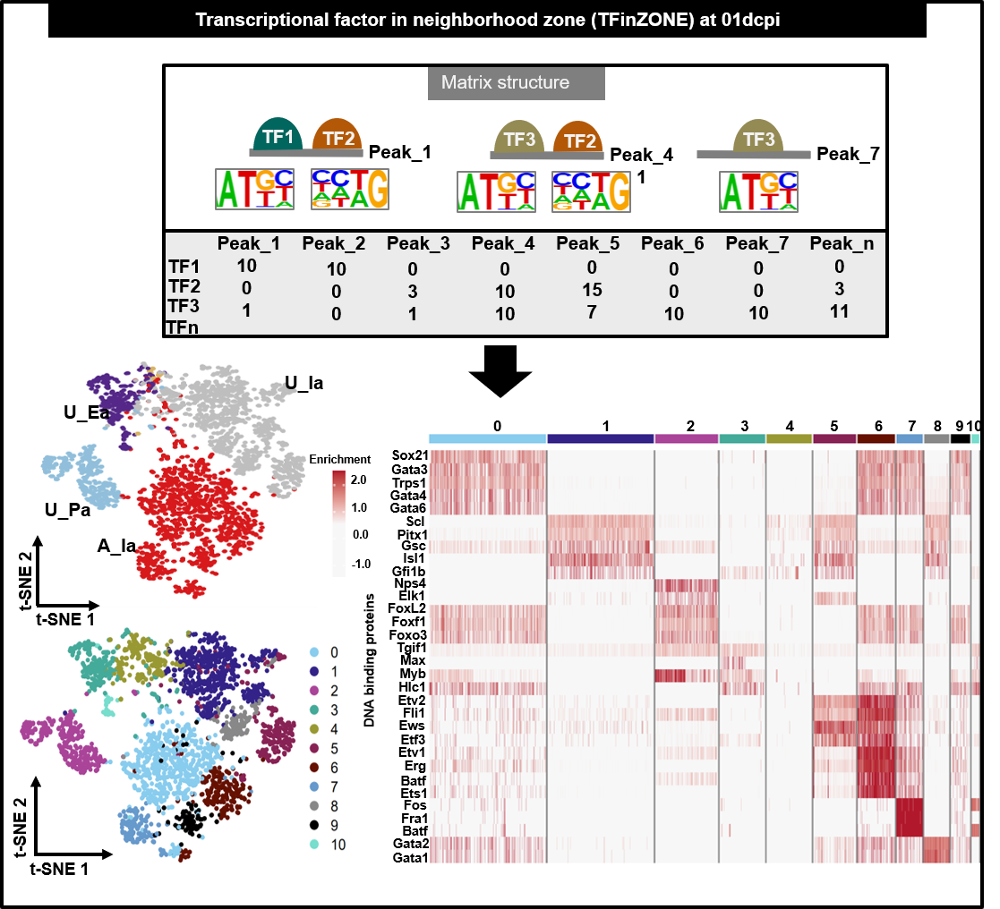

```{r style, echo = FALSE, results = 'asis'}
BiocStyle::markdown()
```

Mailto: julio.cordero@medma.uni-heidelberg.de<br />

# **Objectives**
-  To analyze the TFs-Motifs associated with the chromatin States areas as scRNA-seq 
- To find Transcriptional Factor in neighborhood Zone (TFinZONE)

# General Comments on the Script
-Instead of an expression of genes, we propose an enrichment score. Which combines the motif score of the TFs and the log10-Pvalue of the motif in the chromatin state. Each Cluster identified represents a group of **PEAKS** which contain a specific signature of **MOTIFS from TFs**. 
- Allow the identification of TFs in the neighborhood Zone. To understand the mechanism of how TFs, cooperate among them.
-This Script was used with the Motifs associated with Histone marks. However, it could also be modified to input Motifs associated with **ATAC-seq or ChIP-seq**. In the case of ATAC-seq, the motifs coming from footprinting analysis or Homer motifs search are highly recommended.

# Summary of figures produced by this Script.
```{r,fig.dim = c(13, 8), results="asis", align='center',out.width="150%", echo=F}
library(knitr)

```   

```{r,message=FALSE,echo=FALSE,warning=FALSE}
library(openxlsx)
library(data.table)
library(gridExtra)
library(edgeR)
library(ggpubr)
library(doParallel)
library(ComplexHeatmap)
library(circlize)
library(BiocParallel)
library(gam)
library(foreach)
library(ggplot2)
library("RcppArmadillo")
library(DESeq2)
library(RColorBrewer)
library(Rcpp)
library(clusterProfiler)
library(Seurat)
library(org.Mm.eg.db)
library(plyr)
library(gplots)
library(EnrichedHeatmap)
library(tidyr)
library(circlize)
library(khroma)
library(stringr)
library(dplyr)
library(readxl)
```


#    Set the working environment and Folder to output the results
- It is important to keep the output files well organized following the FAIR principles
- Findable, Accessible, Interoperable, and Reusable **(FAIR)**

```{r,message=FALSE,class.source="bg-info",warning=FALSE,echo=T}
 workdir = "./"
setwd(workdir)
PTHA1="../03OUTPUT/"
dir.create(PTHA1)
PORT=PTHA1
TRY="_"
TRY1="02Ia_"
PROJECT="03a_TFinZONE_at_01dpci"
PVALUE=0.05
#### FOR VOLCANO ###
upcol<- "#B2182B" # magenta from PiyG
nc<- "#000000" # black
downcol<- "grey" # green from PiyG
CC= c(downcol, "#F7F7F7",upcol)
BASIC_COL="black"
CO3<- c("lightgrey","#B2182B")
CO_ALU3=c("#d7191c","#d8b365","#542788","grey", "#91bfdb", "grey","grey")

NAME33<- c("Mo_Name","Consensus","P-value","Log_P-value","q-value_Benja","Nor_of_Tar","Per_of_Tar","No_of_Tar_Backg","Per_of_Tar_Backg")
NAME34<- c("HOmer_NAME",NAME33)
mat_m<- data.frame("mask_500_FIND")
## Here you write the Path to the 
WORK1="../01DATA_ORI/08MOTIFS_on_PEAKS/"

#WORK1="Y:/002ZF/000FIGURES_ANALY/00GITHUB_01HIS_Chroma_Factors/01HIS_Chrom_Factors_TEST/04MOtifs_Analy_as_SC_MOAC_Fig3_5/02Fig4_MO_MOAC_01dpci/01DATA_ORI/08MOTIFS_on_PEAKS/"
NAME_G2 <-data.frame(list.files(path=WORK1,pattern="*_FIND"))

colnames(NAME_G2)<- "ENH4"
#NAME_G2$GROUP <- gsub("CORR1_01d_", "", NAME_G2$ENH4)
NAME_G2$GROUP <- gsub("*_mask_500_FIND", "", NAME_G2$ENH4)
### this is important to check the SYMBOL
NAME_G22<- data.frame(c("00A_Ia","01Ia_A","02U_Ea","03U_Ia","04U_Pa"))


NAME_G2c<- as.character(t(NAME_G2[,2]))

#WORK11A11="../01DATA_ORI/07aMO_forMOAC/08TSS_Enh_w_01dpci_fHeatmap_ALL.xlsx"
WORK11A11="../01DATA_ORI/07aMO_forSeurat_ANALY/08TSS_Enh_w_01dpci_fHeatmap_ALL.xlsx"


MAT_1A= read_excel(WORK11A11)
#MAT_1A= read.delim(WORK11A11)

colnames(MAT_1A)[1]<- "SYMBOL"

dim(MAT_1A)
##### Set resolution for CLustering
RES=0.5
```


## Set processors 
```{r,message=FALSE,class.source="bg-info",warning=FALSE,echo=FALSE}

library(future)
plan()
plan("sequential", workers = 16)
plan()
```


# Load motifs to make the name in the matrix
```{r,message=FALSE,class.source="bg-info",warning=FALSE,echo=FALSE}

DE_list1<- list()
DE_list1b<- list()
DE_list1c<- list()
DE_list2<- list()
DE_list3<- list()
DE_list5 <- list()
library(stringr)
for(D in 1:length(NAME_G2$ENH4)){
WORK=paste(WORK1,NAME_G2[D,1],"/",sep="")
file.list <- data.frame(list.files(path=WORK,pattern='*.txt', all.files = F,full.names = F, recursive = T))
B<- length(file.list[,1])
for(C in 1:B){
file.list1 <- list.files(path=WORK,pattern='*.txt', all.files = T, full.names = T, recursive = T)
file.list2 <- data.frame(list.files(path=WORK,pattern='*.txt', all.files = T,full.names = T, recursive = T))
DE_list1 <- lapply(file.list1, read.delim,sep="\t",header=T,check.names=FALSE, stringsAsFactors=FALSE)

file.list$Mo_Name2 <- gsub(".txt", "", file.list[,1])

NAME_C<- paste(NAME_G2[D,2],"_",sep="")
file.list$Mo_Name1 <- gsub(NAME_C, "", file.list$Mo_Name2)
file.list$Mo_Name2 <- gsub("\\^.*","",file.list$Mo_Name1 )
file.list$GROUP <- NAME_G2[D,2]
DE_list2[[D]]<- subset(file.list,select=c("Mo_Name2","GROUP"))
colnames(DE_list2[[D]])<- c("SYMBOL","GROUP")
DE_list1b[[C]]<- cbind(DE_list1[[C]],DE_list2[[D]][["SYMBOL"]][[C]])
DE_list1b[[C]]$GROUP <- NAME_G2[D,2]
DE_list1c[[D]]<- do.call(rbind, DE_list1b)
#DE_list1c[[D]]$GROUP <- NAME_G2[D,1]
}
}
CHECK2<- do.call(rbind, DE_list2)
GN5a<- do.call(rbind, DE_list1c)
CHECK2<- DE_list2[[4]]
#length(CHECK2$PositionID)
GN5b<- do.call(rbind, DE_list2)
CHECK1<- DE_list1[[1]]
colnames(GN5a)[7]<- "SYMBOL"
#length(unique(GN5a$GROUP))
NAME_GR<- data.frame(table(GN5a$GROUP))
#length(GN5a$GROUP)
GN5a$REG[GN5a$GROUP==NAME_GR[1,1]] <- "02Ia"
GN5a$REG[GN5a$GROUP==NAME_GR[2,1]] <- "01Ea"
GN5a$REG[GN5a$GROUP==NAME_GR[3,1]] <- "01Ea"
GN5a$REG[GN5a$GROUP==NAME_GR[4,1]] <- "02Ia"
GN5a$REG[GN5a$GROUP==NAME_GR[5,1]] <- "03Pa"
```

## Gather the matrix from all the TFs found in this stage
```{r,message=FALSE,class.source="bg-info",warning=FALSE,echo=FALSE}

NAME_G2b<- t(NAME_G2$GROUP)
#c("00A_Ia","01Ia_A","02U_Ea","03U_Ia","04U_Pa")
MAT_1A1<- subset(MAT_1A, select=c("SYMBOL",NAME_G2b))
NAME_G2c<- as.character(t(NAME_G2[,2]))
colnames(MAT_1A1)<- c("SYMBOL",t(NAME_G2[,2]))
MAT_1_c25b<- tidyr::gather(MAT_1A1,NAME_G2c,key="Sample",value="log10Pvalue")


###### select only Pvalue<0.05 from the data
MAT_1_c25b<- subset(MAT_1_c25b,log10Pvalue>1)
#length(unique(GN5a$REG))
#length(GN5a$REG)
NAME_REG<- data.frame(table(GN5a$REG))
NAME_REG<- data.frame(table(GN5a$REG))

MAT_1_c25b$SYMBOL2<- paste(MAT_1_c25b$SYMBOL,MAT_1_c25b$Sample,sep="_")

MAT_1_c25b1<- subset(MAT_1_c25b, select=c("SYMBOL2","log10Pvalue"))
MAT_1_c25b1$log10Pvalue_p1<- MAT_1_c25b1$log10Pvalue+1

GN5a$SYMBOL2<- paste(GN5a$SYMBOL,GN5a$GROUP,sep="_")
#length(MAT_1_c25b1$SYMBOL2)
#length(GN5a$SYMBOL2)
#table(MAT_1_c25b$Sample)
#table(GN5a$GROUP)

MAT_MO1<- merge(MAT_1_c25b1,GN5a,by="SYMBOL2")

```

## Merge TFs Motifs from the 5 GROUPs (00A_Ia, 01Ia_A, 02U_Ea, 03U_Ia, 04U_Pa) 

- Matrix of TFs by Peaks, could be used to merge with other time points
```{r,message=FALSE,class.source="bg-info",warning=FALSE,echo=FALSE}
table(MAT_MO1$GROUP)
length(unique(MAT_MO1$REG))
MAT_MO1_u<- MAT_MO1[!duplicated(MAT_MO1[,c("SYMBOL2","PositionID","GROUP", "REG")]),]
MAT_MO1_u2<- subset(MAT_MO1_u,select=c("SYMBOL","PositionID", "REG","MotifScore"))
NAME_MAT_MO1_u<- data.frame(colnames(MAT_MO1_u))
```


## TF Matrix as Single cell analysis matrix

```{r,message=FALSE,class.source="bg-info",warning=FALSE,echo=FALSE}
NAME_forSC<-c("SYMBOL","PositionID","GROUP", "REG","MotifScore","log10Pvalue_p1") 
## ALL
MAT_MO1_u2<- subset(MAT_MO1_u,select=NAME_forSC)
################ IMPORTANT to ADD THE LOG2P_x_SCORE  ########################
 MAT_MO1_u2$MOti<- MAT_MO1_u2$MotifScore*MAT_MO1_u2$log10Pvalue_p1
#CHECK_u2<- merge(MAT_MO1_u2,MAT_02Ia_u2,by="PositionID")
AC_RE_VOL_SC1<- MAT_MO1_u2
AC_RE_VOL_SC1$zMOtixP = scale(AC_RE_VOL_SC1$MOti,center = F)
#length(unique(CHECK_u2$PositionID))
AC_RE_VOL_SC<- subset(AC_RE_VOL_SC1,select=c("SYMBOL","PositionID","GROUP","REG","zMOtixP"))
#AC_RE_VOL_SC$GROUP <- gsub("CORR1_01d_", "", AC_RE_VOL_SC$GROUP)
#AC_RE_VOL_SC$GROUP <- gsub("_1_mask_500_FIND", "", AC_RE_VOL_SC$GROUP)
AC_RE_VOL_SC_META<- AC_RE_VOL_SC[!duplicated(AC_RE_VOL_SC[,c("PositionID","GROUP", "REG")]),]

#AC_RE_VOL_SC_META$GROUP2 <- gsub("CORR1_01d_u_", "", AC_RE_VOL_SC_META$GROUP)
#AC_RE_VOL_SC_META$GROUP <- gsub("_mask_500_FIND", "", AC_RE_VOL_SC_META$GROUP2)
AC_RE_VOL_SC$PositionID2<- paste(AC_RE_VOL_SC$GROUP,AC_RE_VOL_SC$PositionID,sep="-")
colnames(AC_RE_VOL_SC)[5]<- "zMOtixP"
AC_RE_VOL_SC<- subset(AC_RE_VOL_SC,select=c("SYMBOL","PositionID2","GROUP","REG","zMOtixP"))
AC_RE_VOL_SC_META<- AC_RE_VOL_SC[!duplicated(AC_RE_VOL_SC[,c("PositionID2")]),]

META_1<- AC_RE_VOL_SC_META$PositionID2
#length(AC_RE_VOL_SC[,1])
AC_RE_VOL_SC2<- subset(AC_RE_VOL_SC,select=c("SYMBOL","PositionID2","zMOtixP"))

mat_cm_TMM_BOTH_SC<- spread(AC_RE_VOL_SC2,PositionID2, zMOtixP,fill = 0)
#dim(mat_cm_TMM_BOTH_SC)

META_1<- AC_RE_VOL_SC_META$PositionID
#length(AC_RE_VOL_SC[,1])
write.xlsx(AC_RE_VOL_SC,file=paste(PTHA1,"001",PROJECT,"_forSCELL_MAT.xlsx",sep=""),overwrite = T)
write.table (AC_RE_VOL_SC,file=paste(PTHA1,"001",PROJECT,"_forSCELL_MAT.txt",sep=""),sep="\t",row.names = F,col.names=T,dec=".",quote = F)
write.table (MAT_MO1_u2,file=paste(PTHA1,"001",PROJECT,"_forSCELL_MAT_NO_SCALE.txt",sep=""),sep="\t",row.names = F,col.names=T,dec=".",quote = F)

```

## Create a Seurat object
```{r,message=FALSE,class.source="bg-info",warning=FALSE,echo=T}
b7<- AC_RE_VOL_SC_META
rownames(b7)<- b7$PositionID2

mat_c1<- mat_cm_TMM_BOTH_SC[,rownames(b7)]
rownames(mat_c1)<- mat_cm_TMM_BOTH_SC$SYMBOL
dim(mat_c1)
dim(b7)
smartseq2 <- CreateSeuratObject(mat_c1,project = "01d", meta.data = b7)
```

# Identification of highly variable TFs
```{r,message=FALSE,class.source="bg-info",warning=FALSE,echo=F}
smartseq2 <- FindVariableFeatures(smartseq2, selection.method = "vst", nfeatures = 2000)

############ QC plot for the number of TFs per sample
smartseq2@meta.data[["nTFs_per_Peak"]] <- smartseq2@meta.data[["nFeature_RNA"]]
smartseq2@meta.data[["Total_nTFs_p_Peak"]] <- smartseq2@meta.data[["nCount_RNA"]]

EC00<- VlnPlot(smartseq2, features = c("nTFs_per_Peak"), ncol = 2,group.by ='GROUP',pt.size = 0.3,cols = CO_ALU3)+ labs(title=paste("nTFs_per_Peak",sep="_" ) , x="GROUP", y = "nTFs_per_Peak")

EC001<- VlnPlot(smartseq2, features = c( "Total_nTFs_p_Peak"), ncol = 2,group.by ='GROUP',pt.size = 0.3,cols = CO_ALU3)+ labs(title=paste("Total_nTFs_p_Peak",sep="_" ) , x="GROUP", y = "Total_nTFs_p_Peak")

top10 <- head(VariableFeatures(smartseq2), 10)

plot1 <- VariableFeaturePlot(smartseq2)
plot2 <- LabelPoints(plot = plot1, points = top10, repel = TRUE)

{pdf(file=paste(PTHA1,"000",PROJECT,"_QC_PLOTS_TOP_genes.pdf",sep=""), width=6, height=5)  
print(plot1)
print(plot2)
}
dev.off()
```

## Plot from TOP N° of TFs per peaks
```{r,fig.dim = c(7, 6),message=FALSE,class.source="bg-info",warning=FALSE}
arrangeQC_TF <- ggarrange(EC00,EC001, ncol = 2,nrow =1,common.legend = T, align = c("hv"),legend="none")

print(arrangeQC_TF)
```

## Plot from TOP TFs in the data

```{r,fig.dim = c(5, 6),message=FALSE,class.source="bg-info",warning=FALSE}

grid.arrange(  plot1,plot2, ncol = 1,nrow = 2)

```

# Perform normalization and clustering
```{r,echo=FALSE}
all.genes <- rownames(smartseq2)
smartseq2 <- ScaleData(smartseq2, features = all.genes,model.use	
="linear")
```

## Run the Linear dimensional reduction
```{r,echo=FALSE}
smartseq2 <- RunPCA(smartseq2, features = VariableFeatures(object = smartseq2))
VizDimLoadings(smartseq2, dims = 1:4, reduction = "pca")
P1<- DimPlot(smartseq2, reduction = "pca")

```
## Plot Pincipal component analysis PCA
```{r,fig.dim = c(5, 6),message=FALSE,class.source="bg-info",warning=FALSE}
grid.arrange(  P1, ncol = 1,nrow = 1)
```


```{r,message=FALSE,class.source="bg-info",warning=FALSE,echo=FALSE}
HEA00<- Seurat::DimHeatmap(smartseq2, dims = 1:9, cells = 200, balanced = TRUE,fast = FALSE)
CO_PA<-  c("#4393c3", "white", "#d6601d")
CO_PA1<- rep(CO_PA,3)
P2<- HEA00 + ggplot2::scale_fill_gradientn(colors = CO_PA)
```

## Plot heatmap from 200 Peaks by Pincipal Component Analysis PCA 
```{r,fig.dim = c(9, 10),message=FALSE,class.source="bg-info",warning=FALSE}
print(P2)
```

```{r,message=FALSE,class.source="bg-info",warning=FALSE,echo=FALSE}
smartseq2 <- JackStraw(smartseq2, num.replicate = 100)
smartseq2 <- ScoreJackStraw(smartseq2, dims = 1:20)
P3<- JackStrawPlot(smartseq2, dims = 1:12)

{pdf(file=paste(PTHA1,"000",PROJECT,"_how_many_CL_ALL.pdf",sep=""))  
print(P3)
}
dev.off()
```

## Perform unsupervised Clusters analysis of TFs on peaks
```{r,message=FALSE,class.source="bg-info",warning=FALSE,echo=T}
set.seed(1)
smartseq2 <- FindNeighbors(smartseq2, dims = 1:10)
smartseq2 <- FindClusters(smartseq2, resolution = RES, random.seed=	1, algorithm=1)
```

# Run the dimnsionality reduction by UMAP and T-SNE 
```{r,message=FALSE,class.source="bg-info",warning=FALSE,echo=T}
CO<-brewer.pal(n = 12, name = "Paired")
COb<-brewer.pal(n = 8, name = "Dark2")
CO2b<-c("#E66100","#000000","#0affc2")
CO2<-c("#b2182b","#ef8a62","#67a9cf")
##EDIT Paired color
COe2<- c("#88CCEE", "#332288","#AA4499", "#44AA99", "#999933", "#882255", "#661100", "#6699CC","#888888","#000000","#77ddcc","#df65b0","#CC79A7","#332288", "#E66100", "#1F78B4", "#B2DF8A", "#33A02C", "#FB9A99", "#A6CEE3", "#FDBF6F", "#FF7F00","#CAB2D6","#F0E442","#B15928","#7570B3","#E7298A","#666666","#c241f8" ,"mediumaquamarine","#882E72",'#1965B0',"#bf812d")
A1<- c('#b2182b','#d6601d','#f4a582')
A2<- c('#8c510a','#bf812d','#F6C141')
A3<- c("#882E72", "#AE76A3","#D1BBD7")
A4<-  c('#01665e','#90C987','#CAE0AB')
A5<- c ('#1965B0','#4393c3',"#92c5de")
CO_ALU2=c("#d7191c","#d8b365","#542788","#abd9e9", "#2c7bb6", "#4d4d4d","grey")
CO_ALU=c("#d7191c","#542788","#d8b365","#abd9e9", "#2c7bb6", "#4d4d4d","grey")
CO_ALU3=c("#d7191c","#d8b365","#542788","grey", "#91bfdb", "grey","grey")
COe<- c(A1,A2,A3,A4,A5)
smartseq2 <-  RunUMAP(smartseq2, dims = 1:30, n.neighbors = 30)
smartseq2 <-  RunTSNE(smartseq2, dims = 1:20, check_duplicates = FALSE)
##### These PLots are printed later in the Script. here are to check #####
#DimPlot(smartseq2, reduction = "umap", label = T,cols = COe2,pt.size=0.7)
#DimPlot(smartseq2, reduction = "tsne", label = T,cols = COe2,pt.size=0.7)

#DimPlot(smartseq2, reduction = "umap",group.by ='GROUP',cols = CO_ALU,pt.size=0.7)
#DimPlot(smartseq2, reduction = "tsne",group.by ='GROUP',cols = COe,pt.size=0.7)

#DimPlot(smartseq2, reduction = "tsne", label = T)
#DimPlot(smartseq2, reduction = "tsne",group.by ='seurat_clusters', split.by = 'GROUP',cols = COe2,pt.size=0.7)
#DimPlot(smartseq2, reduction = "tsne",group.by ='GROUP', split.by = 'seurat_clusters',cols = CO_ALU3,pt.size=0.7)

#DimPlot(smartseq2, reduction = "umap",group.by ='GROUP',cols = CO_ALU3,pt.size=0.7)
#DimPlot(smartseq2, reduction = "tsne",group.by ='GROUP',cols = CO_ALU3,pt.size=0.7)

{pdf(file=paste(PTHA1,"01Umap_tsne_",PROJECT,"CLU_PC10_Dim30",".pdf",sep=""), width=8, height=3)  
P00a<- DimPlot(smartseq2, reduction = "umap", label = T,cols = COe2,pt.size=0.7)
P01a<- DimPlot(smartseq2, reduction = "umap", label = F,cols = COe2,pt.size=0.7)

P00at<- DimPlot(smartseq2, reduction = "tsne", label = T,cols = COe2,pt.size=0.7)
P01at<- DimPlot(smartseq2, reduction = "tsne", label = F,cols = COe2,pt.size=0.7)

P03<-DimPlot(smartseq2, reduction = "umap",group.by ='seurat_clusters', split.by = 'GROUP',cols = COe2,pt.size=0.7)
P03a<-  DimPlot(smartseq2, reduction = "umap",group.by ='GROUP', split.by = 'seurat_clusters',cols = CO_ALU3,pt.size=0.7)

P03t<-DimPlot(smartseq2, reduction = "tsne",group.by ='seurat_clusters', split.by = 'GROUP',cols = COe2,pt.size=0.7)
P03at<-  DimPlot(smartseq2, reduction = "tsne",group.by ='GROUP', split.by = 'seurat_clusters',cols = CO_ALU3,pt.size=0.7)
    
arrange1 <- ggarrange(P00a,P01a, ncol = 2,nrow =1,common.legend = T, align = c("hv"),legend="right")
arrange1t <- ggarrange(P00at,P01at, ncol = 2,nrow =1,common.legend = T, align = c("hv"),legend="right")
arrange1c <- ggarrange(P03, ncol = 1,nrow =1,common.legend = T, align = c("hv"),legend="right")
print(arrange1t)
print(arrange1)
}
dev.off()

{pdf(file=paste(PTHA1,"01Umap_tsne_",PROJECT,"CLU_PC10_Dim30_by_STAGE",".pdf",sep=""), width=12, height=3)  
arrange1bt <- ggarrange(P03t, ncol = 1,nrow =1,common.legend = T, align = c("hv"),legend="right")
arrange1ca <- ggarrange(P03a, ncol = 1,nrow =1,common.legend = T, align = c("hv"),legend="right")
arrange1cat <- ggarrange(P03at, ncol = 1,nrow =1,common.legend = T, align = c("hv"),legend="right")

print(arrange1bt)
print(arrange1c)
print(arrange1cat)
}
dev.off()
```

## Plot UMAP and TSNE by Clusters
```{r,fig.dim = c(10, 5),message=FALSE,class.source="bg-info",warning=FALSE}
print(arrange1t)
print(arrange1)
print(arrange1bt)
print(arrange1c)
print(arrange1cat)
```


```{r,echo=FALSE}
{pdf(file=paste(PTHA1,"01Umap_tsne_",PROJECT, "CLU_PC10_Dim30_by_GROUP",".pdf",sep=""), width=8, height=4)  
P00b<- DimPlot(smartseq2, reduction = "umap",group.by ='REG',cols=CO2b,pt.size=0.7)
P00bt<- DimPlot(smartseq2, reduction = "tsne",group.by ='REG',cols=CO2b,pt.size=0.7)

P01b<- DimPlot(smartseq2, reduction = "umap", label = T,group.by ='REG',cols=CO_ALU3,pt.size=0.7)
P01bt<- DimPlot(smartseq2, reduction = "tsne", label = T,group.by ='REG',cols=CO_ALU3,pt.size=0.7)

P01c<- DimPlot(smartseq2, reduction = "umap",group.by ='GROUP',cols = CO_ALU3,pt.size=0.7)
P01ct<- DimPlot(smartseq2, reduction = "tsne",group.by ='GROUP',cols = CO_ALU3,pt.size=0.7)

P01d<- DimPlot(smartseq2, reduction = "umap", label = T,group.by ='GROUP',cols = CO_ALU3,pt.size=0.7)
P01dt<- DimPlot(smartseq2, reduction = "tsne", label = T,group.by ='GROUP',cols = CO_ALU3,pt.size=0.7)

arrange2 <- ggarrange(P00b,P00bt,    ncol = 2,nrow =1,common.legend = T, align = c("hv"),legend="right")
arrange3 <- ggarrange(P01c,P01ct,    ncol = 2,nrow =1,common.legend = T, align = c("hv"),legend="right")
arrange3t <- ggarrange(P01d,P01dt,  ncol = 2,nrow =1,common.legend = T, align = c("hv"),legend="right")

print(arrange3)
print(arrange3t)
print(arrange2)
}
dev.off()
```

## Plot UMAP and TSNE by GROUP
```{r,fig.dim = c(10, 5),message=FALSE,class.source="bg-info",warning=FALSE}
print(arrange3)
print(arrange3t)
print(arrange2)
```


# Find top TFs for every Neighborhood ZONE
- Settings could be changed, here we used the TF present in at least 10% of peaks and enriched in a log2FC>0.09. After the Likelihood-ratio test.
```{r,message=FALSE,class.source="bg-info",warning=FALSE,echo=FALSE}
# find markers for every cluster compared to all remaining cells, report only the positive ones
PP0=0.1
FC0=0.09
PVLAUE_METH<- "bimod"

smartseq2.markers_Wil70_bino <- FindAllMarkers(smartseq2, only.pos = TRUE, min.pct = PP0, logfc.threshold = FC0, test.use	= PVLAUE_METH) ## no
smartseq2.markers_Wil70_poisson <- FindAllMarkers(smartseq2, only.pos = TRUE, min.pct = PP0, logfc.threshold = FC0, test.use	= "t") ## no
smartseq2.markers_Wil70_bino$test <- PVLAUE_METH
META_SEU<- data.frame(smartseq2@meta.data)
META_CLU<- data.frame(table(META_SEU$GROUP,META_SEU$seurat_clusters))
META_CLU<- subset(META_CLU,Freq>0)
colnames(META_CLU)<-c("GROUP","cluster","Freq_clu_in_Peak") 
smartseq2.markers_Wil720<- merge(smartseq2.markers_Wil70_bino,META_CLU,by="cluster")
smartseq2.markers_Wil720u<- smartseq2.markers_Wil720[!duplicated(smartseq2.markers_Wil720[,c("gene","cluster","GROUP")]),]
FIL<- data.frame(as.numeric(summary(smartseq2.markers_Wil720u$Freq_clu_in_Peak)))
smartseq2.markers_Wil720u1<- subset(smartseq2.markers_Wil720u,Freq_clu_in_Peak>FIL[2,1])
MA_CLU_by_CLUS<- plyr::count(smartseq2.markers_Wil720u1, c("GROUP","cluster"))
LEX=12
BASIC_COL="black"
P20<-  ggplot(smartseq2.markers_Wil720u1, aes(factor(cluster), Freq_clu_in_Peak, fill = factor(GROUP))) +  geom_bar(position = "stack",stat = "identity")+ scale_fill_manual(values =CO_ALU3)+ theme_bw()+ labs(fill="GENO_GROUP",title=paste("Number_of_Marker_factors_by_CLUSTER",PVLAUE_METH,sep="_" ) , x="clusters", y = "peaks_numbers")+ theme(text = element_text(size=LEX), panel.border = element_rect(colour = BASIC_COL,  size=2), axis.text.x=element_text(size=LEX, face="bold"), axis.text.y=element_text(size=LEX, face="bold"), axis.title.x = element_text(size=LEX, face="bold"), axis.title.y = element_text(size=LEX, face="bold"))

P201<-  ggplot(smartseq2.markers_Wil720u1, aes(factor(cluster), Freq_clu_in_Peak, fill = factor(GROUP))) +geom_bar(position = "fill",stat = "identity")+ scale_fill_manual(values =CO_ALU3)+ theme_bw()+labs(fill="GENO_GROUP", title=paste("Distribution_of_Marker_factors_by_CLUSTER",PVLAUE_METH,sep="_" ) , x="clusters", y = "peaks_numbers")+ theme_bw()+ labs(title=paste("Number_of_Marker_factors_by_CLUSTER",PVLAUE_METH,sep="_" ) , x="clusters", y = "peaks_numbers")+ theme(text = element_text(size=LEX), panel.border = element_rect(colour = BASIC_COL,  size=2), axis.text.x=element_text(size=LEX, face="bold"), axis.text.y=element_text(size=LEX, face="bold"), axis.title.x = element_text(size=LEX, face="bold"), axis.title.y = element_text(size=LEX, face="bold"))

{pdf(file=paste(PTHA1,"08_", PROJECT,"PEAKS_per_CL",".pdf",sep=""), width=5, height=2.5)  
print(P20)
print(P201)
}
write.xlsx(smartseq2.markers_Wil720u1,file=paste(PTHA1,"001",PROJECT,"markersw_REG",PP0,"_", FC0,PVLAUE_METH,".xlsx",sep=""),overwrite = T)
```

## Barplot across the Neighborhood by GROUP

```{r,fig.dim = c(10, 12),message=FALSE,class.source="bg-info",warning=FALSE}
grid.arrange(P20,P201, ncol = 1,nrow = 2)
```

```{r,message=FALSE,class.source="bg-info",warning=FALSE,echo=F}
LE=10
SI=10
upcol<- "#B2182B" # magenta from RdBu
nc<- "#F7F7F7" # gray
downcol<- "#F7F7F7" # green from RdBu
CO25<- c(downcol,nc,upcol)
top10will_bino <-smartseq2.markers_Wil720u1 %>% group_by(cluster) %>% top_n(n = 10, wt = avg_log2FC)

top5will_bino <- smartseq2.markers_Wil720u1 %>% group_by(cluster) %>% top_n(n = 5, wt = avg_log2FC)

#DoHeatmap(smartseq2, features = top10will_bino$gene,size = 4,group.colors=COe2) +  scale_fill_gradientn(colors = CO25) +ggtitle(paste("Top 10 marke","0.07ce","0.25FC",sep=""))

#DoHeatmap(smartseq2, features = top5will_bino$gene,size = 4,group.colors=COe2) +  scale_fill_gradientn(colors = CO25) + ggtitle(paste("Top 5 marke","0.07ce","0.25FC",sep=""))

{pdf(file=paste(PTHA1,"08_", PROJECT,"Top5_",PP0,"per_incells_",FC0,"_FC_",PVLAUE_METH,".pdf",sep=""), width=10, height=12)  

  P05ah_bino<-DoHeatmap(smartseq2, features = top10will_bino$gene,group.colors=COe2)  + scale_fill_gradientn(colors = CO25) +  ggtitle(paste( PROJECT,"top10will_bino",PP0,"per_incells_",FC0,"_FC_",PVLAUE_METH,sep=""))+
  theme(legend.position = "none",plot.title= element_text(color=BASIC_COL, size=LE, face="bold"), axis.text.y= element_text(size=LE,face="bold"),axis.text.x = element_text(size=SI, face="bold"), axis.title.x =element_text(color=BASIC_COL, size=LE, face="bold"), axis.title.y = element_text(color=BASIC_COL, size=LE, face="bold"))

  P05ah_bino1<-DoHeatmap(smartseq2, features = top5will_bino$gene,group.colors=COe2) + NoLegend() + scale_fill_gradientn(colors = CO25) +  ggtitle(paste(PROJECT, "Top 5 marker",PP0,"per_incells_",FC0,"_FC_",PVLAUE_METH,sep=""))  +  theme(legend.position = "none",plot.title= element_text(color=BASIC_COL, size=LE, face="bold"), axis.text.y= element_text(size=LE,face="bold"),axis.text.x = element_text(size=SI, face="bold"), axis.title.x =element_text(color=BASIC_COL, size=LE, face="bold"), axis.title.y = element_text(color=BASIC_COL, size=LE, face="bold"))
print(P05ah_bino1)
print(P05ah_bino)
}
```

## Heatmap of the top 10 markers per neighborhood after the Likelihood-ratio test

```{r,fig.dim = c(12, 14),message=FALSE,class.source="bg-info",warning=FALSE}
grid.arrange(  P05ah_bino1, ncol = 1,nrow = 1)
grid.arrange(  P05ah_bino, ncol = 1,nrow = 1)
```

# Handeling of the Seurat Object after Analysis
##Save Seurat Object
- Important for further modification of the Plots. You do not need to start from the start of the script.
```{r,message=FALSE,class.source="bg-info",warning=FALSE,echo=FALSE}
#saveRDS(smartseq2, file = paste(PTHA1,"00",PROJECT,"_","data.rds",sep=""))
## this is when i want to start from the processed data
```


## Extract analized matrix from Seurat objects

```{r,message=FALSE,class.source="bg-info",warning=FALSE,echo=T}
DATA_SC<- data.frame(smartseq2@assays[["RNA"]]@counts@i)
DATA_SC<- data.frame(smartseq2@assays[["RNA"]]@counts@i)
DATA_SC<- GetAssay(smartseq2,assay = "RNA")
DATA_SC1<- data.frame(DATA_SC@scale.data)
DATA_SC2<- data.frame(DATA_SC@scale.data)
#dim(DATA_SC1)
META_SEU<- data.frame(smartseq2@meta.data)
colnames(DATA_SC1)<- META_SEU$PositionID
colnames(META_SEU)[4]<- "SYMBOL_TF"
```


## Selection of candidate genes from 04dpci marker list. This is performed after checking the output excel file
```{r,message=FALSE,class.source="bg-info",warning=FALSE,echo=T}
GENES001<- c("Twist2","Smad4", "Nanog","Smad2","Fos","Sox9","Sox10","JunB")
GENES002 <- c("Pitx1","Isl1",  "Mef2b","FOXA1","TEAD3","GATA3", "Gata6", "Mef2b")
GENES003 <- c("Eomes","Oct4","Foxh1","CUX1","Bapx1", "Elk4","Foxo1","Fli1")
GENES004<- c("Rbp7","Rgcc", "Fabp4","Egfl7","Flt1", "Cd36","Nrp1","Tpm1", "Rbp1")
```


# Code to perform Violin plots of selected TFs
```{r,fig.dim = c(10, 12),message=FALSE,class.source="bg-info",warning=FALSE,echo=T}
LE=10
SI=10
YL3="Norm binding of TFs"
XL3="clusters"
P1 <- VlnPlot(smartseq2, GENES001, stack = TRUE, sort = F, flip = T,pt.size=0.02)+geom_point(size = .4,colour = "darkgrey") +scale_fill_manual(values = COe2)+
  theme(legend.position = "none",plot.title= element_text(color=BASIC_COL, size=LE, face="bold"), axis.text.y= element_text(size=LE,face="bold"),axis.text.x = element_text(size=SI, face="bold"), axis.title.x =element_text(color=BASIC_COL, size=LE, face="bold"), axis.title.y = element_text(color=BASIC_COL, size=LE, face="bold")) +labs(title=paste(PROJECT, "SEVERAL_TFs",sep="" ) , x=XL3, y = YL3)


P1CM <- VlnPlot(smartseq2, GENES002, stack = TRUE, sort = F, flip = T,pt.size=0.02)+geom_point(size = .4,colour = "darkgrey") +scale_fill_manual(values = COe2)+
  theme(legend.position = "none",plot.title= element_text(color=BASIC_COL, size=LE, face="bold"), axis.text.y= element_text(size=LE,face="bold"),axis.text.x = element_text(size=SI, face="bold"), axis.title.x =element_text(color=BASIC_COL, size=LE, face="bold"), axis.title.y = element_text(color=BASIC_COL, size=LE, face="bold")) +labs(title=paste(PROJECT, "SEVERAL_TFs",sep="" ) , x=XL3, y = YL3)

P1CM3 <- VlnPlot(smartseq2, GENES003, stack = TRUE, sort = F, flip = T,pt.size=0.02)+geom_point(size = .4,colour = "darkgrey") +scale_fill_manual(values = COe2)+
  theme(legend.position = "none",plot.title= element_text(color=BASIC_COL, size=LE, face="bold"), axis.text.y= element_text(size=LE,face="bold"),axis.text.x = element_text(size=SI, face="bold"), axis.title.x =element_text(color=BASIC_COL, size=LE, face="bold"), axis.title.y = element_text(color=BASIC_COL, size=LE, face="bold")) +labs(title=paste(PROJECT, "SEVERAL_TFs",sep="" ) , x=XL3, y = YL3)
#P1CM3
#print(P1CM)

pdf(file=paste(PTHA1,"09_", PROJECT,"_CLU_vs_Ex_VIol_groups_STACKED",".pdf",sep=""), width=10, height=15)
 print(P1)
  arrange1CM <- ggarrange(P1CM, ncol = 1,nrow =1,common.legend = T, align = c("hv"),legend="top")
  arrange1CM3 <- ggarrange(P1CM3, ncol = 1,nrow =1,common.legend = T, align = c("hv"),legend="top")
dev.off()
```


## Print Violin of Selected TFs by Neighborhood 
```{r,fig.dim = c(5, 5),message=FALSE,class.source="bg-info",warning=FALSE}
print(arrange1CM)
print(arrange1CM3)
```


```{r,fig.dim = c(10, 12),message=FALSE,class.source="bg-info",warning=FALSE,echo=FALSE}
P1CM41 <- VlnPlot(smartseq2, GENES001, stack = TRUE, sort = F, flip = T,split.by = "GROUP") +geom_point(size = .4,colour = "darkgrey") +scale_fill_manual(values = COe2) +scale_fill_manual(values = CO_ALU)+
  theme(legend.position = "none",plot.title= element_text(color=BASIC_COL, size=LE, face="bold"), axis.text.y= element_text(size=LE,face="bold"),axis.text.x = element_text(size=SI, face="bold"), axis.title.x =element_text(color=BASIC_COL, size=LE, face="bold"), axis.title.y = element_text(color=BASIC_COL, size=LE, face="bold")) +labs(title=paste(PROJECT, "SEVERAL_TFs",sep="" ) , x=XL3, y = YL3)

P1CM42 <- VlnPlot(smartseq2, GENES002, stack = TRUE, sort = F, flip = T,split.by = "GROUP") +geom_point(size = .4,colour = "darkgrey") +scale_fill_manual(values = COe2) +scale_fill_manual(values = CO_ALU)+
  theme(legend.position = "none",plot.title= element_text(color=BASIC_COL, size=LE, face="bold"), axis.text.y= element_text(size=LE,face="bold"),axis.text.x = element_text(size=SI, face="bold"), axis.title.x =element_text(color=BASIC_COL, size=LE, face="bold"), axis.title.y = element_text(color=BASIC_COL, size=LE, face="bold")) +labs(title=paste(PROJECT, "SEVERAL_TFs",sep="" ) , x=XL3, y = YL3)

P1CM43 <- VlnPlot(smartseq2, GENES003, stack = TRUE, sort = F, flip = T,split.by = "GROUP") +geom_point(size = .4,colour = "darkgrey") +scale_fill_manual(values = COe2) +scale_fill_manual(values = CO_ALU)+
  theme(legend.position = "none",plot.title= element_text(color=BASIC_COL, size=LE, face="bold"), axis.text.y= element_text(size=LE,face="bold"),axis.text.x = element_text(size=SI, face="bold"), axis.title.x =element_text(color=BASIC_COL, size=LE, face="bold"), axis.title.y = element_text(color=BASIC_COL, size=LE, face="bold")) +labs(title=paste(PROJECT, "SEVERAL_TFs",sep="" ) , x=XL3, y = YL3)

pdf(file=paste(PTHA1,"10_", PROJECT,"_CLU_vs_Ex_VIol_BY_groups_STACKED",".pdf",sep=""), width=15, height=15)
  arrange1CM41 <- ggarrange(P1CM41, ncol = 1,nrow =1,common.legend = T, align = c("hv"),legend="top")
  arrange1CM42 <- ggarrange(P1CM42, ncol = 1,nrow =1,common.legend = T, align = c("hv"),legend="top")
  arrange1CM43 <- ggarrange(P1CM43, ncol = 1,nrow =1,common.legend = T, align = c("hv"),legend="top")

print(arrange1CM41)
print(arrange1CM42)
print(arrange1CM43)   
dev.off()
```

## Print Violin of Selected TFs by Neighborhood splited by GROUPs
```{r,fig.dim = c(5, 5),message=FALSE,class.source="bg-info",warning=FALSE}
print(arrange1CM41)
print(arrange1CM42)
print(arrange1CM43) 
```

```{r,message=FALSE,class.source="bg-info",warning=FALSE,echo=F}
#P04a1 <- VlnPlot(smartseq2, features = GENES001,pt.size = 0.3,  group.by="seurat_clusters",split.by = 'GROUP',log = TRUE,cols = CO_ALU3, combine = F,sort = F)
#P04b1 <- VlnPlot(smartseq2, features = GENES002,pt.size = 0.3,  group.by="seurat_clusters",split.by = 'GROUP',log = TRUE,cols = CO_ALU3, combine = F,sort = F)
#P04c1 <- VlnPlot(smartseq2, features = GENES003,pt.size = 0.3,  group.by="seurat_clusters",split.by = 'GROUP', log = TRUE,cols = CO_ALU3, combine = F,sort = F)
#{ pdf(file=paste(PTHA1,"08_", PROJECT,"_CLUS_by_GROUP",".pdf",sep=""),width=10, height=3)  

#print(P04a1)
#print(P04b1)
#print(P04c1)
#}
#dev.off()
P04a12<- VlnPlot(smartseq2, features = GENES001,pt.size = 0.3,  group.by="seurat_clusters",split.by ='GROUP',log = TRUE,cols = CO_ALU3,  combine = T,sort = F)
P04b12<- VlnPlot(smartseq2, features = GENES002,pt.size = 0.3,  group.by="seurat_clusters",split.by = 'GROUP',log = TRUE,cols = CO_ALU3,  combine = T,sort = F)
P04c12<- VlnPlot(smartseq2, features = GENES003,pt.size = 0.3,  group.by="seurat_clusters",split.by = 'GROUP',log = TRUE,cols = CO_ALU3,  combine = T,sort = F)
arrange12 <- ggarrange(P04a12,ncol = 1,nrow =1,common.legend = T, align = c("hv"),legend="top")

pdf(file=paste(PTHA1,"08_",PROJECT,"_CLUS_by_GROUP_COMBI.pdf",sep=""), width=13, height=7)  
print(arrange12)
print(P04b12)
print(P04c12)
dev.off()

```

## Violin plot splited by seurat Neighborhood Cluster 
- Plot in group to give an Overview of the TF across the Clusters
- Alternative Violin plot of each TF in a plot (Optional to perform)

```{r,fig.dim = c(12, 10),message=FALSE,class.source="bg-info",warning=FALSE}
print(arrange12)
print(P04b12)
print(P04c12)
```
# Code for UMAP and TSNE plots

```{r,message=FALSE,class.source="bg-info",warning=FALSE,echo=T}
#FeaturePlot(smartseq2, features =GENES001,min.cutoff=0,max.cutoff=1,cols = CO3)
P05a<-FeaturePlot(smartseq2, features =GENES001,min.cutoff=0,max.cutoff=1,cols = CO3)
P05b<-FeaturePlot(smartseq2, features =GENES002,min.cutoff=0,max.cutoff=1,cols = CO3)
P05c<-FeaturePlot(smartseq2, features =GENES003,min.cutoff=0,max.cutoff=1,cols = CO3)

{pdf(file=paste(PTHA1,"09_",PROJECT,"_CLU_vs_Exp_UMMAP_groups",".pdf",sep=""),width=8, height=6)  
print(P05a)
print(P05b)
print(P05c)
}
dev.off()

P05a1<-FeaturePlot(smartseq2, features =GENES001,min.cutoff=0,max.cutoff=1,cols = CO3,reduction="tsne")
P05b1<-FeaturePlot(smartseq2, features =GENES002,min.cutoff=0,max.cutoff=1,cols = CO3,reduction="tsne")
P05c1<-FeaturePlot(smartseq2, features =GENES003,min.cutoff=0,max.cutoff=1,cols = CO3,reduction="tsne")

{pdf(file=paste(PTHA1,"09_",PROJECT,"_CLU_vs_Ex_TSNE_groups",".pdf",sep=""),width=8, height=6)  
print(P05a1)
print(P05b1)
print(P05c1)
}
dev.off()
```
# Dimentional reduction plot for each selected TFs

## UMAP plot 
```{r,fig.dim = c(12, 12),message=FALSE,class.source="bg-info",warning=FALSE}
print(P05a)
print(P05b)
print(P05c)
```

## TSNE plot 
```{r,fig.dim = c(12, 12),message=FALSE,class.source="bg-info",warning=FALSE}
print(P05a1)
print(P05b1)
print(P05c1)
```

# SessionInfo 
```{r,warning=FALSE}
sessionInfo()
```
