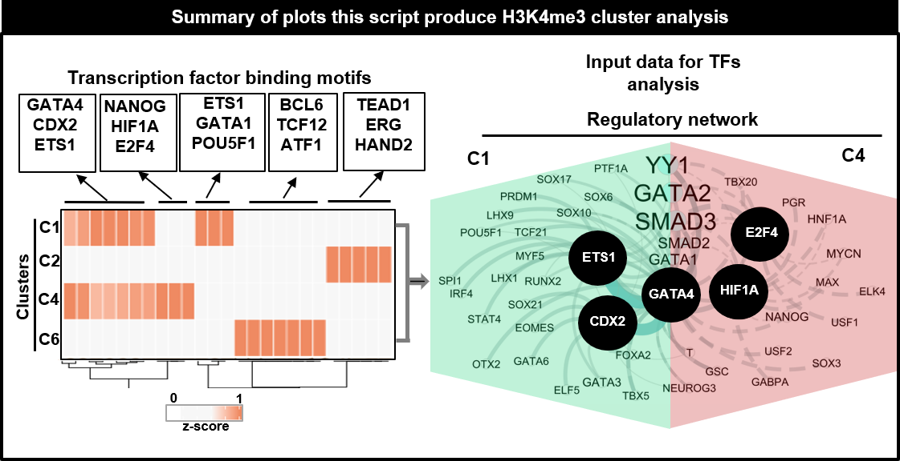

```{r style, echo = FALSE, results = 'asis'}
BiocStyle::markdown()
```

Mailto: julio.cordero@medma.uni-heidelberg.de<br />

# **Objective**
- To integrate the STRING-Web output file from Protein-Protein interactions associated with H3K4me3 ChIP-seq. <br />  

# General Comments on the Script
- Usually, diverse transcriptional factor **TF** proteins are associated with the peak areas of associated Histone mark ChIP-seq. Here we handle **STRING-Web results from known protein-protein interactions**. The classification is performed by counting the number of known interactions that the proteins have. This script could be customized to handle any output text file with protein-protein interactions. The output text result from this script could serve as an input network for the Cytoscape program.

# Summary of figures produced by this script.
```{r,fig.dim = c(13, 8), results="asis", align='center',out.width="150%", echo=F}
library(knitr)

```   


```{r,message=FALSE,echo=FALSE,class.source="bg-info",warning=FALSE}
library(openxlsx)
library(data.table)
library(edgeR)
library(doParallel)
library(ComplexHeatmap)
library(circlize)
library(BiocParallel)
library(gam)
library(foreach)
library(ggplot2)
library("RcppArmadillo")
library(DESeq2)
library(RColorBrewer)
library(Rcpp)
library(clusterProfiler)
library(plyr)
library(gplots)
library(org.Rn.eg.db)
library(EnrichedHeatmap)
library(tidyr)
library(circlize)
 
```


# Set the working environment and folder to output the results
- Important to keep the output files well organized following the FAIR principles
- Findable, Accessible, Interoperable, and Reusable **(FAIR)**
```{r,class.source="bg-info",echo=TRUE,warning=FALSE}
 workdir = "./"
setwd(workdir)
PTHA1="../03OUTPUT/"
dir.create(PTHA1)
PORT="../03OUTPUT/"
PROJECT="02Fig2H_MO_H3K4me3_aSTRING"
PORT=paste(PTHA1,PROJECT,"/",sep="")
dir.create(PTHA1)
dir.create(PORT)
NAME33<- c("Mo_Name","Consensus","P-value","Log_P-value","q-value_Benja","Nor_of_Tar","Per_of_Tar","No_of_Tar_Backg","Per_of_Tar_Backg")
NAME34<- c("HOmer_NAME",NAME33)
NAME56<- c("Description","Plog10","REG")
NAME_MO<- c("Mo_Name","Plog10","REG")
WORK1="../01DATA/aSTRING/"
NAME_G1 <- data.frame(list.files(path=WORK1,pattern="*.tsv",all.files = T,full.names = T, recursive = T))
NAME_G2 <- data.frame(list.files(path=WORK1,pattern="*.tsv",all.files = F,full.names = F, recursive = T))

NAME_G2$Mo_Name2 <- gsub("*_Protein_string_interactions_short.tsv", "", NAME_G2[,1])
REP=1:length(unique(NAME_G2[,1]))
CL<- data.frame(NAME_G2[,2])
NAME_G2$CLU<- NAME_G2$Mo_Name2
######## group of motifs
colnames(NAME_G2)<- c("ENH4","Mo_Name2","CLU")
NAME_G2b<- t(NAME_G2[,2])
```


# Import the data
## Import the different matrixes and merging together 
```{r,class.source="bg-info",echo=TRUE,warning=FALSE}
### TO read all files from String in one LOOP 
mat_PEAKS2<- list()
for(i in 1:length(NAME_G2[,1])) {
MO<- NAME_G2[i,3]
mat_PEAKS2[[MO]] = read.delim(NAME_G1[i,1],header=T,check.names=FALSE, stringsAsFactors=FALSE,sep="\t")
mat_PEAKS2[[MO]]$CLU<- MO
}
GN5a<- do.call(rbind, mat_PEAKS2)
```


## Count the interactions from the matrixes obtained from String
```{r,message=FALSE,class.source="bg-info",warning=FALSE}
MA6<- data.frame(table(GN5a$node1,GN5a$CLU))
MA6<- subset(MA6, Freq>=1 )
colnames(MA6)<- c("node1","CLU","Freq")
FIL<- data.matrix(summary(MA6$Freq))
FIL2<-as.numeric(round(FIL[2,1],digits = 2))
FIL5<-as.numeric(round(FIL[5,1],digits = 2))
FIL4<-as.numeric(round(FIL[4,1],digits = 2))
MA7<- subset(MA6, Freq>=1 )
MA74<- subset(MA6, Freq>=1 )
differ_4 = merge(GN5a,MA7, by= "node1")
MA7_46<- subset(differ_4, Freq>= FIL5 )
```

# Subset the Top 10 of TFs 
```{r,class.source="bg-info",echo=F,warning=FALSE}
### Order the protein network and select the TOP 10 TFs associated to the clusters
DIS_list<- list()
DIS_list1<- list()
NAME_CLUS<- CL
for (i in 1:length(unique(MA7$CLU))){ 
DIS_list[[i]]<- subset(MA6,  CLU==CL[i,1] )
DIS_list[[i]] <- DIS_list[[i]][order(DIS_list[[i]]$Freq,decreasing=T),]
DIS_list1[[i]]<-  DIS_list[[i]]
DIS_list[[i]]<- head( DIS_list[[i]],10)
}
MA_OER<- do.call(rbind, DIS_list)
MA_OER_A<- do.call(rbind, DIS_list1)
MA_CHECK1<- DIS_list[[1]]
```
# Visualization of the data
## Code for the top10 of the heatmap

-from Interactome proteins selected based in the top 10 interactome afer the String 
```{r,message=FALSE,echo=FALSE,warning=FALSE, include=FALSE}
#### FOR VOLCANO
upcol<- "#ef8a62" # magenta from PiyG
nc<- "#000000" # black
#downcol<- "#7fbc41" # green from PiyG
downcol<- "#F7F7F7" # green from PiyG
CC= c("#F7F7F7", "#F7F7F7",upcol)

TRY="ALL_per_GROUP"

#MA_OER2<- subset(MA_OER_A,node1=="CLOCK")
#MA_OER2b<- subset(MA_OER_A,node1=="ARNTL")

 # MA_OER3<- rbind(MA_OER,MA_OER2,MA_OER2b)
MAT_AA4<- spread(MA_OER,CLU, Freq,fill = 0)
CO<-brewer.pal(n = 8, name = "RdBu")
mat_esc_TMM_filter<-MAT_AA4
rownames(mat_esc_TMM_filter)<- mat_esc_TMM_filter$node1
gly_esc_TMM_filter <-  as.matrix(mat_esc_TMM_filter[,2:ncol(mat_esc_TMM_filter)])
mat_esc_TMM_filter_heat = t(scale(t(gly_esc_TMM_filter)))

NAME_22<- paste("z",colnames(mat_esc_TMM_filter_heat),sep="")
colnames(mat_esc_TMM_filter_heat)<-NAME_22
HHa1<- cbind(mat_esc_TMM_filter,mat_esc_TMM_filter_heat)
type = gsub("s/d+_", "", colnames(mat_esc_TMM_filter_heat))
  HHa <- na.omit(HHa1) 
IMPORT=column_order = order(as.numeric(gsub("column", "", colnames(HHa[,NAME_22]))))
M=1
L=-1
TRY="ALL_per_GROUP"
SI2=14
HEAT_K<-length(unique(NAME_G2[,1]))
pdf(file=paste(PORT,"001_FIG1E_", PROJECT,"_HEAT_TOP10",".pdf",sep=""), width=5, height=6) 
set.seed(1)
hcm_TMM2<- Heatmap(HHa[,NAME_22] , name="zcore", cluster_columns = F,cluster_rows = T, col=colorRamp2(c(L, 0, M), CC),rect_gp = gpar(col = "white", lwd = 1), show_row_names = T,  row_names_gp = gpar(fontsize = SI2),  show_column_names = T,km= HEAT_K,column_order = IMPORT,column_title=paste(PROJECT,TRY,sep=""))
draw(hcm_TMM2, heatmap_legend_side = "left", annotation_legend_side = "left", merge_legend = TRUE)
 
hcm_TMM1<- Heatmap(HHa[,NAME_22] , name="zcore", cluster_columns = F,cluster_rows = T, col=colorRamp2(c(L, 0, M), CC), show_row_names = T,  row_names_gp = gpar(fontsize = SI2), rect_gp = gpar(col = "white", lwd = 1), show_column_names = T,km= "",column_order = IMPORT,column_title=paste(PROJECT))
draw(hcm_TMM1, heatmap_legend_side = "left", annotation_legend_side = "left",merge_legend = TRUE)
   set.seed(1)
   hcm_TMM<- Heatmap(HHa[,NAME_22] , name="zcore", cluster_columns = F,cluster_rows = F, col=colorRamp2(c(L, 0, M), CC), show_row_names = T,  row_names_gp = gpar(fontsize = SI2),rect_gp = gpar(col = "white", lwd = 1),  show_column_names = T,km= "",column_order = IMPORT,column_title=paste(PROJECT))
   draw(hcm_TMM, heatmap_legend_side = "left", annotation_legend_side = "left",merge_legend = TRUE)
   set.seed(3)
    dev.off()
```

## Print heatmap 


```{r,fig.dim = c(7, 8),class.source="bg-info"}
print(hcm_TMM2)


```

## Code to make the barplot as suplementary figure in the script.
-It contains top10 proteins per cluster
```{r,echo=FALSE,message=FALSE,class.source="bg-info",warning=FALSE, include=FALSE}
SI=10
XL="Protein Motifs"
YL="Numb of interactions per Protein"
CO=c("#d7191c","#d8b365","#542788","#abd9e9", "#2c7bb6", "#4d4d4d","grey")
CO<-brewer.pal(n = 6, name = "Dark2")

#CO=c("#d7191c","#d8b365","#542788","grey", "#91bfdb", "grey","grey")##from

BASIC_COL="black"
GO04b<- ggplot(MA_OER, aes(x=reorder(node1, Freq),Freq,  fill=factor(CLU))) +  geom_bar(position = "stack",stat = "identity") + coord_flip() +theme_classic() +   scale_fill_manual(name="Group",values =CO)+ theme(plot.title = element_text(color=BASIC_COL, size=SI, face="bold.italic"),axis.title.x = element_text(color=BASIC_COL, size=SI, face="bold"),axis.title.y = element_text(color=BASIC_COL, size=SI, face="bold"),axis.text.x=element_text(angle = 0, size=SI, face="bold"),axis.text.y=element_text(angle = 0, size=SI, face="bold"))+ labs(title=paste(PROJECT,sep="" ) , x=XL, y = YL)

GO04c<- ggplot(MA_OER, aes(x=reorder(node1, Freq),Freq,  fill=factor(CLU)))+geom_bar(position = "stack",stat = "identity") +coord_flip() +theme_classic() +   scale_fill_manual(name="Group",values =CO)+ theme(plot.title = element_text(color=BASIC_COL, size=SI, face="bold.italic"),axis.title.x = element_text(color=BASIC_COL, size=SI, face="bold"),axis.title.y = element_text(color=BASIC_COL, size=SI, face="bold"),axis.text.x=element_text(angle = 0, size=SI,face="bold"),axis.text.y=element_text(angle = 0, size=SI, face="bold"))+ labs(title=paste(PROJECT,sep="" ) , x=XL, y = YL)

pdf(file=paste(PORT,"001_FIG1E_", PROJECT,"_SUPLE.pdf", sep=""),width=5, height=6)  

print(GO04b)
print(GO04c)
dev.off()
```

## Print  Barplot from the top10 protein networks

```{r,fig.dim = c(6, 7),message=FALSE,class.source="bg-info",warning=FALSE}
print(GO04c)
```

# Handling the matrixes of TFs interactions

## Main TFs used in this stuy 
- The network was performed with Cytoscape version 3.6.1
```{r,message=FALSE,class.source="bg-info",warning=FALSE}
PROT1="GATA4"
PROT2="ETS1"
PROT3="CDX2"

TFC0="TEAD1"
TFC01="HAND2"
TFC02="IRF4"

U1="GATA4"
U2="E2F4"
U3="HIF1A"

U11="BCL6"
U21="ATF1"
U31="TCF12"
```

## Select TF representative from the different clusters 
```{r,class.source="bg-info",warning=FALSE}
NAME_SELEC<- c("node1","node2","CLU")
differ_4 = merge(GN5a,MAT_AA4, by= "node1")
MA7_1<- subset(differ_4, CLU==NAME_G2[1,3] ,select=NAME_SELEC)
MA7_2<- subset(differ_4, CLU==NAME_G2[2,3],select=NAME_SELEC )
MA7_3<- subset(differ_4, CLU==NAME_G2[3,3] ,select=NAME_SELEC)
MA7_4<- subset(differ_4, CLU==NAME_G2[4,3] ,select=NAME_SELEC)

PORT2<- paste(PORT,"00fCytpe","/",sep="")
dir.create(PORT2)
MA7_25_TOP10_1<- subset(MA7_1,node1==PROT1 | node1==PROT2| node1==PROT3 )
MA7_25_TOP10_2<- subset(MA7_2,node1==TFC0 | node1==TFC01 | node1==TFC02 )
MA7_25_TOP10_3<- subset(MA7_3,node1==U1 | node1==U2 | node1==U3 )
MA7_25_TOP10_4<- subset(MA7_4,node1==U11 | node1==U21 | node1==U31 )
CY="forCyto2"
write.table(MA7_25_TOP10_1,file=paste(PORT2, PROJECT,"_",NAME_G2[1,3],".txt", sep=""),sep="\t",row.names = F,col.names=T,dec=".",quote = F)
write.table(MA7_25_TOP10_2,file=paste(PORT2, PROJECT,"_",NAME_G2[2,3],".txt", sep=""),sep="\t",row.names = F,col.names=T,dec=".",quote = F)
write.table(MA7_25_TOP10_3,file=paste(PORT2, PROJECT,"_",NAME_G2[3,3],".txt", sep=""),sep="\t",row.names = F,col.names=T,dec=".",quote = F)
write.table(MA7_25_TOP10_3,file=paste(PORT2, PROJECT,"_",NAME_G2[4,3],".txt", sep=""),sep="\t",row.names = F,col.names=T,dec=".",quote = F)

TOGe<- rbind(MA7_25_TOP10_1,MA7_25_TOP10_2,MA7_25_TOP10_3,MA7_25_TOP10_4)

write.table(TOGe,file=paste(PORT2,"002_FIG1F_", PROJECT,"_A",".txt",sep=""),sep="\t",row.names = F,col.names=T,dec=".",quote = F)
write.xlsx(HHa,file=paste(PORT2,"002_FIG1F_", PROJECT,"_A",".xlsx",sep=""),rowNames=T)
write.xlsx(differ_4,file=paste(PORT, PROJECT,"_A",".xlsx", sep=""),rowNames=T)
```


