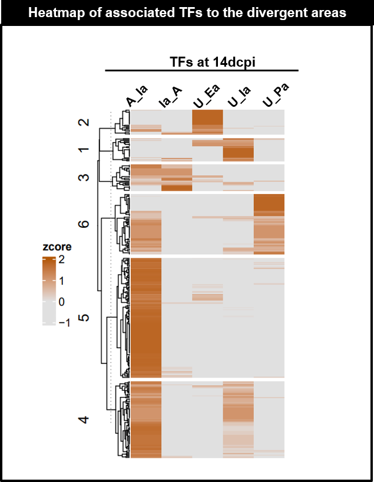

```{r style, echo = FALSE, results = 'asis'}
BiocStyle::markdown()
```

Mailto: julio.cordero@medma.uni-heidelberg.de<br />

# **Objectives**
- To combine all DNA motifs into one matrix to be used in Transcriptional Factor in the neighborhood Zone (TFinZONE) at 04dcpi as a reference point.<br />

# General comments on the script
-This Script was used to combine the motifs search output from **Homer** on the 5 divergent groups. The output Excel file serves as input for the script **TFinZONE**. The Script is highly customized.


# Summary of figures produced by this script.
```{r,fig.dim = c(13, 8), results="asis", align='center',out.width="150%", echo=F}
library(knitr)

```


```{r,message=FALSE,echo=FALSE,warning=FALSE}
library(openxlsx)
library(data.table)
library(edgeR)
#library(dplyr)
library(doParallel)
library(ComplexHeatmap)
library(circlize)
library(BiocParallel)
library(gam)
library(foreach)
library(ggplot2)
library("RcppArmadillo")
library(DESeq2)
library(RColorBrewer)
library(Rcpp)
library(clusterProfiler)
library(org.Hs.eg.db)
library(org.Mm.eg.db)
library(plyr)
library(gplots)
library(org.Rn.eg.db)
library(EnrichedHeatmap)
library(tidyr)
library(circlize)

```

```{r,class.source="bg-info",echo=TRUE,warning=FALSE}
workdir = "./"
setwd(workdir)

PTHA11="../01DATA_ORI/"
PORT11b="../03OUTPUT/01fR_a_MO_fTFinZONE/"
dir.create(PORT11b)
PROJECT="02aMO_INTEGRA_14dpci"
PORT11=paste(PORT11b,PROJECT,"/",sep="")

dir.create(PORT11)

##
NAME33<- c("Mo_Name","Consensus","P-value","Log_P-value","q-value_Benja","Nor_of_Tar","Per_of_Tar","No_of_Tar_Backg","Per_of_Tar_Backg")
NAME34<- c("HOmer_NAME",NAME33)
MOTIF_FOL <- data.frame(list.files(path=PTHA11,pattern="*_500", all.files = T,full.names = T))
MOTIF_FOL1 <-data.frame(list.files(path=PTHA11,pattern="*_500"))

MOTIF_dcpi <- data.frame(c("01dcpi","04dcpi","14dcpi"))
MOTIF_FOL1$Mo_Name2 <- gsub("*_forMOTIF_mask_500", "", MOTIF_FOL1[,1])

NAME56<- c("Description","Plog10","ENH4")
NAME_MO<- c("Mo_Name", "Plog10","ENH4")

REP=1:6
NAME57<- paste("c_SE",REP,sep="")
NAME58 <- data.frame(c(NAME56,NAME57))
NAME56a<- data.frame(c("Description",NAME56,NAME57))
NAME56a<- t(NAME56a)
######## group of motifs
NAME_G2<- data.frame(c("x00AC_RE","x01RE_AC","02oAC","03oRE","04oAC"))
colnames(NAME_G2)<- "ENH4"
NAME_G2b<- c("00AC_RE","01RE_AC","02oAC","03oRE","04oAC")
NAME34<- paste("z",NAME_G2b,sep="_")
  mat_m<- data.frame("_500")
```

# Run a loop to read all text files from the motif output

```{r,class.source="bg-info",echo=TRUE,warning=FALSE}
TRY="ALL_per_GROUP"
DE_list <- list()
DE_list1<- list()
DE_list4<- list()
DE_list5 <- list()
DE_list6<- list()
#GN5a<- list()
#GN5a2<- list()
#GN5a3<- list()
#GN5a3z<- list()
HHa<- list()


PORT2=paste(PORT11b,PROJECT,"/",sep="")
PORT3=paste(PORT11b,PROJECT,"/",sep="")
for(i in 2){
for(A in 1:length(MOTIF_FOL[,1])) {
print(i)
#print(paste("MOTIF",A))
#print(paste("DCPI_x_MO",i,A))

options(scipen = 999)
#CHECK11<- do.call(rbind, MO_files)
#DE_list2[[i]]<- data.frame(CHECK11[grep(MOTIF_dcpi[i,1], CHECK11[,1]), ])
#CEHCK00<- DE_list2[[i]]
DE_list4[[A]] = read.delim(paste(MOTIF_FOL[A,1],"/knownResults.txt",sep=""),header=T,sep="\t")

NAME44<- colnames(DE_list4[[A]])
colnames(DE_list4[[A]])<- NAME33
DE_list4[[A]]$ENH4<-  MOTIF_FOL1[A,2] 
DE_list4[[A]]$dpci<-  MOTIF_dcpi[2,1] 

DE_list4[[A]]$P2<- gsub("E", "e", DE_list4[[A]]$`P-value`)
DE_list4[[A]]$P3<- gsub(",", ".", DE_list4[[A]]$P2)

DE_list4[[A]]$P4<-format(as.numeric(DE_list4[[A]]$P3, scientific = FALSE))

CHECK44<-data.frame(DE_list4[[A]]) 
DE_list4[[A]]$Plog10<- log10(as.numeric(DE_list4[[A]]$P4))*(-1)
DE_list4[[A]]$FDRlog10 <- log10(p.adjust(DE_list4[[A]]$P4,method="fdr"))*(-1)
DCPI<-  MOTIF_dcpi[2,1]
############## prepare for heatmap  ###########
}}
```

## Filter motifs with log10P<1
```{r,message=FALSE,class.source="bg-info",warning=FALSE,echo=T}
GN5a<- do.call(rbind, DE_list4)
GN5a2<- subset(GN5a,Plog10>=1,select=NAME_MO )
GN5a2<- subset(GN5a,Plog10>=1,select=c(NAME_MO))
GN5a2$Mo_Name2 <- gsub("-", "", GN5a2$Mo_Name)

GN5a2<- separate(GN5a2,Mo_Name2, into = c("Description","Source","method"))
GN5a2<- subset(GN5a2, Description ="",select=NAME56)
GN5a3<- GN5a2[!duplicated(GN5a2[,c("Description","ENH4")]),]
GN5a3<- spread(GN5a3,ENH4, Plog10,fill = 0)
CO<-brewer.pal(n = 8, name = "RdBu")

rownames(GN5a3)<- GN5a3$Description
GN5a3z <-  as.matrix(GN5a3[,2:ncol(GN5a3)])

NAME_Z<- paste("z",colnames(GN5a3[,2:ncol(GN5a3)]),sep="")
colnames(GN5a3z)<- NAME_Z
GN5a3z = t(scale(t(GN5a3z)))
HHa<- cbind(GN5a3,GN5a3z)
type = gsub("s//d+_", "", colnames(GN5a3z))
IMPORT=column_order = order(as.numeric(gsub("column", "", colnames(GN5a3z))))
TRY_MO<- PROJECT
write.table(HHa,file=paste(PORT3,TRY_MO,"_",MOTIF_dcpi[i,1] , "_forHeatmap",".txt",sep=""),sep="\t",row.names = F,col.names=T,dec=".",quote = F)
write.xlsx(HHa,file=paste(PORT3,TRY_MO,"_",MOTIF_dcpi[i,1] , "_forHeatmap_ALL",".xlsx", sep=""),rowNames=F,overwrite = T)
CHECK_uPA<- DE_list4[[5]]
dim(HHa)
```


## Code for Heatmap from motifs 
```{r,message=FALSE,class.source="bg-info",warning=FALSE,echo=FALSE}
hcm_TMM2<- list()
hcm_TMM1<- list()
hcm_TMM<- list()
for(i in 2) {
HHa1 = read.delim(paste(PORT3,TRY_MO,"_",MOTIF_dcpi[i,1] , "_forHeatmap",".txt",sep=""),header=T,check.names=FALSE, stringsAsFactors=FALSE)
HHa2<- subset(HHa1,select=c("Description",NAME_Z))
rownames(HHa2)<- HHa2$Description
set.seed(1)
MI=6
clusters <- kmeans(HHa2[,2:ncol(HHa2)] ,MI,iter.max=500) 
set.seed(1)
clusters2 <- kmeans(HHa2[,2:ncol(HHa2)] , MI,iter.max=500)
identical(clusters,clusters2)
HHa2$Clu <- as.factor(clusters$cluster)
HHa2 <- HHa2[order(HHa2$Clu,decreasing=F),]
FIELD<- HHa2$Clu
h<-rowAnnotation(df =data.frame(FIELD), col = list(FIELD = c("1" =  "#66C2A5","2" = "#999999", "3"="#8DA0CB","4"="#c51b7d","5"="#A6D854","6"="black")))
KM=6
#### FOR VOLCANO
upcol<- "#b35806" # magenta from PiyG
downcol<- "#e0e0e0" # green from PiyG
CC= c(downcol,downcol,upcol)
L=-1
M=2
IMPORT2=column_order = order(as.numeric(gsub("column", "", colnames(HHa2[,NAME_Z]))))
}
SI2=5
```

```{r,message=FALSE,class.source="bg-info",warning=FALSE,echo=FALSE}
{pdf(file=paste(PORT3,"/",TRY_MO,"_",MOTIF_dcpi[i,1] , "_HEAT",".pdf",sep=""), width=6, height=36) 
set.seed(1)
hcm_TMM2[[i]]<- Heatmap(HHa2[,NAME_Z] , name="zcore", cluster_columns = F,cluster_rows = T, col=colorRamp2(c(L, 0, M), CC), show_row_names = T,  row_names_gp = gpar(fontsize = SI2),  show_column_names = T,km= MI,column_order = IMPORT2,column_title=paste(PROJECT,sep=""))
draw(hcm_TMM2[[i]], heatmap_legend_side = "left", annotation_legend_side = "left", merge_legend = TRUE)
set.seed(1)
dev.off()
}

{pdf(file=paste(PORT3,"/",TRY_MO,"_",MOTIF_dcpi[i,1] , "_HEATMAP_FIG_SMALL",".pdf",sep=""), width=4, height=6) 
set.seed(1)
hcm_TMM2[[i]]<- Heatmap(HHa2[,NAME_Z] , name="zcore", cluster_columns = F,cluster_rows = T, col=colorRamp2(c(L, 0, M), CC), show_row_names = T,  row_names_gp = gpar(fontsize = SI2),  show_column_names = T,km= MI,column_order = IMPORT2,column_title=paste(PROJECT,sep=""))
draw(hcm_TMM2[[i]], heatmap_legend_side = "left", annotation_legend_side = "left", merge_legend = TRUE)
dev.off()
}
```
## Print the heatmap from all DNA binding factors with log10P>=1
```{r,fig.dim = c(6, 25),message=FALSE,class.source="bg-info",warning=FALSE}
 print(hcm_TMM2[[i]])

#draw(hcm_TMM2[[i]], heatmap_legend_side = "left", annotation_legend_side = "left", merge_legend = TRUE)
```
