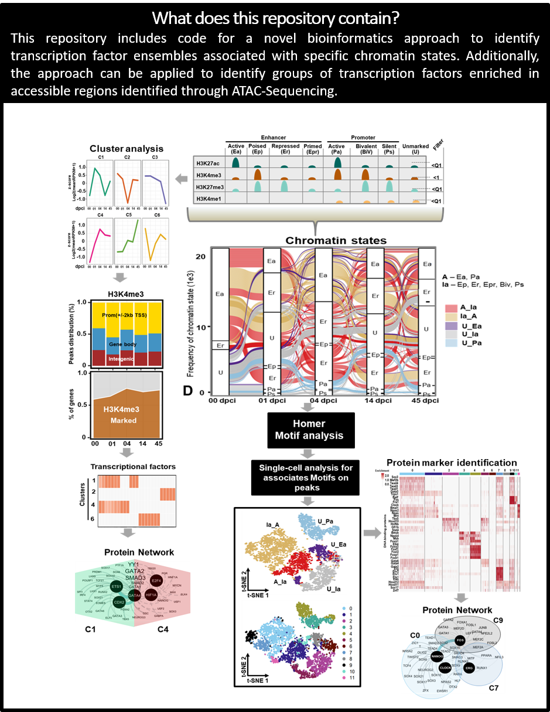

```{r setup, include=FALSE}
knitr::opts_chunk$set(echo = TRUE)
```

```{r style, echo = FALSE, results = 'asis'}
BiocStyle::markdown()
```

Mailto: julio.cordero@medma.uni-heidelberg.de<br />


#  **Transcriptional factors in Neighborhood ZONE (TFinZONE)**
-If you are interested in utilizing our novel bioinformatics approach to identify transcription factor ensembles associated with specific chromatin state transitions or reproducing the figures from "Leveraging chromatin state transitions for the identification of regulatory networks orchestrating heart regeneration", all you need to do is to download the files uploaded in the repository and run the Scripts. The primary input files for each figure have been included for this purpose.<br />
-All you need to do is to download the repository and run the Scripts. I added the main Input files from each figure, in order to use them.
```{r,fig.dim = c(13, 8), results="asis", align='center',out.width="150%", echo=F}
library(knitr)

```